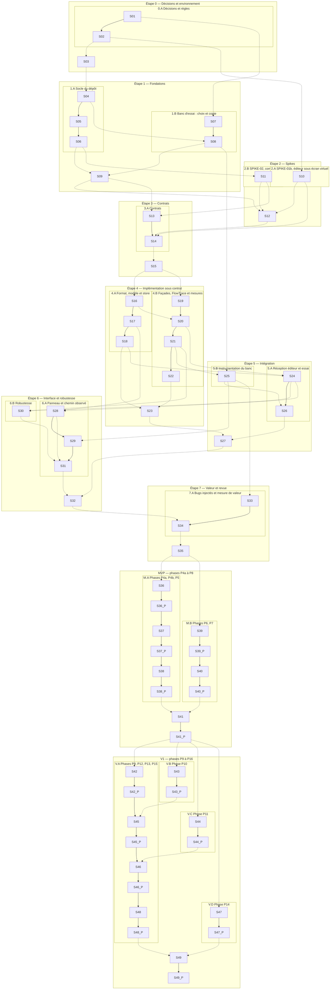

# Suivi de la construction

Liste de progression du mode autonome, et seule source de l'avancement. Une ligne par unité ; elle est cochée seulement à la fusion, sur `main`, par `python3 suivi/outil.py fusionner`. Le détail de chaque unité (ce qu'il faut faire, prompts, sous-étapes à cocher et à signer) est dans sa fiche `suivi/`. Règles : `docs/construction/sequence.md`.

**Tableau de bord.** `suivi/tableau.html` dessine ce fichier : cinq carrés par unité, du rouge au vert, et un carré de fond par piste autonome. Son bouton « Actualiser » relit ce fichier et les branches en direct sur GitHub. Régénération : `python3 suivi/outil.py tableau`.

**Lecture d'une ligne.** `réalise` et `vérifie` : IA 1 (conception), IA 2 (développement), IA 3 (vérification) ; tu choisis quelle IA tient chaque numéro, et il ne change plus. `après` : les unités qui doivent être cochées avant de commencer.

**Pistes autonomes.** Dans chaque section, une piste regroupe des unités qui se font à la suite : chacune attend la précédente. Les pistes d'une même section avancent en même temps, chacune de son côté ; une colonne `après` qui cite une unité d'une autre piste marque un point d'attente. Le rendez-vous de la section attend la fin de ses pistes.

**Accès simultané.** Toutes les IA peuvent lire ce fichier en même temps, sur `origin/main`. Aucune ne le modifie à la main : il ne change que par `fusionner` (ligne cochée), `correction` (porte KO) et l'insertion des tâches d'une phase, toujours sous le verrou de `main` (`verrou/main`), une IA à la fois. Détail : `docs/construction/sequence.md`, §3.

**Contrôle de cohérence** : `python3 suivi/outil.py verifier`.

## Vue d'ensemble

| Section | Pistes autonomes, qui avancent en même temps | Rendez-vous |
| --- | --- | --- |
| Étape 0 — Décisions et environnement | **0.A** Décisions et règles : S01 → S02 | S03 |
| Étape 1 — Fondations | **1.A** Socle du dépôt : S04 → S05 → S06 · **1.B** Banc d'essai : choix et copie : S07 → S08 | S09 |
| Étape 2 — Spikes | **2.A** SPIKE-01b, éditeur sous écran virtuel : S10 · **2.B** SPIKE-02, compatibilité : S11 | S12 |
| Étape 3 — Contrats | **3.A** Contrats : S13 → S14 | S15 |
| Étape 4 — Implémentation sous contrat | **4.A** Format, modèle et store : S16 → S17 → S18 · **4.B** Façades, FlowTrace et mesures : S19 → S20 → S21 → S22 | S23 |
| Étape 5 — Intégration | **5.A** Réception éditeur et essai : S24 → S26 · **5.B** Instrumentation du banc : S25 | S27 |
| Étape 6 — Interface et robustesse | **6.A** Panneau et chemin observé : S28 → S29 → S31 · **6.B** Robustesse : S30 | S32 |
| Étape 7 — Valeur et revue | **7.A** Bugs injectés et mesure de valeur : S33 → S34 | S35 |
| MVP — phases P4a à P8 | **M.A** Phases P4a, P4b, P5 : S36 → S36.P → S37 → S37.P → S38 → S38.P · **M.B** Phases P6, P7 : S39 → S39.P → S40 → S40.P | S41 → S41.P |
| V1 — phases P9 à P16 | **V.A** Phases P9, P12, P13, P15 : S42 → S42.P → S45 → S45.P → S46 → S46.P → S48 → S48.P · **V.B** Phase P10 : S43 → S43.P · **V.C** Phase P11 : S44 → S44.P · **V.D** Phase P14 : S47 → S47.P | S49 → S49.P |

## Étape 0 — Décisions et environnement

### Piste 0.A · Décisions et règles — démarre tout de suite

- [ ] **S01** · 0.A Dossier de décisions · réalise IA 1 · vérifie IA 3 · après — · fiche `suivi/S01-0A-decisions.md`
- [ ] **S02** · 0.B Squelettes et règles des agents · réalise IA 1 · vérifie IA 3 · après S01 · fiche `suivi/S02-0B-squelettes.md`

### Rendez-vous de l'étape 0 — attend S02

- [ ] **S03** · Porte de l'étape 0 · réalise IA 1 · vérifie IA 3 · après S02 · fiche `suivi/S03-porte-0.md`

## Étape 1 — Fondations

### Piste 1.A · Socle du dépôt — démarre après S03

- [ ] **S04** · T01 Squelette du dépôt et plugin activable · réalise IA 2 · vérifie IA 3 · après S03 · fiche `suivi/S04-T01.md`
- [ ] **S05** · T02 Runner de tests et contrôle de dépendances · réalise IA 2 · vérifie IA 3 · après S04 · fiche `suivi/S05-T02.md`
- [ ] **S06** · T03 Contrôle unique, lint et CI · réalise IA 2 · vérifie IA 1 · après S05 · fiche `suivi/S06-T03.md`

### Piste 1.B · Banc d'essai : choix et copie — démarre après S01

- [ ] **S07** · T04 Sélection du banc d'essai · réalise IA 3 · vérifie IA 1 · après S01 · fiche `suivi/S07-T04-selection.md`
- [ ] **S08** · T04 Préparation du banc d'essai · réalise IA 2 · vérifie IA 3 · après S04, S07 · fiche `suivi/S08-T04-preparation.md`

### Rendez-vous de l'étape 1 — attend S06, S08

- [ ] **S09** · Porte de l'étape 1 · réalise IA 1 · vérifie IA 3 · après S06, S08 · fiche `suivi/S09-porte-1.md`

## Étape 2 — Spikes

### Piste 2.A · SPIKE-01b, éditeur sous écran virtuel — démarre après S02

- [ ] **S10** · T05 SPIKE-01b, partie éditeur, sous écran virtuel · réalise IA 1 · vérifie IA 3 · après S02 · fiche `suivi/S10-T05-spike01b.md`

### Piste 2.B · SPIKE-02, compatibilité — démarre après S06

- [ ] **S11** · T06 SPIKE-02, frontière de compatibilité · réalise IA 1 · vérifie IA 3 · après S06 · fiche `suivi/S11-T06-spike02.md`

### Rendez-vous de l'étape 2 — attend S09, S10, S11

- [ ] **S12** · Porte de l'étape 2 · réalise IA 1 · vérifie IA 3 · après S09, S10, S11 · fiche `suivi/S12-porte-2.md`

## Étape 3 — Contrats

### Piste 3.A · Contrats — démarre après S09, S11

- [ ] **S13** · T07 Contrats C-01, C-02, C-05 · réalise IA 1 · vérifie IA 3 · après S09, S11 · fiche `suivi/S13-T07-contrats.md`
- [ ] **S14** · T08 Contrats C-03, C-04, C-06, C-07 · réalise IA 1 · vérifie IA 3 · après S10, S12, S13 · fiche `suivi/S14-T08-contrats.md`

### Rendez-vous de l'étape 3 — attend S14

- [ ] **S15** · Porte de l'étape 3 et gel des contrats · réalise IA 1 · vérifie IA 3 · après S14 · fiche `suivi/S15-porte-3-gel.md`

## Étape 4 — Implémentation sous contrat

### Piste 4.A · Format, modèle et store — démarre après S15

- [ ] **S16** · T09 Codec et validateur de l'enveloppe · réalise IA 2 · vérifie IA 3 · après S15 · fiche `suivi/S16-T09-codec.md`
- [ ] **S17** · T10 Modèle minimal, graphe déclaré, clés de sonde · réalise IA 2 · vérifie IA 3 · après S16 · fiche `suivi/S17-T10-modele.md`
- [ ] **S18** · T11 Event Store minimal · réalise IA 2 · vérifie IA 3 · après S17 · fiche `suivi/S18-T11-store.md`

### Piste 4.B · Façades, FlowTrace et mesures — démarre après S15

- [ ] **S19** · T12 Façades de compatibilité et profil moteur · réalise IA 2 · vérifie IA 1 · après S15 · fiche `suivi/S19-T12-facades.md`
- [ ] **S20** · T13a FlowTrace, runtime et protocole de session · réalise IA 2 · vérifie IA 1 · après S16, S19 · fiche `suivi/S20-T13a-flowtrace.md`
- [ ] **S21** · T13b Banc sans éditeur et scénarios de coupure · réalise IA 2 · vérifie IA 1 · après S20 · fiche `suivi/S21-T13b-banc.md`
- [ ] **S22** · T13c Mesures de performance (SPIKE-05) · réalise IA 2 · vérifie IA 3 · après S21 · fiche `suivi/S22-T13c-mesures.md`

### Rendez-vous de l'étape 4 — attend S18, S22

- [ ] **S23** · Porte de l'étape 4 · réalise IA 1 · vérifie IA 3 · après S18, S22 · fiche `suivi/S23-porte-4.md`

## Étape 5 — Intégration

### Piste 5.A · Réception éditeur et essai — démarre après S18, S20

- [ ] **S24** · T14 Réception côté éditeur · réalise IA 2 · vérifie IA 3 · après S18, S20 · fiche `suivi/S24-T14-reception.md`
- [ ] **S26** · Essai dans l'éditeur sous écran virtuel (PC5.6) · réalise IA 2 · vérifie IA 1 · après S24, S25 · fiche `suivi/S26-essai-editeur.md`

### Piste 5.B · Instrumentation du banc — démarre après S08, S21

- [ ] **S25** · T15 Instrumentation du banc d'essai · réalise IA 2 · vérifie IA 3 · après S08, S21 · fiche `suivi/S25-T15-instrumentation.md`

### Rendez-vous de l'étape 5 — attend S23, S26

- [ ] **S27** · Porte de l'étape 5 · réalise IA 1 · vérifie IA 3 · après S23, S26 · fiche `suivi/S27-porte-5.md`

## Étape 6 — Interface et robustesse

### Piste 6.A · Panneau et chemin observé — démarre après S17, S24

- [ ] **S28** · T16 Panneau du POC · réalise IA 2 · vérifie IA 3 · après S17, S24 · fiche `suivi/S28-T16-panneau.md`
- [ ] **S29** · T17 Chemin observé et ouverture du code · réalise IA 2 · vérifie IA 3 · après S25, S28 · fiche `suivi/S29-T17-chemin.md`
- [ ] **S31** · Démonstration sous écran virtuel (PC6.7) · réalise IA 2 · vérifie IA 3 · après S28, S29, S30 · fiche `suivi/S31-demonstration.md`

### Piste 6.B · Robustesse — démarre après S21, S24

- [ ] **S30** · T18 Robustesse et cycle de vie · réalise IA 2 · vérifie IA 1 · après S21, S24 · fiche `suivi/S30-T18-robustesse.md`

### Rendez-vous de l'étape 6 — attend S27, S31

- [ ] **S32** · Porte de l'étape 6 · réalise IA 1 · vérifie IA 3 · après S27, S31 · fiche `suivi/S32-porte-6.md`

## Étape 7 — Valeur et revue

### Piste 7.A · Bugs injectés et mesure de valeur — démarre après S25

- [ ] **S33** · T19 Injection de trois bugs · réalise IA 3 · vérifie IA 1 · après S25 · fiche `suivi/S33-T19-injection.md`
- [ ] **S34** · T19 Mesure de valeur par substitution · réalise IA 2 · vérifie IA 3 · après S32, S33 · fiche `suivi/S34-T19-diagnostic.md`

### Rendez-vous de l'étape 7 — attend S34

- [ ] **S35** · T20 Revue de continuation et décision · réalise IA 1 · vérifie IA 3 · après S34 · fiche `suivi/S35-T20-revue.md`

## MVP — phases P4a à P8

### Piste M.A · Phases P4a, P4b, P5 — démarre après S35

- [ ] **S36** · P4a Évaluations : rendu et backend statique : découpage · réalise IA 1 · vérifie IA 3 · après S35 · fiche `suivi/S36-P4a-decoupage.md`
  - Les tâches S36.1, S36.2… s'insèrent ici, sous cette ligne, à la fusion du découpage.
- [ ] **S36.P** · Porte de P4a · réalise IA 1 · vérifie IA 3 · après S36, S36.* · fiche `suivi/S36.P-P4a-porte.md`
- [ ] **S37** · P4b Backend statique et inventaire (CAP-08, CAP-09) : découpage · réalise IA 1 · vérifie IA 3 · après S36.P · fiche `suivi/S37-P4b-decoupage.md`
  - Les tâches S37.1, S37.2… s'insèrent ici, sous cette ligne, à la fusion du découpage.
- [ ] **S37.P** · Porte de P4b · réalise IA 1 · vérifie IA 3 · après S37, S37.* · fiche `suivi/S37.P-P4b-porte.md`
- [ ] **S38** · P5 Navigation et arborescence res:// (CAP-10) : découpage · réalise IA 1 · vérifie IA 3 · après S37.P · fiche `suivi/S38-P5-decoupage.md`
  - Les tâches S38.1, S38.2… s'insèrent ici, sous cette ligne, à la fusion du découpage.
- [ ] **S38.P** · Porte de P5 · réalise IA 1 · vérifie IA 3 · après S38, S38.* · fiche `suivi/S38.P-P5-porte.md`

### Piste M.B · Phases P6, P7 — démarre après S35

- [ ] **S39** · P6 Historique, persistance, protocole MVP (CAP-11, CAP-07 complet) : découpage · réalise IA 1 · vérifie IA 3 · après S35 · fiche `suivi/S39-P6-decoupage.md`
  - Les tâches S39.1, S39.2… s'insèrent ici, sous cette ligne, à la fusion du découpage.
- [ ] **S39.P** · Porte de P6 · réalise IA 1 · vérifie IA 3 · après S39, S39.* · fiche `suivi/S39.P-P6-porte.md`
- [ ] **S40** · P7 Logique et Game Flow annoté (CAP-12 annoté) : découpage · réalise IA 1 · vérifie IA 3 · après S39.P · fiche `suivi/S40-P7-decoupage.md`
  - Les tâches S40.1, S40.2… s'insèrent ici, sous cette ligne, à la fusion du découpage.
- [ ] **S40.P** · Porte de P7 · réalise IA 1 · vérifie IA 3 · après S40, S40.* · fiche `suivi/S40.P-P7-porte.md`

### Rendez-vous du MVP — attend S38.P, S40.P

- [ ] **S41** · P8 Compatibilité MVP et stabilisation (CAP-13) : découpage · réalise IA 1 · vérifie IA 3 · après S38.P, S40.P · fiche `suivi/S41-P8-decoupage.md`
  - Les tâches S41.1, S41.2… s'insèrent ici, sous cette ligne, à la fusion du découpage.
- [ ] **S41.P** · Porte de P8 et porte du MVP · réalise IA 1 · vérifie IA 3 · après S41, S41.* · fiche `suivi/S41.P-P8-porte.md`

## V1 — phases P9 à P16

### Piste V.A · Phases P9, P12, P13, P15 — démarre après S41.P

- [ ] **S42** · P9 Timeline du Game Flow : découpage · réalise IA 1 · vérifie IA 3 · après S41.P · fiche `suivi/S42-P9-decoupage.md`
  - Les tâches S42.1, S42.2… s'insèrent ici, sous cette ligne, à la fusion du découpage.
- [ ] **S42.P** · Porte de P9 · réalise IA 1 · vérifie IA 3 · après S42, S42.* · fiche `suivi/S42.P-P9-porte.md`
- [ ] **S45** · P12 Attendu contre observé : découpage · réalise IA 1 · vérifie IA 3 · après S42.P, S43.P · fiche `suivi/S45-P12-decoupage.md`
  - Les tâches S45.1, S45.2… s'insèrent ici, sous cette ligne, à la fusion du découpage.
- [ ] **S45.P** · Porte de P12 · réalise IA 1 · vérifie IA 3 · après S45, S45.* · fiche `suivi/S45.P-P12-porte.md`
- [ ] **S46** · P13 Diagnostic, Explain, Tune : découpage · réalise IA 1 · vérifie IA 3 · après S44.P, S45.P · fiche `suivi/S46-P13-decoupage.md`
  - Les tâches S46.1, S46.2… s'insèrent ici, sous cette ligne, à la fusion du découpage.
- [ ] **S46.P** · Porte de P13 · réalise IA 1 · vérifie IA 3 · après S46, S46.* · fiche `suivi/S46.P-P13-porte.md`
- [ ] **S48** · P15 AI Snapshot : découpage · réalise IA 1 · vérifie IA 3 · après S46.P · fiche `suivi/S48-P15-decoupage.md`
  - Les tâches S48.1, S48.2… s'insèrent ici, sous cette ligne, à la fusion du découpage.
- [ ] **S48.P** · Porte de P15 · réalise IA 1 · vérifie IA 3 · après S48, S48.* · fiche `suivi/S48.P-P15-porte.md`

### Piste V.B · Phase P10 — démarre après S41.P

- [ ] **S43** · P10 Instances et comparaison : découpage · réalise IA 1 · vérifie IA 3 · après S41.P · fiche `suivi/S43-P10-decoupage.md`
  - Les tâches S43.1, S43.2… s'insèrent ici, sous cette ligne, à la fusion du découpage.
- [ ] **S43.P** · Porte de P10 · réalise IA 1 · vérifie IA 3 · après S43, S43.* · fiche `suivi/S43.P-P10-porte.md`

### Piste V.C · Phase P11 — démarre après S41.P

- [ ] **S44** · P11 Data Flow : origine et usages d'un paramètre : découpage · réalise IA 1 · vérifie IA 3 · après S41.P · fiche `suivi/S44-P11-decoupage.md`
  - Les tâches S44.1, S44.2… s'insèrent ici, sous cette ligne, à la fusion du découpage.
- [ ] **S44.P** · Porte de P11 · réalise IA 1 · vérifie IA 3 · après S44, S44.* · fiche `suivi/S44.P-P11-porte.md`

### Piste V.D · Phase P14 — démarre après S41.P

- [ ] **S47** · P14 Performance corrélée : découpage · réalise IA 1 · vérifie IA 3 · après S41.P · fiche `suivi/S47-P14-decoupage.md`
  - Les tâches S47.1, S47.2… s'insèrent ici, sous cette ligne, à la fusion du découpage.
- [ ] **S47.P** · Porte de P14 · réalise IA 1 · vérifie IA 3 · après S47, S47.* · fiche `suivi/S47.P-P14-porte.md`

### Rendez-vous de la V1 — attend S47.P, S48.P

- [ ] **S49** · P16 Durcissement et documentation : découpage · réalise IA 1 · vérifie IA 3 · après S47.P, S48.P · fiche `suivi/S49-P16-decoupage.md`
  - Les tâches S49.1, S49.2… s'insèrent ici, sous cette ligne, à la fusion du découpage.
- [ ] **S49.P** · Porte de P16 et porte de la V1 · réalise IA 1 · vérifie IA 3 · après S49, S49.* · fiche `suivi/S49.P-P16-porte.md`

## Recette finale, pour toi

- [ ] Décisions « adoptées par défaut » de `docs/DECISIONS.md` confirmées ou changées
- [ ] Mesures sur ta machine avec GPU : débit de SPIKE-01b, latence PC6.7, désactivation du plugin pendant une vraie collecte, jugement visuel
- [ ] Mesure de valeur humaine (T19 du guide), comparée à la mesure par substitution
- [ ] Test de cartographie du MVP, chronométré avec et sans l'outil
- [ ] Installation à froid en suivant la documentation, puis désinstallation
- [ ] Licence (D-06) et décision de diffusion
- [ ] Carte des scripts superposée au jeu (maquette) : entrée au plan ou non
- [ ] Éléments ajoutés pendant la construction à la liste de recette de `PROJECT_STATE.md`
