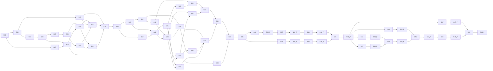

# Suivi de la construction

Liste de progression du mode autonome. Une ligne par unité ; on la coche seulement à la fusion, sur `main`, quand l'unité est vérifiée et fusionnée. Le détail de chaque unité (ce qu'il faut faire, prompts, sous-étapes à cocher) est dans sa fiche `suivi/`. Règles : `docs/construction/sequence.md`.

**Lecture d'une ligne.** `réalise` et `vérifie` : C concepteur, D développeur, V vérificateur. `après` : les unités qui doivent être cochées avant de commencer. Une unité dont tous les prérequis sont cochés peut commencer, même si d'autres unités de la liste sont encore ouvertes.

**Contrôle de cohérence** : `python3 suivi/outil.py verifier`.

## Ce qui se fait à la suite, et ce qui peut avancer en parallèle

Les unités d'une même vague sont indépendantes entre elles : aucune n'attend une autre, et elles ne modifient pas les mêmes fichiers. Une unité peut commencer dès que ses propres prérequis sont cochés, sans attendre le reste de sa vague. Les vagues se suivent : chacune contient au moins une unité qui attend la vague précédente.

| Vague | Unités indépendantes, réalisables en même temps |
| --- | --- |
| 1 | S01 |
| 2 | S02, S07 |
| 3 | S03, S10 |
| 4 | S04 |
| 5 | S05, S08 |
| 6 | S06 |
| 7 | S09, S11 |
| 8 | S12, S13 |
| 9 | S14 |
| 10 | S15 |
| 11 | S16, S19 |
| 12 | S17, S20 |
| 13 | S18, S21 |
| 14 | S22, S24, S25 |
| 15 | S23, S26, S28, S30, S33 |
| 16 | S27, S29 |
| 17 | S31 |
| 18 | S32 |
| 19 | S34 |
| 20 | S35 |
| 21 | S36, S39 |
| 22 | S36.P, S39.P |
| 23 | S37, S40 |
| 24 | S37.P, S40.P |
| 25 | S38 |
| 26 | S38.P |
| 27 | S41 |
| 28 | S41.P |
| 29 | S42, S43, S44, S47 |
| 30 | S42.P, S43.P, S44.P, S47.P |
| 31 | S45 |
| 32 | S45.P |
| 33 | S46 |
| 34 | S46.P |
| 35 | S48 |
| 36 | S48.P |
| 37 | S49 |
| 38 | S49.P |

Chaînes strictement séquentielles du POC, où chaque unité attend la précédente :

- Socle : S04 → S05 → S06 → S11 → S13 → S14 → S15 → S16 → S17 → S18.
- Runtime : S15 → S19 → S20 → S21 → S22, puis S21 → S25 et S21 → S30.
- Éditeur : S18 et S20 → S24 → S28 → S29 → S31 → S32 → S34 → S35.
- Parties indépendantes : S07 (choix du banc) dès S01 ; S10 (SPIKE-01b) dès S02 ; S19 en même temps que S16 à S18 ; S22, S24, S25 en même temps ; S33 (injection des bugs) dès S25 ; au MVP, P6 et P7 en même temps que P4a à P5 ; en V1, P9, P10, P11 et P14 en même temps.

## Étape 0 — Décisions et environnement

- [ ] **S01** · 0.A Dossier de décisions · réalise C · vérifie V · après — · fiche `suivi/S01-0A-decisions.md`
- [ ] **S02** · 0.B Squelettes et règles des agents · réalise C · vérifie V · après S01 · fiche `suivi/S02-0B-squelettes.md`
- [ ] **S03** · Porte de l'étape 0 · réalise C · vérifie V · après S02 · fiche `suivi/S03-porte-0.md`

## Étape 1 — Fondations

- [ ] **S04** · T01 Squelette du dépôt et plugin activable · réalise D · vérifie V · après S03 · fiche `suivi/S04-T01.md`
- [ ] **S05** · T02 Runner de tests et contrôle de dépendances · réalise D · vérifie V · après S04 · fiche `suivi/S05-T02.md`
- [ ] **S06** · T03 Contrôle unique, lint et CI · réalise D · vérifie C · après S05 · fiche `suivi/S06-T03.md`
- [ ] **S07** · T04 Sélection du banc d'essai · réalise V · vérifie C · après S01 · fiche `suivi/S07-T04-selection.md`
- [ ] **S08** · T04 Préparation du banc d'essai · réalise D · vérifie V · après S04, S07 · fiche `suivi/S08-T04-preparation.md`
- [ ] **S09** · Porte de l'étape 1 · réalise C · vérifie V · après S06, S08 · fiche `suivi/S09-porte-1.md`

## Étape 2 — Spikes

- [ ] **S10** · T05 SPIKE-01b, partie éditeur, sous écran virtuel · réalise C · vérifie V · après S02 · fiche `suivi/S10-T05-spike01b.md`
- [ ] **S11** · T06 SPIKE-02, frontière de compatibilité · réalise C · vérifie V · après S06 · fiche `suivi/S11-T06-spike02.md`
- [ ] **S12** · Porte de l'étape 2 · réalise C · vérifie V · après S09, S10, S11 · fiche `suivi/S12-porte-2.md`

## Étape 3 — Contrats

- [ ] **S13** · T07 Contrats C-01, C-02, C-05 · réalise C · vérifie V · après S09, S11 · fiche `suivi/S13-T07-contrats.md`
- [ ] **S14** · T08 Contrats C-03, C-04, C-06, C-07 · réalise C · vérifie V · après S10, S12, S13 · fiche `suivi/S14-T08-contrats.md`
- [ ] **S15** · Porte de l'étape 3 et gel des contrats · réalise C · vérifie V · après S14 · fiche `suivi/S15-porte-3-gel.md`

## Étape 4 — Implémentation sous contrat

- [ ] **S16** · T09 Codec et validateur de l'enveloppe · réalise D · vérifie V · après S15 · fiche `suivi/S16-T09-codec.md`
- [ ] **S17** · T10 Modèle minimal, graphe déclaré, clés de sonde · réalise D · vérifie V · après S16 · fiche `suivi/S17-T10-modele.md`
- [ ] **S18** · T11 Event Store minimal · réalise D · vérifie V · après S17 · fiche `suivi/S18-T11-store.md`
- [ ] **S19** · T12 Façades de compatibilité et profil moteur · réalise D · vérifie C · après S15 · fiche `suivi/S19-T12-facades.md`
- [ ] **S20** · T13a FlowTrace, runtime et protocole de session · réalise D · vérifie C · après S16, S19 · fiche `suivi/S20-T13a-flowtrace.md`
- [ ] **S21** · T13b Banc sans éditeur et scénarios de coupure · réalise D · vérifie C · après S20 · fiche `suivi/S21-T13b-banc.md`
- [ ] **S22** · T13c Mesures de performance (SPIKE-05) · réalise D · vérifie V · après S21 · fiche `suivi/S22-T13c-mesures.md`
- [ ] **S23** · Porte de l'étape 4 · réalise C · vérifie V · après S18, S22 · fiche `suivi/S23-porte-4.md`

## Étape 5 — Intégration

- [ ] **S24** · T14 Réception côté éditeur · réalise D · vérifie V · après S18, S20 · fiche `suivi/S24-T14-reception.md`
- [ ] **S25** · T15 Instrumentation du banc d'essai · réalise D · vérifie V · après S08, S21 · fiche `suivi/S25-T15-instrumentation.md`
- [ ] **S26** · Essai dans l'éditeur sous écran virtuel (PC5.6) · réalise D · vérifie C · après S24, S25 · fiche `suivi/S26-essai-editeur.md`
- [ ] **S27** · Porte de l'étape 5 · réalise C · vérifie V · après S23, S26 · fiche `suivi/S27-porte-5.md`

## Étape 6 — Interface et robustesse

- [ ] **S28** · T16 Panneau du POC · réalise D · vérifie V · après S17, S24 · fiche `suivi/S28-T16-panneau.md`
- [ ] **S29** · T17 Chemin observé et ouverture du code · réalise D · vérifie V · après S25, S28 · fiche `suivi/S29-T17-chemin.md`
- [ ] **S30** · T18 Robustesse et cycle de vie · réalise D · vérifie C · après S21, S24 · fiche `suivi/S30-T18-robustesse.md`
- [ ] **S31** · Démonstration sous écran virtuel (PC6.7) · réalise D · vérifie V · après S28, S29, S30 · fiche `suivi/S31-demonstration.md`
- [ ] **S32** · Porte de l'étape 6 · réalise C · vérifie V · après S27, S31 · fiche `suivi/S32-porte-6.md`

## Étape 7 — Valeur et revue

- [ ] **S33** · T19 Injection de trois bugs · réalise V · vérifie C · après S25 · fiche `suivi/S33-T19-injection.md`
- [ ] **S34** · T19 Mesure de valeur par substitution · réalise D · vérifie V · après S32, S33 · fiche `suivi/S34-T19-diagnostic.md`
- [ ] **S35** · T20 Revue de continuation et décision · réalise C · vérifie V · après S34 · fiche `suivi/S35-T20-revue.md`

## MVP — phases P4a à P8

- [ ] **S36** · P4a Évaluations : rendu et backend statique : découpage · réalise C · vérifie V · après S35 · fiche `suivi/S36-P4a-decoupage.md`
  - Les tâches S36.1, S36.2… s'insèrent ici à la fusion du découpage.
- [ ] **S36.P** · Porte de P4a · réalise C · vérifie V · après S36, S36.* · fiche `suivi/S36.P-P4a-porte.md`
- [ ] **S37** · P4b Backend statique et inventaire (CAP-08, CAP-09) : découpage · réalise C · vérifie V · après S36.P · fiche `suivi/S37-P4b-decoupage.md`
  - Les tâches S37.1, S37.2… s'insèrent ici à la fusion du découpage.
- [ ] **S37.P** · Porte de P4b · réalise C · vérifie V · après S37, S37.* · fiche `suivi/S37.P-P4b-porte.md`
- [ ] **S38** · P5 Navigation et arborescence res:// (CAP-10) : découpage · réalise C · vérifie V · après S37.P · fiche `suivi/S38-P5-decoupage.md`
  - Les tâches S38.1, S38.2… s'insèrent ici à la fusion du découpage.
- [ ] **S38.P** · Porte de P5 · réalise C · vérifie V · après S38, S38.* · fiche `suivi/S38.P-P5-porte.md`
- [ ] **S39** · P6 Historique, persistance, protocole MVP (CAP-11, CAP-07 complet) : découpage · réalise C · vérifie V · après S35 · fiche `suivi/S39-P6-decoupage.md`
  - Les tâches S39.1, S39.2… s'insèrent ici à la fusion du découpage.
- [ ] **S39.P** · Porte de P6 · réalise C · vérifie V · après S39, S39.* · fiche `suivi/S39.P-P6-porte.md`
- [ ] **S40** · P7 Logique et Game Flow annoté (CAP-12 annoté) : découpage · réalise C · vérifie V · après S39.P · fiche `suivi/S40-P7-decoupage.md`
  - Les tâches S40.1, S40.2… s'insèrent ici à la fusion du découpage.
- [ ] **S40.P** · Porte de P7 · réalise C · vérifie V · après S40, S40.* · fiche `suivi/S40.P-P7-porte.md`
- [ ] **S41** · P8 Compatibilité MVP et stabilisation (CAP-13) : découpage · réalise C · vérifie V · après S38.P, S40.P · fiche `suivi/S41-P8-decoupage.md`
  - Les tâches S41.1, S41.2… s'insèrent ici à la fusion du découpage.
- [ ] **S41.P** · Porte de P8 et porte du MVP · réalise C · vérifie V · après S41, S41.* · fiche `suivi/S41.P-P8-porte.md`

## V1 — phases P9 à P16

- [ ] **S42** · P9 Timeline du Game Flow : découpage · réalise C · vérifie V · après S41.P · fiche `suivi/S42-P9-decoupage.md`
  - Les tâches S42.1, S42.2… s'insèrent ici à la fusion du découpage.
- [ ] **S42.P** · Porte de P9 · réalise C · vérifie V · après S42, S42.* · fiche `suivi/S42.P-P9-porte.md`
- [ ] **S43** · P10 Instances et comparaison : découpage · réalise C · vérifie V · après S41.P · fiche `suivi/S43-P10-decoupage.md`
  - Les tâches S43.1, S43.2… s'insèrent ici à la fusion du découpage.
- [ ] **S43.P** · Porte de P10 · réalise C · vérifie V · après S43, S43.* · fiche `suivi/S43.P-P10-porte.md`
- [ ] **S44** · P11 Data Flow : origine et usages d'un paramètre : découpage · réalise C · vérifie V · après S41.P · fiche `suivi/S44-P11-decoupage.md`
  - Les tâches S44.1, S44.2… s'insèrent ici à la fusion du découpage.
- [ ] **S44.P** · Porte de P11 · réalise C · vérifie V · après S44, S44.* · fiche `suivi/S44.P-P11-porte.md`
- [ ] **S45** · P12 Attendu contre observé : découpage · réalise C · vérifie V · après S42.P, S43.P · fiche `suivi/S45-P12-decoupage.md`
  - Les tâches S45.1, S45.2… s'insèrent ici à la fusion du découpage.
- [ ] **S45.P** · Porte de P12 · réalise C · vérifie V · après S45, S45.* · fiche `suivi/S45.P-P12-porte.md`
- [ ] **S46** · P13 Diagnostic, Explain, Tune : découpage · réalise C · vérifie V · après S44.P, S45.P · fiche `suivi/S46-P13-decoupage.md`
  - Les tâches S46.1, S46.2… s'insèrent ici à la fusion du découpage.
- [ ] **S46.P** · Porte de P13 · réalise C · vérifie V · après S46, S46.* · fiche `suivi/S46.P-P13-porte.md`
- [ ] **S47** · P14 Performance corrélée : découpage · réalise C · vérifie V · après S41.P · fiche `suivi/S47-P14-decoupage.md`
  - Les tâches S47.1, S47.2… s'insèrent ici à la fusion du découpage.
- [ ] **S47.P** · Porte de P14 · réalise C · vérifie V · après S47, S47.* · fiche `suivi/S47.P-P14-porte.md`
- [ ] **S48** · P15 AI Snapshot : découpage · réalise C · vérifie V · après S46.P · fiche `suivi/S48-P15-decoupage.md`
  - Les tâches S48.1, S48.2… s'insèrent ici à la fusion du découpage.
- [ ] **S48.P** · Porte de P15 · réalise C · vérifie V · après S48, S48.* · fiche `suivi/S48.P-P15-porte.md`
- [ ] **S49** · P16 Durcissement et documentation : découpage · réalise C · vérifie V · après S47.P, S48.P · fiche `suivi/S49-P16-decoupage.md`
  - Les tâches S49.1, S49.2… s'insèrent ici à la fusion du découpage.
- [ ] **S49.P** · Porte de P16 et porte de la V1 · réalise C · vérifie V · après S49, S49.* · fiche `suivi/S49.P-P16-porte.md`

## Recette finale, pour toi

- [ ] Décisions « adoptées par défaut » de `docs/DECISIONS.md` confirmées ou changées
- [ ] Mesures sur ta machine avec GPU : débit de SPIKE-01b, latence PC6.7, désactivation du plugin pendant une vraie collecte, jugement visuel
- [ ] Mesure de valeur humaine (T19 du guide), comparée à la mesure par substitution
- [ ] Test de cartographie du MVP, chronométré avec et sans l'outil
- [ ] Installation à froid en suivant la documentation, puis désinstallation
- [ ] Licence (D-06) et décision de diffusion
- [ ] Carte des scripts superposée au jeu (maquette) : entrée au plan ou non
- [ ] Éléments ajoutés pendant la construction à la liste de recette de `PROJECT_STATE.md`
