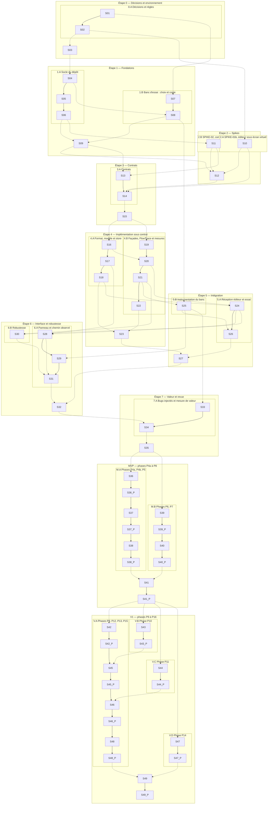

# Suivi de la construction

Liste de progression du mode autonome, et seule source de l'avancement. Une ligne par unité ; elle est cochée seulement à la fusion, sur `main`, par `python3 suivi/outil.py fusionner`. Le détail de chaque unité (ce qu'il faut faire, prompts, sous-étapes à cocher et à signer) est dans sa fiche `suivi/`. Règles : `docs/construction/sequence.md`.

**Tableau de bord.** `suivi/tableau.html` dessine ce fichier : cinq carrés par unité, du rouge au vert, et un carré de fond par piste autonome. Son bouton « Actualiser » relit ce fichier et les branches en direct sur GitHub. Régénération : `python3 suivi/outil.py tableau`.

**Lecture d'une ligne.** `réalise` et `vérifie` : IA 1 (conception), IA 2 (développement), IA 3 (vérification) ; tu choisis quelle IA tient chaque numéro, et il ne change plus. `après` : les unités qui doivent être cochées avant de commencer.

**Pistes autonomes.** Dans chaque section, une piste regroupe des unités qui se font à la suite : chacune attend la précédente. Les pistes d'une même section avancent en même temps, chacune de son côté ; une colonne `après` qui cite une unité d'une autre piste marque un point d'attente. Le rendez-vous de la section attend la fin de ses pistes.

**Accès simultané.** Toutes les IA peuvent lire ce fichier en même temps, sur `origin/main`. Aucune ne le modifie à la main : il ne change que par `fusionner` (ligne cochée), `correction` (porte KO) et l'insertion des tâches d'une phase, toujours sous le verrou de `main` (`verrou/main`), une IA à la fois. Détail : `docs/construction/sequence.md`, §3.

**Contrôle de cohérence** : `python3 suivi/outil.py verifier`.

## Vue d'ensemble

Le MVP et la V1 sont découpés en tâches dès maintenant, d'après `mvp.md`, `v1.md` et le plan directeur (`suivi/plan_phases.py`). Ce découpage est provisoire : au début de chaque phase, son unité de revue le confronte aux résultats du POC et des phases précédentes, et garde, modifie, retire ou ajoute des tâches. Les tâches d'une phase se font entre sa revue et sa porte ; celles qui ne s'attendent pas avancent en même temps.

| Section | Pistes autonomes, qui avancent en même temps | Rendez-vous | Unités |
| --- | --- | --- | --- |
| Étape 0 — Décisions et environnement | **0.A** Décisions et règles : S01 → S02 | S03 | 3 |
| Étape 1 — Fondations | **1.A** Socle du dépôt : S04 → S05 → S06 · **1.B** Banc d'essai : choix et copie : S07 → S08 | S09 | 6 |
| Étape 2 — Spikes | **2.A** SPIKE-01b, éditeur sous écran virtuel : S10 · **2.B** SPIKE-02, compatibilité : S11 | S12 | 3 |
| Étape 3 — Contrats | **3.A** Contrats : S13 → S14 | S15 | 3 |
| Étape 4 — Implémentation sous contrat | **4.A** Format, modèle et store : S16 → S17 → S18 · **4.B** Façades, FlowTrace et mesures : S19 → S20 → S21 → S22 | S23 | 8 |
| Étape 5 — Intégration | **5.A** Réception éditeur et essai : S24 → S26 · **5.B** Instrumentation du banc : S25 | S27 | 4 |
| Étape 6 — Interface et robustesse | **6.A** Panneau et chemin observé : S28 → S29 → S31 · **6.B** Robustesse : S30 | S32 | 5 |
| Étape 7 — Valeur et revue | **7.A** Bugs injectés et mesure de valeur : S33 → S34 | S35 | 3 |
| MVP — phases P4a à P8 | **M.A** Phases P4a, P4b, P5 : S36 → S36.P → S37 → S37.P → S38 → S38.P · **M.B** Phases P6, P7 : S39 → S39.P → S40 → S40.P | S41 → S41.P | 64, dont 52 tâches de phase |
| V1 — phases P9 à P16 | **V.A** Phases P9, P12, P13, P15 : S42 → S42.P → S45 → S45.P → S46 → S46.P → S48 → S48.P · **V.B** Phase P10 : S43 → S43.P · **V.C** Phase P11 : S44 → S44.P · **V.D** Phase P14 : S47 → S47.P | S49 → S49.P | 74, dont 58 tâches de phase |

## Étape 0 — Décisions et environnement

### Piste 0.A · Décisions et règles — démarre tout de suite

- [ ] **S01** · 0.A Dossier de décisions · réalise IA 1 · vérifie IA 3 · après — · fiche `suivi/S01-0A-decisions.md`
- [ ] **S02** · 0.B Squelettes et règles des agents · réalise IA 1 · vérifie IA 3 · après S01 · fiche `suivi/S02-0B-squelettes.md`

### Rendez-vous de l'étape 0 — attend S02

- [ ] **S03** · Porte de l'étape 0 · réalise IA 1 · vérifie IA 3 · après S02 · fiche `suivi/S03-porte-0.md`

## Étape 1 — Fondations

### Piste 1.A · Socle du dépôt — démarre après S03

- [ ] **S04** · T01 Squelette du dépôt et plugin activable · réalise IA 2 · vérifie IA 3 · après S03 · fiche `suivi/S04-T01.md`
- [ ] **S05** · T02 Runner de tests et contrôle de dépendances · réalise IA 2 · vérifie IA 3 · après S04 · fiche `suivi/S05-T02.md`
- [ ] **S06** · T03 Contrôle unique, lint et CI · réalise IA 2 · vérifie IA 1 · après S05 · fiche `suivi/S06-T03.md`

### Piste 1.B · Banc d'essai : choix et copie — démarre après S01

- [ ] **S07** · T04 Sélection du banc d'essai · réalise IA 3 · vérifie IA 1 · après S01 · fiche `suivi/S07-T04-selection.md`
- [ ] **S08** · T04 Préparation du banc d'essai · réalise IA 2 · vérifie IA 3 · après S04, S07 · fiche `suivi/S08-T04-preparation.md`

### Rendez-vous de l'étape 1 — attend S06, S08

- [ ] **S09** · Porte de l'étape 1 · réalise IA 1 · vérifie IA 3 · après S06, S08 · fiche `suivi/S09-porte-1.md`

## Étape 2 — Spikes

### Piste 2.A · SPIKE-01b, éditeur sous écran virtuel — démarre après S02

- [ ] **S10** · T05 SPIKE-01b, partie éditeur, sous écran virtuel · réalise IA 1 · vérifie IA 3 · après S02 · fiche `suivi/S10-T05-spike01b.md`

### Piste 2.B · SPIKE-02, compatibilité — démarre après S06

- [ ] **S11** · T06 SPIKE-02, frontière de compatibilité · réalise IA 1 · vérifie IA 3 · après S06 · fiche `suivi/S11-T06-spike02.md`

### Rendez-vous de l'étape 2 — attend S09, S10, S11

- [ ] **S12** · Porte de l'étape 2 · réalise IA 1 · vérifie IA 3 · après S09, S10, S11 · fiche `suivi/S12-porte-2.md`

## Étape 3 — Contrats

### Piste 3.A · Contrats — démarre après S09, S11

- [ ] **S13** · T07 Contrats C-01, C-02, C-05 · réalise IA 1 · vérifie IA 3 · après S09, S11 · fiche `suivi/S13-T07-contrats.md`
- [ ] **S14** · T08 Contrats C-03, C-04, C-06, C-07 · réalise IA 1 · vérifie IA 3 · après S10, S12, S13 · fiche `suivi/S14-T08-contrats.md`

### Rendez-vous de l'étape 3 — attend S14

- [ ] **S15** · Porte de l'étape 3 et gel des contrats · réalise IA 1 · vérifie IA 3 · après S14 · fiche `suivi/S15-porte-3-gel.md`

## Étape 4 — Implémentation sous contrat

### Piste 4.A · Format, modèle et store — démarre après S15

- [ ] **S16** · T09 Codec et validateur de l'enveloppe · réalise IA 2 · vérifie IA 3 · après S15 · fiche `suivi/S16-T09-codec.md`
- [ ] **S17** · T10 Modèle minimal, graphe déclaré, clés de sonde · réalise IA 2 · vérifie IA 3 · après S16 · fiche `suivi/S17-T10-modele.md`
- [ ] **S18** · T11 Event Store minimal · réalise IA 2 · vérifie IA 3 · après S17 · fiche `suivi/S18-T11-store.md`

### Piste 4.B · Façades, FlowTrace et mesures — démarre après S15

- [ ] **S19** · T12 Façades de compatibilité et profil moteur · réalise IA 2 · vérifie IA 1 · après S15 · fiche `suivi/S19-T12-facades.md`
- [ ] **S20** · T13a FlowTrace, runtime et protocole de session · réalise IA 2 · vérifie IA 1 · après S16, S19 · fiche `suivi/S20-T13a-flowtrace.md`
- [ ] **S21** · T13b Banc sans éditeur et scénarios de coupure · réalise IA 2 · vérifie IA 1 · après S20 · fiche `suivi/S21-T13b-banc.md`
- [ ] **S22** · T13c Mesures de performance (SPIKE-05) · réalise IA 2 · vérifie IA 3 · après S21 · fiche `suivi/S22-T13c-mesures.md`

### Rendez-vous de l'étape 4 — attend S18, S22

- [ ] **S23** · Porte de l'étape 4 · réalise IA 1 · vérifie IA 3 · après S18, S22 · fiche `suivi/S23-porte-4.md`

## Étape 5 — Intégration

### Piste 5.A · Réception éditeur et essai — démarre après S18, S20

- [ ] **S24** · T14 Réception côté éditeur · réalise IA 2 · vérifie IA 3 · après S18, S20 · fiche `suivi/S24-T14-reception.md`
- [ ] **S26** · Essai dans l'éditeur sous écran virtuel (PC5.6) · réalise IA 2 · vérifie IA 1 · après S24, S25 · fiche `suivi/S26-essai-editeur.md`

### Piste 5.B · Instrumentation du banc — démarre après S08, S21

- [ ] **S25** · T15 Instrumentation du banc d'essai · réalise IA 2 · vérifie IA 3 · après S08, S21 · fiche `suivi/S25-T15-instrumentation.md`

### Rendez-vous de l'étape 5 — attend S23, S26

- [ ] **S27** · Porte de l'étape 5 · réalise IA 1 · vérifie IA 3 · après S23, S26 · fiche `suivi/S27-porte-5.md`

## Étape 6 — Interface et robustesse

### Piste 6.A · Panneau et chemin observé — démarre après S17, S24

- [ ] **S28** · T16 Panneau du POC · réalise IA 2 · vérifie IA 3 · après S17, S24 · fiche `suivi/S28-T16-panneau.md`
- [ ] **S29** · T17 Chemin observé et ouverture du code · réalise IA 2 · vérifie IA 3 · après S25, S28 · fiche `suivi/S29-T17-chemin.md`
- [ ] **S31** · Démonstration sous écran virtuel (PC6.7) · réalise IA 2 · vérifie IA 3 · après S28, S29, S30 · fiche `suivi/S31-demonstration.md`

### Piste 6.B · Robustesse — démarre après S21, S24

- [ ] **S30** · T18 Robustesse et cycle de vie · réalise IA 2 · vérifie IA 1 · après S21, S24 · fiche `suivi/S30-T18-robustesse.md`

### Rendez-vous de l'étape 6 — attend S27, S31

- [ ] **S32** · Porte de l'étape 6 · réalise IA 1 · vérifie IA 3 · après S27, S31 · fiche `suivi/S32-porte-6.md`

## Étape 7 — Valeur et revue

### Piste 7.A · Bugs injectés et mesure de valeur — démarre après S25

- [ ] **S33** · T19 Injection de trois bugs · réalise IA 3 · vérifie IA 1 · après S25 · fiche `suivi/S33-T19-injection.md`
- [ ] **S34** · T19 Mesure de valeur par substitution · réalise IA 2 · vérifie IA 3 · après S32, S33 · fiche `suivi/S34-T19-diagnostic.md`

### Rendez-vous de l'étape 7 — attend S34

- [ ] **S35** · T20 Revue de continuation et décision · réalise IA 1 · vérifie IA 3 · après S34 · fiche `suivi/S35-T20-revue.md`

## MVP — phases P4a à P8

### Piste M.A · Phases P4a, P4b, P5 — démarre après S35

- [ ] **S36** · P4a Évaluations : rendu et backend statique : revue du découpage · réalise IA 1 · vérifie IA 3 · après S35 · fiche `suivi/S36-P4a-decoupage.md`
  - Découpage provisoire : 6 tâches, S36.1 à S36.6, revues par S36 au début de la phase (budget de la phase : 6 à 12 h humaines). Une tâche ajoutée par la revue s'insère avec elles.
- [ ] **S36.1** · Étalon des relations attendues sur le banc d'essai · réalise IA 3 · vérifie IA 1 · après S36 · fiche `suivi/S36.1-etalon-relations.md`
- [ ] **S36.2** · SPIKE-03, rendu du graphe : GraphEdit, canevas ou hybride · réalise IA 1 · vérifie IA 3 · après S36 · fiche `suivi/S36.2-spike03-rendu.md`
- [ ] **S36.3** · SPIKE-04, extraction maison des relations d'appel · réalise IA 2 · vérifie IA 1 · après S36.1 · fiche `suivi/S36.3-spike04-maison.md`
- [ ] **S36.4** · SPIKE-04, évaluation de GDScript AST Flow · réalise IA 1 · vérifie IA 3 · après S36.1 · fiche `suivi/S36.4-spike04-astflow.md`
- [ ] **S36.5** · Décisions de rendu et de backend statique · réalise IA 1 · vérifie IA 3 · après S36.2, S36.3, S36.4 · fiche `suivi/S36.5-decisions-p4a.md`
- [ ] **S36.6** · Outils de contrat par convention : un dossier par format, un fichier par contrat · réalise IA 2 · vérifie IA 1 · après S36 · fiche `suivi/S36.6-outils-contrat.md`
- [ ] **S36.P** · Porte de P4a · réalise IA 1 · vérifie IA 3 · après S36, S36.* · fiche `suivi/S36.P-P4a-porte.md`
- [ ] **S37** · P4b Backend statique et inventaire (CAP-08, CAP-09) : revue du découpage · réalise IA 1 · vérifie IA 3 · après S36.P · fiche `suivi/S37-P4b-decoupage.md`
  - Découpage provisoire : 11 tâches, S37.1 à S37.11, revues par S37 au début de la phase (budget de la phase : 8 à 14 h humaines). Une tâche ajoutée par la revue s'insère avec elles.
- [ ] **S37.1** · Contrat C-08 : inventaire du projet et relations d'appel · réalise IA 1 · vérifie IA 3 · après S37 · fiche `suivi/S37.1-contrat-c08.md`
- [ ] **S37.2** · Façades d'introspection et de syntaxe · réalise IA 2 · vérifie IA 1 · après S37 · fiche `suivi/S37.2-facades-introspection-syntaxe.md`
- [ ] **S37.3** · Fixtures de syntaxe GDScript et relations attendues · réalise IA 3 · vérifie IA 2 · après S37.1 · fiche `suivi/S37.3-fixtures-syntaxe.md`
- [ ] **S37.4** · Lexeur GDScript · réalise IA 2 · vérifie IA 3 · après S37.2, S37.3 · fiche `suivi/S37.4-lexeur-gdscript.md`
- [ ] **S37.5** · Extraction des déclarations et de leurs ancrages · réalise IA 2 · vérifie IA 3 · après S37.4 · fiche `suivi/S37.5-declarations.md`
- [ ] **S37.6** · Extraction des relations d'appel et de signal · réalise IA 2 · vérifie IA 3 · après S37.5 · fiche `suivi/S37.6-relations-appel.md`
- [ ] **S37.7** · Inventaire du projet sans instanciation · réalise IA 2 · vérifie IA 3 · après S37.2, S37.6 · fiche `suivi/S37.7-inventaire.md`
- [ ] **S37.8** · Résolution entre scripts et fusion avec le graphe déclaré · réalise IA 2 · vérifie IA 1 · après S37.7 · fiche `suivi/S37.8-resolution-provenance.md`
- [ ] **S37.9** · Cache d'index par révision de fichier · réalise IA 2 · vérifie IA 3 · après S37.7 · fiche `suivi/S37.9-cache-index.md`
- [ ] **S37.10** · Grand projet de mesure : 300 scripts ou plus · réalise IA 3 · vérifie IA 1 · après S37 · fiche `suivi/S37.10-grand-projet.md`
- [ ] **S37.11** · Tests de référence sur le banc d'essai et contrôle CI · réalise IA 3 · vérifie IA 2 · après S37.8, S37.9, S37.10 · fiche `suivi/S37.11-golden-banc.md`
- [ ] **S37.P** · Porte de P4b · réalise IA 1 · vérifie IA 3 · après S37, S37.* · fiche `suivi/S37.P-P4b-porte.md`
- [ ] **S38** · P5 Navigation et arborescence res:// (CAP-10) : revue du découpage · réalise IA 1 · vérifie IA 3 · après S37.P · fiche `suivi/S38-P5-decoupage.md`
  - Découpage provisoire : 9 tâches, S38.1 à S38.9, revues par S38 au début de la phase (budget de la phase : 8 à 13 h humaines). Une tâche ajoutée par la revue s'insère avec elles.
- [ ] **S38.1** · Contrat C-09 : requêtes de navigation · réalise IA 1 · vérifie IA 3 · après S38 · fiche `suivi/S38.1-contrat-c09.md`
- [ ] **S38.2** · Index de recherche des définitions · réalise IA 2 · vérifie IA 3 · après S38.1 · fiche `suivi/S38.2-index-recherche.md`
- [ ] **S38.3** · Appelants et appelés, expansion bornée · réalise IA 2 · vérifie IA 3 · après S38.1 · fiche `suivi/S38.3-appelants-appeles.md`
- [ ] **S38.4** · Arborescence res:// et correspondance fichier ↔ éléments · réalise IA 2 · vérifie IA 3 · après S38.1 · fiche `suivi/S38.4-arborescence-res.md`
- [ ] **S38.5** · Vue de graphe bornée, selon SPIKE-03 · réalise IA 2 · vérifie IA 3 · après S38.3 · fiche `suivi/S38.5-vue-graphe.md`
- [ ] **S38.6** · Onglet de navigation : recherche, appelants, res:// · réalise IA 2 · vérifie IA 3 · après S38.2, S38.4, S38.5, S39.12 · fiche `suivi/S38.6-panneau-navigation.md`
- [ ] **S38.7** · Requêtes de navigation en ligne de commande · réalise IA 2 · vérifie IA 3 · après S38.2, S38.3, S38.4 · fiche `suivi/S38.7-requetes-cli.md`
- [ ] **S38.8** · Essai de navigation sous écran virtuel (J2 et J3) · réalise IA 3 · vérifie IA 2 · après S38.6 · fiche `suivi/S38.8-essai-navigation.md`
- [ ] **S38.9** · Test de cartographie par substitution · réalise IA 3 · vérifie IA 1 · après S38.7, S38.8 · fiche `suivi/S38.9-cartographie-substitution.md`
- [ ] **S38.P** · Porte de P5 · réalise IA 1 · vérifie IA 3 · après S38, S38.* · fiche `suivi/S38.P-P5-porte.md`

### Piste M.B · Phases P6, P7 — démarre après S35

- [ ] **S39** · P6 Historique, persistance, protocole MVP (CAP-11, CAP-07 complet) : revue du découpage · réalise IA 1 · vérifie IA 3 · après S35 · fiche `suivi/S39-P6-decoupage.md`
  - Découpage provisoire : 12 tâches, S39.1 à S39.12, revues par S39 au début de la phase (budget de la phase : 10 à 16 h humaines). Une tâche ajoutée par la revue s'insère avec elles.
- [ ] **S39.1** · Révision des contrats C-04, C-06 et C-07 en version 2 · réalise IA 1 · vérifie IA 3 · après S39, S36.6 · fiche `suivi/S39.1-contrats-c04-c06-v2.md`
- [ ] **S39.2** · Contrat C-10 : format de session persistée · réalise IA 1 · vérifie IA 3 · après S39, S36.6 · fiche `suivi/S39.2-contrat-c10-session.md`
- [ ] **S39.3** · Codec de l'enveloppe v2, lecture de la v1 · réalise IA 2 · vérifie IA 1 · après S39.1 · fiche `suivi/S39.3-codec-v2.md`
- [ ] **S39.4** · FlowTrace v2 : capacités, frames, ticks, nouveaux événements · réalise IA 2 · vérifie IA 1 · après S39.3 · fiche `suivi/S39.4-flowtrace-v2.md`
- [ ] **S39.5** · Connexion tardive et reconnexion, côté jeu · réalise IA 2 · vérifie IA 1 · après S39.4 · fiche `suivi/S39.5-connexion-tardive-jeu.md`
- [ ] **S39.6** · Réception v2 côté éditeur · réalise IA 2 · vérifie IA 1 · après S39.3, S39.7 · fiche `suivi/S39.6-reception-v2.md`
- [ ] **S39.7** · Event Store v2 : lacunes explicites, doublons, frames · réalise IA 2 · vérifie IA 3 · après S39.1 · fiche `suivi/S39.7-store-v2.md`
- [ ] **S39.8** · Sauvegarde atomique et rechargement des sessions · réalise IA 2 · vérifie IA 1 · après S39.2, S39.7, S37.2 · fiche `suivi/S39.8-persistance-session.md`
- [ ] **S39.9** · Relecture d'une session sans le jeu · réalise IA 2 · vérifie IA 3 · après S39.6, S39.8, S39.12 · fiche `suivi/S39.9-relecture.md`
- [ ] **S39.10** · Banc de reconnexion sans éditeur · réalise IA 3 · vérifie IA 1 · après S39.5, S39.6 · fiche `suivi/S39.10-banc-reconnexion.md`
- [ ] **S39.11** · Export d'une fenêtre de session · réalise IA 2 · vérifie IA 3 · après S39.8 · fiche `suivi/S39.11-export-session.md`
- [ ] **S39.12** · Panneau principal à onglets découverts et capture d'un onglet · réalise IA 2 · vérifie IA 3 · après S39 · fiche `suivi/S39.12-panneau-onglets.md`
- [ ] **S39.P** · Porte de P6 · réalise IA 1 · vérifie IA 3 · après S39, S39.* · fiche `suivi/S39.P-P6-porte.md`
- [ ] **S40** · P7 Logique et Game Flow annoté (CAP-12 annoté) : revue du découpage · réalise IA 1 · vérifie IA 3 · après S39.P · fiche `suivi/S40-P7-decoupage.md`
  - Découpage provisoire : 7 tâches, S40.1 à S40.7, revues par S40 au début de la phase (budget de la phase : 5 à 9 h humaines). Une tâche ajoutée par la revue s'insère avec elles.
- [ ] **S40.1** · Contrat C-11 : blocs temporels déclarés · réalise IA 1 · vérifie IA 3 · après S40 · fiche `suivi/S40.1-contrat-c11-blocs.md`
- [ ] **S40.2** · FlowTrace : déclaration des blocs · réalise IA 2 · vérifie IA 1 · après S40.1 · fiche `suivi/S40.2-flowtrace-blocs.md`
- [ ] **S40.3** · Projection des blocs et de leurs occurrences · réalise IA 2 · vérifie IA 3 · après S40.1 · fiche `suivi/S40.3-projection-blocs.md`
- [ ] **S40.4** · Projection logique : décisions et états · réalise IA 2 · vérifie IA 3 · après S40 · fiche `suivi/S40.4-projection-logique.md`
- [ ] **S40.5** · Vues Game Flow annoté et Logique · réalise IA 2 · vérifie IA 3 · après S40.3, S40.4, S40.7 · fiche `suivi/S40.5-vues-gameflow-logique.md`
- [ ] **S40.6** · Blocs déclarés dans le banc d'essai · réalise IA 3 · vérifie IA 2 · après S40.2, S40.3, S40.7 · fiche `suivi/S40.6-blocs-banc.md`
- [ ] **S40.7** · Chargeur du graphe déclaré .flow.json en version 2 · réalise IA 2 · vérifie IA 3 · après S40.1 · fiche `suivi/S40.7-chargeur-flow-v2.md`
- [ ] **S40.P** · Porte de P7 · réalise IA 1 · vérifie IA 3 · après S40, S40.* · fiche `suivi/S40.P-P7-porte.md`

### Rendez-vous du MVP — attend S38.P, S40.P

- [ ] **S41** · P8 Compatibilité MVP et stabilisation (CAP-13) : revue du découpage · réalise IA 1 · vérifie IA 3 · après S38.P, S40.P · fiche `suivi/S41-P8-decoupage.md`
  - Découpage provisoire : 7 tâches, S41.1 à S41.7, revues par S41 au début de la phase (budget de la phase : 6 à 10 h humaines). Une tâche ajoutée par la revue s'insère avec elles.
- [ ] **S41.1** · Matrice de compatibilité générée par la CI · réalise IA 2 · vérifie IA 1 · après S41 · fiche `suivi/S41.1-matrice-compat.md`
- [ ] **S41.2** · Bascule vers Godot 4.8 stable · réalise IA 1 · vérifie IA 3 · après S41.1, S41.3 · fiche `suivi/S41.2-bascule-48.md`
- [ ] **S41.3** · Tri des échecs de la préversion · réalise IA 2 · vérifie IA 1 · après S41 · fiche `suivi/S41.3-tri-preversion.md`
- [ ] **S41.4** · Outil de désinstallation de l'instrumentation · réalise IA 2 · vérifie IA 3 · après S41 · fiche `suivi/S41.4-desinstallation-instrumentation.md`
- [ ] **S41.5** · Installation et désinstallation propres du plugin · réalise IA 3 · vérifie IA 2 · après S41.4 · fiche `suivi/S41.5-installation-propre.md`
- [ ] **S41.6** · Mesures du MVP et dette · réalise IA 1 · vérifie IA 3 · après S41.1, S41.3 · fiche `suivi/S41.6-mesures-mvp.md`
- [ ] **S41.7** · Démonstration du MVP sous écran virtuel · réalise IA 2 · vérifie IA 3 · après S41.5 · fiche `suivi/S41.7-demo-mvp.md`
- [ ] **S41.P** · Porte de P8 et porte du MVP · réalise IA 1 · vérifie IA 3 · après S41, S41.* · fiche `suivi/S41.P-P8-porte.md`

## V1 — phases P9 à P16

### Piste V.A · Phases P9, P12, P13, P15 — démarre après S41.P

- [ ] **S42** · P9 Timeline du Game Flow : revue du découpage · réalise IA 1 · vérifie IA 3 · après S41.P · fiche `suivi/S42-P9-decoupage.md`
  - Découpage provisoire : 7 tâches, S42.1 à S42.7, revues par S42 au début de la phase (budget de la phase : 8 à 12 h humaines). Une tâche ajoutée par la revue s'insère avec elles.
- [ ] **S42.1** · Contrat C-12 : timeline et corrélation à travers await · réalise IA 1 · vérifie IA 3 · après S42 · fiche `suivi/S42.1-contrat-c12-timeline.md`
- [ ] **S42.2** · Fixtures d'occurrences entrelacées · réalise IA 3 · vérifie IA 2 · après S42.1 · fiche `suivi/S42.2-fixtures-timeline.md`
- [ ] **S42.3** · Projection timeline · réalise IA 2 · vérifie IA 3 · après S42.2 · fiche `suivi/S42.3-projection-timeline.md`
- [ ] **S42.4** · Regroupement par niveau et zoom sémantique · réalise IA 2 · vérifie IA 3 · après S42.3 · fiche `suivi/S42.4-zoom-semantique.md`
- [ ] **S42.5** · Vue timeline · réalise IA 2 · vérifie IA 3 · après S42.4 · fiche `suivi/S42.5-vue-timeline.md`
- [ ] **S42.6** · Corrélation à travers await, côté jeu et côté éditeur · réalise IA 2 · vérifie IA 1 · après S42.1 · fiche `suivi/S42.6-await-runtime.md`
- [ ] **S42.7** · Essai de la timeline sur le banc d'essai · réalise IA 3 · vérifie IA 2 · après S42.5, S42.6 · fiche `suivi/S42.7-essai-timeline.md`
- [ ] **S42.P** · Porte de P9 · réalise IA 1 · vérifie IA 3 · après S42, S42.* · fiche `suivi/S42.P-P9-porte.md`
- [ ] **S45** · P12 Attendu contre observé : revue du découpage · réalise IA 1 · vérifie IA 3 · après S42.P, S43.P · fiche `suivi/S45-P12-decoupage.md`
  - Découpage provisoire : 7 tâches, S45.1 à S45.7, revues par S45 au début de la phase (budget de la phase : 10 à 16 h humaines). Une tâche ajoutée par la revue s'insère avec elles.
- [ ] **S45.1** · Contrat C-15 : attentes et première divergence · réalise IA 1 · vérifie IA 3 · après S45 · fiche `suivi/S45.1-contrat-c15-attentes.md`
- [ ] **S45.2** · Lecture et écriture des attentes · réalise IA 2 · vérifie IA 1 · après S45.1 · fiche `suivi/S45.2-persistance-attentes.md`
- [ ] **S45.3** · Session de référence · réalise IA 2 · vérifie IA 3 · après S45.2 · fiche `suivi/S45.3-session-reference.md`
- [ ] **S45.4** · Alignement des étapes attendues et observées · réalise IA 2 · vérifie IA 3 · après S45.1 · fiche `suivi/S45.4-alignement.md`
- [ ] **S45.5** · Première divergence connue · réalise IA 2 · vérifie IA 3 · après S45.3, S45.4 · fiche `suivi/S45.5-premiere-divergence.md`
- [ ] **S45.6** · Vue Attendu contre observé · réalise IA 2 · vérifie IA 3 · après S45.5 · fiche `suivi/S45.6-vue-attendu.md`
- [ ] **S45.7** · Sessions de référence et fautive du banc d'essai · réalise IA 3 · vérifie IA 2 · après S45.5 · fiche `suivi/S45.7-attendu-banc.md`
- [ ] **S45.P** · Porte de P12 · réalise IA 1 · vérifie IA 3 · après S45, S45.* · fiche `suivi/S45.P-P12-porte.md`
- [ ] **S46** · P13 Diagnostic, Explain, Tune : revue du découpage · réalise IA 1 · vérifie IA 3 · après S44.P, S45.P · fiche `suivi/S46-P13-decoupage.md`
  - Découpage provisoire : 8 tâches, S46.1 à S46.8, revues par S46 au début de la phase (budget de la phase : 14 à 22 h humaines). Une tâche ajoutée par la revue s'insère avec elles.
- [ ] **S46.1** · Contrat C-16 : explication, suggestions, points d'intervention · réalise IA 1 · vérifie IA 3 · après S46 · fiche `suivi/S46.1-contrat-c16-explain.md`
- [ ] **S46.2** · Points d'intervention et portée · réalise IA 2 · vérifie IA 3 · après S46.1 · fiche `suivi/S46.2-points-intervention.md`
- [ ] **S46.3** · Explications fondées sur les preuves · réalise IA 2 · vérifie IA 1 · après S46.1 · fiche `suivi/S46.3-explications.md`
- [ ] **S46.4** · Vérifications suggérées · réalise IA 2 · vérifie IA 3 · après S46.1 · fiche `suivi/S46.4-verifications-suggerees.md`
- [ ] **S46.5** · Annotations et validation humaine · réalise IA 2 · vérifie IA 1 · après S46.1 · fiche `suivi/S46.5-annotations.md`
- [ ] **S46.6** · Vue Explain et Tune · réalise IA 2 · vérifie IA 3 · après S46.2, S46.3, S46.4, S46.5 · fiche `suivi/S46.6-vue-explain-tune.md`
- [ ] **S46.7** · Nouveaux bugs injectés à l'aveugle · réalise IA 3 · vérifie IA 1 · après S46 · fiche `suivi/S46.7-bugs-v1.md`
- [ ] **S46.8** · Mesure du diagnostic assisté, par substitution · réalise IA 2 · vérifie IA 1 · après S46.6, S46.7 · fiche `suivi/S46.8-mesure-diagnostic-v1.md`
- [ ] **S46.P** · Porte de P13 · réalise IA 1 · vérifie IA 3 · après S46, S46.* · fiche `suivi/S46.P-P13-porte.md`
- [ ] **S48** · P15 AI Snapshot : revue du découpage · réalise IA 1 · vérifie IA 3 · après S46.P · fiche `suivi/S48-P15-decoupage.md`
  - Découpage provisoire : 5 tâches, S48.1 à S48.5, revues par S48 au début de la phase (budget de la phase : 5 à 8 h humaines). Une tâche ajoutée par la revue s'insère avec elles.
- [ ] **S48.1** · Contrat C-17 : AI Snapshot · réalise IA 1 · vérifie IA 3 · après S48 · fiche `suivi/S48.1-contrat-c17-snapshot.md`
- [ ] **S48.2** · Export JSON : choix des champs et exclusions · réalise IA 2 · vérifie IA 1 · après S48.1 · fiche `suivi/S48.2-export-json.md`
- [ ] **S48.3** · Image PNG cohérente avec le JSON · réalise IA 2 · vérifie IA 3 · après S48.2 · fiche `suivi/S48.3-export-png.md`
- [ ] **S48.4** · Aperçu avant partage · réalise IA 2 · vérifie IA 3 · après S48.2 · fiche `suivi/S48.4-apercu.md`
- [ ] **S48.5** · Essai de l'export sur des diagnostics réels · réalise IA 3 · vérifie IA 1 · après S48.3, S48.4 · fiche `suivi/S48.5-snapshot-essai-ia.md`
- [ ] **S48.P** · Porte de P15 · réalise IA 1 · vérifie IA 3 · après S48, S48.* · fiche `suivi/S48.P-P15-porte.md`

### Piste V.B · Phase P10 — démarre après S41.P

- [ ] **S43** · P10 Instances et comparaison : revue du découpage · réalise IA 1 · vérifie IA 3 · après S41.P · fiche `suivi/S43-P10-decoupage.md`
  - Découpage provisoire : 6 tâches, S43.1 à S43.6, revues par S43 au début de la phase (budget de la phase : 8 à 12 h humaines). Une tâche ajoutée par la revue s'insère avec elles.
- [ ] **S43.1** · Affirmations et preuves : socle commun de la V1 · réalise IA 1 · vérifie IA 3 · après S43 · fiche `suivi/S43.1-affirmations-preuves.md`
- [ ] **S43.2** · Contrat C-13 : comparaison d'instances · réalise IA 1 · vérifie IA 3 · après S43 · fiche `suivi/S43.2-contrat-c13-comparaison.md`
- [ ] **S43.3** · Couverture et fenêtres d'observation · réalise IA 2 · vérifie IA 3 · après S43.2 · fiche `suivi/S43.3-couverture.md`
- [ ] **S43.4** · Projection de comparaison d'instances · réalise IA 2 · vérifie IA 3 · après S43.1, S43.3 · fiche `suivi/S43.4-projection-comparaison.md`
- [ ] **S43.5** · Vue de comparaison · réalise IA 2 · vérifie IA 3 · après S43.4 · fiche `suivi/S43.5-vue-comparaison.md`
- [ ] **S43.6** · Deux ennemis du banc d'essai comparés · réalise IA 3 · vérifie IA 2 · après S43.4 · fiche `suivi/S43.6-comparaison-banc.md`
- [ ] **S43.P** · Porte de P10 · réalise IA 1 · vérifie IA 3 · après S43, S43.* · fiche `suivi/S43.P-P10-porte.md`

### Piste V.C · Phase P11 — démarre après S41.P

- [ ] **S44** · P11 Data Flow : origine et usages d'un paramètre : revue du découpage · réalise IA 1 · vérifie IA 3 · après S41.P · fiche `suivi/S44-P11-decoupage.md`
  - Découpage provisoire : 9 tâches, S44.1 à S44.9, revues par S44 au début de la phase (budget de la phase : 12 à 20 h humaines). Une tâche ajoutée par la revue s'insère avec elles.
- [ ] **S44.1** · Contrat C-14 : origine et usages d'un paramètre · réalise IA 1 · vérifie IA 3 · après S44, S42.1 · fiche `suivi/S44.1-contrat-c14-parametres.md`
- [ ] **S44.2** · Déclarations de paramètres et valeurs par défaut · réalise IA 2 · vérifie IA 3 · après S44.1 · fiche `suivi/S44.2-declarations-parametres.md`
- [ ] **S44.3** · Valeurs des ressources .tres et .res · réalise IA 2 · vérifie IA 1 · après S44.1 · fiche `suivi/S44.3-valeurs-ressources.md`
- [ ] **S44.4** · Surcharges de paramètres dans les scènes · réalise IA 2 · vérifie IA 3 · après S44.1 · fiche `suivi/S44.4-surcharges-scenes.md`
- [ ] **S44.5** · Lecteurs et écrivains statiques d'un paramètre · réalise IA 2 · vérifie IA 3 · après S44.2 · fiche `suivi/S44.5-lecteurs-ecrivains.md`
- [ ] **S44.6** · Valeur observée : écritures instrumentées · réalise IA 2 · vérifie IA 1 · après S44.1, S42.6 · fiche `suivi/S44.6-valeur-observee.md`
- [ ] **S44.7** · Projection de l'origine d'un paramètre · réalise IA 2 · vérifie IA 3 · après S44.3, S44.4, S44.5, S44.6 · fiche `suivi/S44.7-projection-origine.md`
- [ ] **S44.8** · Vue Data Flow (parcours J4) · réalise IA 2 · vérifie IA 3 · après S44.7 · fiche `suivi/S44.8-vue-data-flow.md`
- [ ] **S44.9** · Paramètre du banc d'essai suivi de bout en bout · réalise IA 3 · vérifie IA 2 · après S44.7 · fiche `suivi/S44.9-parametre-banc.md`
- [ ] **S44.P** · Porte de P11 · réalise IA 1 · vérifie IA 3 · après S44, S44.* · fiche `suivi/S44.P-P11-porte.md`

### Piste V.D · Phase P14 — démarre après S41.P

- [ ] **S47** · P14 Performance corrélée : revue du découpage · réalise IA 1 · vérifie IA 3 · après S41.P · fiche `suivi/S47-P14-decoupage.md`
  - Découpage provisoire : 6 tâches, S47.1 à S47.6, revues par S47 au début de la phase (budget de la phase : 6 à 10 h humaines). Une tâche ajoutée par la revue s'insère avec elles.
- [ ] **S47.1** · Contrat : événement metric et coût de capture · réalise IA 1 · vérifie IA 3 · après S47, S44.1 · fiche `suivi/S47.1-contrat-metric.md`
- [ ] **S47.2** · Échantillonneur de moniteurs, côté jeu · réalise IA 2 · vérifie IA 1 · après S47.1, S44.6, S44.3 · fiche `suivi/S47.2-echantillonneur.md`
- [ ] **S47.3** · Coût de capture avec et sans collecte · réalise IA 2 · vérifie IA 3 · après S47.2 · fiche `suivi/S47.3-cout-capture.md`
- [ ] **S47.4** · Projection de corrélation performance ↔ événements · réalise IA 2 · vérifie IA 3 · après S47.1 · fiche `suivi/S47.4-projection-perf.md`
- [ ] **S47.5** · Vue performance · réalise IA 2 · vérifie IA 3 · après S47.3, S47.4 · fiche `suivi/S47.5-vue-perf.md`
- [ ] **S47.6** · Pic de frame corrélé sur le banc d'essai · réalise IA 3 · vérifie IA 2 · après S47.3, S47.4 · fiche `suivi/S47.6-pic-banc.md`
- [ ] **S47.P** · Porte de P14 · réalise IA 1 · vérifie IA 3 · après S47, S47.* · fiche `suivi/S47.P-P14-porte.md`

### Rendez-vous de la V1 — attend S47.P, S48.P

- [ ] **S49** · P16 Durcissement et documentation : revue du découpage · réalise IA 1 · vérifie IA 3 · après S47.P, S48.P · fiche `suivi/S49-P16-decoupage.md`
  - Découpage provisoire : 10 tâches, S49.1 à S49.10, revues par S49 au début de la phase (budget de la phase : 12 à 20 h humaines). Une tâche ajoutée par la revue s'insère avec elles.
- [ ] **S49.1** · Deux versions stables dans la CI · réalise IA 2 · vérifie IA 1 · après S49 · fiche `suivi/S49.1-deux-stables.md`
- [ ] **S49.2** · Traitement de la dette · réalise IA 1 · vérifie IA 3 · après S49 · fiche `suivi/S49.2-dette.md`
- [ ] **S49.3** · Documentation : installation et premiers pas · réalise IA 3 · vérifie IA 2 · après S49 · fiche `suivi/S49.3-doc-installation.md`
- [ ] **S49.4** · Documentation des modes · réalise IA 3 · vérifie IA 2 · après S49.3 · fiche `suivi/S49.4-doc-modes.md`
- [ ] **S49.5** · Guide d'instrumentation · réalise IA 3 · vérifie IA 2 · après S49.3 · fiche `suivi/S49.5-doc-instrumentation.md`
- [ ] **S49.6** · Installation à froid par la documentation seule · réalise IA 1 · vérifie IA 2 · après S49.4, S49.5, S49.8, S49.9 · fiche `suivi/S49.6-installation-froid.md`
- [ ] **S49.7** · Démonstrations de CAP-12 à CAP-18 rejouées · réalise IA 2 · vérifie IA 3 · après S49.1 · fiche `suivi/S49.7-demos-v1.md`
- [ ] **S49.8** · Installation et désinstallation propres de la V1 · réalise IA 3 · vérifie IA 2 · après S49.3, S49.7 · fiche `suivi/S49.8-desinstallation-v1.md`
- [ ] **S49.9** · Mesures finales et limites · réalise IA 1 · vérifie IA 3 · après S49.7 · fiche `suivi/S49.9-mesures-v1.md`
- [ ] **S49.10** · Dossier de décision : licence et diffusion · réalise IA 1 · vérifie IA 3 · après S49 · fiche `suivi/S49.10-dossier-licence.md`
- [ ] **S49.P** · Porte de P16 et porte de la V1 · réalise IA 1 · vérifie IA 3 · après S49, S49.* · fiche `suivi/S49.P-P16-porte.md`

## Recette finale, pour toi

- [ ] Décisions « adoptées par défaut » de `docs/DECISIONS.md` confirmées ou changées
- [ ] Mesures sur ta machine avec GPU : débit de SPIKE-01b, latence PC6.7, désactivation du plugin pendant une vraie collecte, jugement visuel
- [ ] Mesure de valeur humaine (T19 du guide), comparée à la mesure par substitution
- [ ] Test de cartographie du MVP, chronométré avec et sans l'outil
- [ ] Installation à froid en suivant la documentation, puis désinstallation
- [ ] Licence (D-06) et décision de diffusion
- [ ] Carte des scripts superposée au jeu (maquette) : entrée au plan ou non
- [ ] Éléments ajoutés pendant la construction à la liste de recette de `PROJECT_STATE.md`
