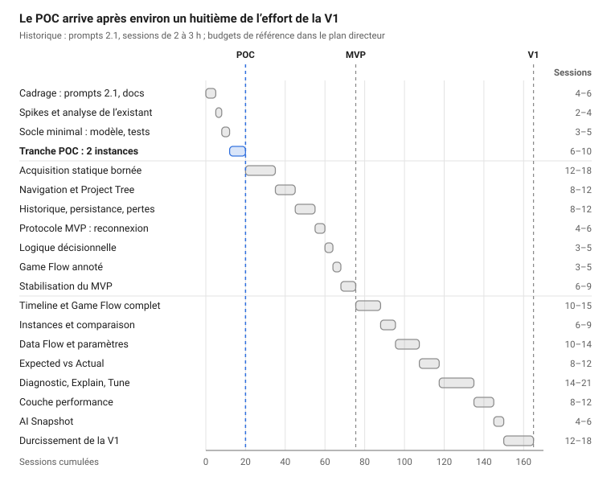

# Estimation — Godot Visual Program & Execution Explorer

7 octobre 2026

Projet pertinent et faisable, mais réaliste seulement en version instrumentée, livrée par paliers. La cartographie entièrement automatique de n'importe quel projet Godot n'est pas atteignable de façon fiable.

Avec les prompts 2.1, comptez 15 à 25 sessions pour le POC, 60 à 90 pour le MVP et 130 à 200 pour une V1. À 2,5 h par session en moyenne, le MVP représente 150 à 225 h de travail effectif. C'est 4,5 à 7 mois à 3 sessions par semaine, ou 1,5 à 2 mois à plein temps.

En mode agent, avec Claude Code, Opus 5.5 et des tests automatiques, votre temps baisse d'environ 40 %. Le MVP demande alors 80 à 130 h de votre temps, la V1 175 à 260 h.

La couche de compatibilité avec les versions de Godot, ajoutée avec les prompts 2.2, porte ces fourchettes à 17–28 sessions pour le POC, 63–98 pour le MVP et 138–211 pour la V1 ; le plan directeur les détaille par phase.

## Pertinence

Pertinence élevée : le besoin est réel et l'intégration visée n'existe pas, mais l'analyse statique seule n'est plus un différenciateur.

Plusieurs outils récents couvrent chacun une facette du projet :

| Outil | Ce qu'il couvre | Ce qu'il ne couvre pas |
| --- | --- | --- |
| [GDScript AST Flow](https://store.godotengine.org/asset/star-weaver/gdscript-ast/) (MIT, v2.4.0, août 2026) | Parseur GDScript écrit en GDScript, graphe d'appels, flux de signaux, chaînes def-use, export JSON destiné aux IA | Exécution réelle, temporalité, instances ; Godot 4.7.x uniquement |
| [Script Dependency Inspector](https://store.godotengine.org/asset/illia-ananich/class-tree/) (MIT, v0.4.0) | Dépendances statiques validées, navigation vers la source, export JSON, Mermaid et PlantUML | Alias, dispatch virtuel, réflexion, chemins dynamiques : limites déclarées par l'auteur |
| [Signal Lens](https://github.com/yannlemos/signal-lens) (MIT) | Graphe des connexions et des émissions de signaux en direct, dans un onglet du débogueur | Tout ce qui n'est pas un signal |
| [LimboAI](https://limboai.readthedocs.io/en/latest/behavior-trees/create-tree.html) | Débogueur visuel des arbres de comportement actifs dans le jeu en cours | Le code hors arbres de comportement |

Aucun ne relie structure, logique, Game Flow temporel et instances runtime sur une même carte. C'est le vrai différenciateur, et il reste entier.

Ces outils réduisent aussi le risque technique. Ils prouvent que le canal du débogueur supporte une visualisation en direct, et qu'un parseur GDScript réutilisable existe. Le reprendre comme backend statique économiserait 6 à 10 sessions, au prix d'une dépendance à un mainteneur unique.

La valeur se concentre dans les questions ciblées : qui appelle ceci, quelle branche a été prise, pourquoi le Goblin #17 diffère. Une carte globale exhaustive devient illisible au-delà de quelques centaines de nœuds visibles.

Les deux prompts sont pertinents comme cadrage : spec et méthode séparées, contrats d'abord, vertical slices, garde-fous anti-hallucination. Script Dependency Inspector a d'ailleurs été construit avec une démarche IA très proche. Leur version initiale était surdimensionnée pour une personne seule, avec 74 sections ; la révision 2.1 tient en 14 sections chacun, avec budget et critère d'arrêt.

## Faisabilité par composant

Le noyau instrumenté est faisable en GDScript pur. Tout ce qui repose sur l'automatique (appels dynamiques, décisions, data flow, instrumentation) ne l'est que partiellement.

| Composant | Faisabilité | Difficulté | Fiable / non fiable | Horizon |
| --- | --- | --- | --- | --- |
| Modèle central : FlowModel, nœuds, arêtes, index, JSON versionné | Élevée | Moyenne | Pur GDScript, testable sans éditeur. Risque principal : sur-concevoir le modèle avant la première slice. | MVP |
| Structure statique : scripts, classes, fonctions, signaux, héritage, scènes, ressources, autoloads | Élevée | Moyenne | Fiable via la réflexion des scripts et l'état des scènes. Connexions de signaux des scènes : fiables ; celles faites par code : heuristiques. | MVP |
| Appels entre fonctions et scripts (statique) | Moyenne | Élevée | Fiable pour les appels directs typés ou via class_name. Non fiable pour duck typing, call(), Callable, groupes, get_node par chemin : chaque arête porte provenance et confiance. | MVP |
| Décisions déclarées ou instrumentées (if, match, états) | Élevée | Faible | FlowTracer.condition() ou déclaration dans le .flow.json : fiable, mais demande un effort manuel par décision. | MVP |
| Décisions extraites automatiquement du code | Moyenne | Élevée | Envisageable via un AST tiers ; robustesse sur du code réel inconnue, à mesurer en spike. | ADVANCED |
| Data flow et paramètres : défini, runtime, modifié par | Moyenne | Élevée | Définition et lectures directes : fiable. Valeur runtime et « modifié par » : seulement instrumenté ou échantillonné. Propagation complète : non fiable. | V1 |
| Traçage runtime instrumenté : FlowTracer, ring buffer, lots, pont débogueur | Élevée | Moyenne | Canal éprouvé par Signal Lens et LimboAI. Le débit est le vrai risque : envoyer par lots, jamais un message par événement. | MVP |
| Instrumentation automatique, sans toucher au code | Faible | Très élevée | Pas de point d'accroche générique d'entrée et sortie de fonction pour un plugin GDScript, à confirmer en spike. Pistes : réécriture des sources en copie, GDExtension. | EXPERIMENTAL |
| Illumination runtime et sélection d'instance | Élevée | Moyenne | Rafraîchir l'UI à 10–30 Hz au plus. L'identifiant d'instance change à chaque exécution : prévoir un libellé stable (ordre d'apparition, chemin de nœud). | MVP |
| Rendu du graphe avec GraphEdit | Moyenne | Élevée | Correct pour quelques centaines de nœuds visibles, seuil exact à mesurer. Au-delà : agrégation par niveau de zoom ou canevas dessiné maison. | MVP |
| Timeline, lanes et blocs temporels | Élevée | Moyenne | Dessin 2D personnalisé classique. Blocs déclarés ou instrumentés : fiables. Blocs inférés : non fiables. | MVP |
| Threads et execution lanes | Moyenne | Moyenne | Le thread appelant est identifiable ; l'ordonnancement réel ne l'est pas. Lanes logiques déclarées, pas un profileur système. | V1 |
| Project Tree synchronisé | Élevée | Faible | Ouvrir un script à la ligne et sélectionner un fichier : API éditeur disponibles. Suivre la sélection du dock Système de fichiers : à vérifier. | MVP |
| Expected vs Actual et comparaison d'instances | Élevée | Moyenne | Attendu déclaré ou baseline enregistrée : fiable. Attendu inféré par IA : hypothèse marquée, jamais vérité. | V1 |
| Modes Diagnostic, Explain et Tune | Moyenne | Élevée | Projections et règles sur le modèle : faisable. Diagnostic automatique de la cause racine : non fiable. | V1 |
| Couche performance | Élevée | Moyenne | Moniteurs du moteur et métriques personnalisées : fiable. Temps par fonction automatique : non, sauf instrumentation. | V1 |
| AI Snapshot : JSON et PNG | Élevée | Faible | Export d'un sous-graphe et de la trace ciblée. GDScript AST Flow exporte déjà un JSON de code pour IA. | V1 |

Évaluation pour Godot 4.7.x, branche stable actuelle ([4.7 publiée le 18 juin 2026](https://github.com/godotengine/godot/releases/tag/4.7-stable)).

## Réalisme du périmètre

Réaliste à une condition : traiter la vision complète comme un horizon, pas comme un cahier des charges. Livrée intégralement, volets expérimentaux compris, elle dépasse 210 sessions, avec une forte incertitude sur ces volets.

Cinq promesses de la spec doivent être assumées comme semi-automatiques :

- La carte complète de n'importe quel projet. Le GDScript dynamique échappe en partie à l'analyse statique, ce que les outils existants déclarent eux-mêmes. Chaque relation doit indiquer si elle est extraite, déclarée ou observée.
- Le flow chart décisionnel automatique. Godot n'expose pas son arbre syntaxique aux plugins, d'où les parseurs tiers écrits en GDScript. Le MVP s'appuie sur des décisions déclarées ou instrumentées.
- L'instrumentation sans modifier le code. Le MVP passe par des appels explicites à FlowTracer ; l'automatique reste expérimental.
- Les vrais threads. Les lanes restent logiques : le thread appelant est connu, pas l'ordonnancement réel.
- Le graphe global lisible. Au-delà de quelques centaines de nœuds visibles, aucune technique ne sauve la lisibilité : niveaux de détail et projections sont le produit, pas une option.

L'instrumentation manuelle cantonne d'abord l'outil à vos projets, ou aux équipes prêtes à annoter leur code. C'est acceptable pour un MVP, pas pour une diffusion large.

La méthodologie initiale imposait neuf passes par tâche, soit 30 à 50 % de temps en plus. La version 2.1 les remplace par une boucle proportionnée au risque, ce que reflète cette estimation.

Point de décision, désormais inscrit dans les prompts 2.1 : si le POC ne fait pas gagner de temps sur deux ou trois bugs d'un jeu open source retenu, revoyez le concept avant d'investir dans l'analyse statique.

## Sessions par phase

Le POC, c'est montrer, preuves à l'appui, laquelle de deux instances a pris la branche attack ou chase, puis ouvrir le code. Diagnostic, Explain et Tune, l'analyse statique et le durcissement de la V1 sont les plus gros postes.

## Temps estimé

En sessions pilotées à la main, comptez 150 à 225 h effectives pour le MVP et 325 à 500 h pour une V1, à planifier sur la borne haute.

| Jalon | Sessions cumulées | Heures (2,5 h par session) | 3 sessions / semaine | 6 sessions / semaine | 10 sessions / semaine | Confiance |
| --- | --- | --- | --- | --- | --- | --- |
| POC | 15–25 | 40–65 h | 5–8 semaines | 3–4 semaines | 2–3 semaines | Moyenne |
| MVP | 60–90 | 150–225 h | 4,5–7 mois | 2,5–3,5 mois | 1,5–2 mois | Moyenne à faible |
| V1 | 130–200 | 325–500 h | 10–15 mois | 5–7,5 mois | 3–4,5 mois | Faible |
| Volets ADVANCED et EXPERIMENTAL | +80–150 | +200–375 h | +6–12 mois | +3–6 mois | +2–3,5 mois | Très faible |

Hypothèses de chiffrage :

- Une session = 2 à 3 h de travail focalisé avec une IA sur une tâche atomique : contexte, plan, code, revue, test dans Godot, commit, rapport.
- Développeur seul, à l'aise en GDScript et Godot 4, peu familier des API EditorPlugin et du débogueur.
- Développement sur Godot 4.7.x, préversion 4.8 suivie ; GDScript uniquement ; C# hors périmètre.
- Périmètre des prompts 2.1 : POC resserré à deux instances et une décision, MVP sans toutes les vues.
- Boucle de travail proportionnée au risque, sans neuf passes systématiques.
- Bancs d'essai : jeux Godot open source déjà disponibles ; leur migration vers Godot 4.7 et leur instrumentation sont incluses, 1 à 2 sessions.
- Non compté : apprentissage hors session, support d'une communauté, maintenance après V1.

Avant tout spike, l'écart réel peut atteindre ×1,5. Recalibrez après le POC avec la vélocité mesurée : sessions consommées par capability livrée.

## Variante : sessions Claude Code sur forfait Pro

En mode agent, le volume de travail baisse peu mais votre temps baisse d'environ 40 %. Le rythme dépend alors de votre temps de revue et du quota Pro.

Hypothèses de cette variante :

- Claude Code avec Opus 5.5 en effort medium, son réglage par défaut.
- Tests GDScript lancés par l'agent lui-même, en mode headless.
- Une tâche atomique par conversation, /clear entre deux tâches.

| Jalon | Tâches | Votre temps | Fenêtres de 5 h consommées |
| --- | --- | --- | --- |
| POC | 13–22 | 25–40 h | 3–7 |
| MVP | 50–80 | 80–130 h | 8–27 |
| V1 | 115–175 | 175–260 h | 19–58 |

Votre temps par tâche tombe d'environ 2,5 h à 1,5 h. L'agent enchaîne seul code, tests et corrections ; vous gardez le plan, la relecture du diff et la vérification visuelle. Le socle, l'analyse statique et Expected vs Actual, testables sans éditeur, gagnent le plus ; cadrage, spikes et rendu du graphe gagnent peu.

Anthropic ne publie pas de nombre de sessions par semaine. Sur Pro, une session est une fenêtre d'usage réinitialisée toutes les 5 h, doublée d'une limite hebdomadaire ([aide Pro](https://support.claude.com/en/articles/8324991-about-claude-s-pro-plan-usage)). Les deux sont partagées entre claude.ai et Claude Code ([aide Claude Code](https://support.claude.com/en/articles/11145838-use-claude-code-with-your-pro-or-max-plan)).

Ce qu'une fenêtre contient dépend de la longueur des échanges, des fichiers lus et du modèle ; Opus consomme nettement plus que Sonnet ([aide modèles et limites](https://support.claude.com/fr/articles/14552983-modeles-utilisation-et-limites-dans-claude-code)). Avec Opus 5.5, Anthropic a relevé les limites de 5 h sur Pro et offert une réinitialisation à déclencher au moment choisi ([annonce du 22 septembre 2026](https://www.anthropic.com/claude-opus-5-5)). La promotion de +50 % sur les limites hebdomadaires de Claude Code a pris fin le 31 août 2026 ([aide](https://support.claude.com/en/articles/15910845)).

Les fenêtres du tableau supposent 3 à 6 tâches par fenêtre : une hypothèse à vérifier, pas un chiffre publié. Le rythme réel dépend surtout de votre disponibilité :

| Votre temps | Tâches par semaine | Fenêtres de 5 h par semaine | MVP | V1 | Risque de plafond hebdomadaire |
| --- | --- | --- | --- | --- | --- |
| 8 h par semaine | ~5 | 1–2 | 2,5–4 mois | 5,5–8 mois | Faible |
| 20 h par semaine | ~13 | 2–4 | 4–6 semaines | 9–14 semaines | Moyen |
| 35 h par semaine | ~23 | 4–8 | 2–3,5 semaines | 5–8 semaines | Élevé |

Calibrez dès la première semaine :

1. Faites 3 à 5 tâches représentatives, une par conversation.
2. Après chacune, notez le pourcentage consommé de la fenêtre de 5 h et de la limite hebdomadaire, avec /usage dans Claude Code ou dans Paramètres > Utilisation.
3. Tâches possibles par semaine ≈ 100 ÷ pourcentage hebdomadaire consommé par tâche. Si ce chiffre est sous votre rythme de revue, c'est le quota qui fixe le calendrier.

Pour étirer le quota : Opus 5.5 pour planifier et déboguer, Sonnet pour l'implémentation courante (/model opusplan), et /clear entre deux tâches. Si la limite hebdomadaire bloque plus d'une semaine sur deux, passez aux crédits d'usage ou à Max 5x.

## Ce qui fait varier l'estimation

Le niveau de rigueur appliqué et l'outillage de l'IA pèsent plus lourd que tout le reste.

| Facteur | Effet sur la charge |
| --- | --- |
| Pipeline en neuf passes appliqué à chaque tâche | +30 à +50 % |
| Viser dès le MVP des projets tiers inconnus | +20 à +40 sessions pour fiabiliser l'analyse statique |
| Nouvelle version mineure de Godot, tous les quelques mois | Avec la couche de compatibilité : +2 à +3 sessions au POC, puis 1 à 3 par version ; sans elle, 2 à 6 par version et un risque de rupture |
| Support C# | +30 sessions au minimum, hors périmètre actuel |
| Agent de code qui lance lui-même Godot en mode headless et les tests | environ −40 % sur votre temps, voir la variante Claude Code |
| Expérience préalable des API EditorPlugin et du débogueur | −10 à −15 % |
| Reprise de GDScript AST Flow comme backend statique | −6 à −10 sessions, mais verrou sur Godot 4.7.x et sur un mainteneur unique |
| Jeux open source déjà disponibles comme bancs d'essai | −1 à −2 sessions au POC, mais +1 à +3 si un jeu vient d'une version antérieure à Godot 4.7 |
| Modèle local Qwen3.8-27B pour les tâches sous contrat et testées | Quota Claude −30 à −50 % ; votre temps inchangé ; calendrier −10 à −20 % à partir de 20 h par semaine, presque rien en dessous |

## Sources

- [Godot 4.7-stable, notes de publication GitHub](https://github.com/godotengine/godot/releases/tag/4.7-stable)
- [GDScript AST Flow, Godot Asset Store](https://store.godotengine.org/asset/star-weaver/gdscript-ast/)
- [Script Dependency Inspector, Godot Asset Store](https://store.godotengine.org/asset/illia-ananich/class-tree/)
- [Signal Lens, dépôt GitHub](https://github.com/yannlemos/signal-lens)
- [LimboAI, débogage des arbres de comportement](https://limboai.readthedocs.io/en/latest/behavior-trees/create-tree.html)
- [Anthropic, Introducing Claude Opus 5.5](https://www.anthropic.com/claude-opus-5-5)
- [Aide Claude, utilisation du forfait Pro](https://support.claude.com/en/articles/8324991-about-claude-s-pro-plan-usage)
- [Aide Claude, Claude Code avec un forfait Pro ou Max](https://support.claude.com/en/articles/11145838-use-claude-code-with-your-pro-or-max-plan)
- [Aide Claude, modèles, utilisation et limites dans Claude Code](https://support.claude.com/fr/articles/14552983-modeles-utilisation-et-limites-dans-claude-code)
- [Aide Claude, promotion sur les limites hebdomadaires de Claude Code](https://support.claude.com/en/articles/15910845)

Les volumes de sessions, de tâches et d'heures, comme le nombre de tâches par fenêtre de 5 h, sont des estimations d'expert sans source externe.
