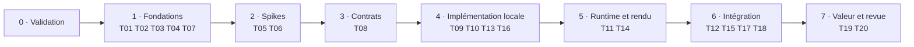

# Orchestration du projet, étape par étape

Révision OR-0.1 · statut : **proposé** · 7 octobre 2026 · fondé sur PD-0.1 et MC-0.1

Le POC se déroule en huit étapes, de 0 à 7. Chacune indique ce qui avance en parallèle, quel modèle exécute quoi et la porte à franchir avant l'étape suivante. Ce document est le backlog vivant : il est mis à jour à la fin de chaque tâche.

## Files de travail

| File | Contenu | Niveau de modèle dominant |
| --- | --- | --- |
| L1 Socle | Modèle, identités, protocole, Event Store | Local, sous contrats |
| L2 Runtime | Helper d'instrumentation, buffer, lots | Local ; intermédiaire pour l'intégration |
| L3 Éditeur | Plugin, panneau, réception débogueur, navigation | Intermédiaire ; retouches locales |
| L4 Acquisition | Inventaire, extraction, évaluation de l'existant | Grand modèle pour l'évaluation, local pour les adaptateurs |
| L5 Bancs d'essai | Choix des jeux, migration, instrumentation, mesures de valeur | Humain et local |
| L6 Compatibilité | Ports, adaptateurs, CI multi-version, veille | Grand modèle pour les ports, local pour les adaptateurs et la CI |

Règle de capacité : deux files actives à 10 h par semaine, trois à 20 h, quatre à 35 h.

## Étapes du POC

| Étape | Mode | Tâches | Qui exécute | Porte de sortie |
| --- | --- | --- | --- | --- |
| 0 Validation | Séquentiel | Valider PD-0.1 et MC-0.1 ; trancher D-01, D-02, D-05, D-07 ; créer les squelettes de SPEC, ARCHITECTURE, CONTRACTS, COMPATIBILITY, TEST_PLAN, PROJECT_STATE et CLAUDE.md | Humain et grand modèle | Décisions consignées |
| 1 Fondations | Parallèle | T01, T02, T03 ; T04 ; T07 | Local ; grand modèle ; humain | CI verte sur 4.7.x, et un test volontairement en échec bien détecté |
| 2 Spikes | Parallèle | T05, T06 | Grand modèle | Rapports KEEP, REWRITE ou DISCARD ; ADR-003 et ADR-004 proposés |
| 3 Contrats | Séquentiel | T08 | Grand modèle et humain | C-01, C-04 et C-07 validés et gelés pour le POC |
| 4 Implémentation locale | Parallèle | T09, T10, T13, T16 | Modèle local | Tests verts sur 4.7.x, rapport 4.8, taux de réussite local consigné (SPIKE-06) |
| 5 Runtime et rendu | Parallèle | T11 ; T14 | Local ; intermédiaire | Saturation testée, surcoût mesuré (SPIKE-05), ADR-005 proposé |
| 6 Intégration | Séquentiel puis parallèle | T12, puis T15, puis T17 et T18 | Intermédiaire et local | Démonstration complète sur le banc d'essai |
| 7 Valeur et revue | Séquentiel | T19, puis T20 | Humain ; grand modèle et humain | Décision consignée : continuer, réduire, réorienter ou arrêter |

## Vingt premières tâches

| ID | Objectif | Étape | File | Niveau | Dépend de | Preuve de réussite | Risque |
| --- | --- | --- | --- | --- | --- | --- | --- |
| T01 | Squelette du dépôt et plugin activable | 1 | L3 | Local | Étape 0 | Activation et désactivation sans erreur sur 4.7.x | Faible |
| T02 | Manifeste de versions et CI multi-version | 1 | L6 | Local, revue du grand modèle | T01 | Job 4.7.x bloquant vert ; job 4.8 non bloquant exécuté | Moyen |
| T03 | Runner de tests headless | 1 | L1 | Local | T01 | Un test en échec fait échouer la CI | Faible |
| T04 | Contrat C-03 : ports du POC et profil moteur | 1 | L6 | Grand modèle et humain | Étape 0 | Contrat validé, tests de contrat définis | Moyen |
| T05 | SPIKE-01 : canal débogueur | 2 | L2 | Grand modèle | T01 | Rapport : débit, latence, redémarrage | Élevé |
| T06 | SPIKE-02 : capacités, UID, isolation de compilation | 2 | L6 | Grand modèle | T02, T04 | Plugin actif sur 4.7.x et 4.8 ; règle d'adaptateur écrite | Élevé |
| T07 | Choix et préparation du banc d'essai (D-02) | 1 | L5 | Humain et local | Étape 0 | Fiche du jeu ; copie de travail ouverte sans erreur sur 4.7.x | Moyen |
| T08 | Contrats C-01 identités, C-04 enveloppe, C-07 API d'instrumentation | 3 | L1, L2 | Grand modèle et humain | T05 | Contrats validés avec exemples valides et invalides | Moyen |
| T09 | Profil moteur et adaptateurs 4.7 des ports du POC | 4 | L6 | Local | T04, T06 | Tests de contrat verts sur 4.7.x ; écarts 4.8 rapportés | Moyen |
| T10 | Codec et validateur de l'enveloppe | 4 | L1 | Local | T08 | Sérialisation testée ; identifiants 64 bits sans perte | Faible |
| T11 | Helper runtime : API, buffer borné, lots, pertes ; SPIKE-05 | 5 | L2 | Local | T08, T09, T10 | Saturation testée ; aucun effet sans debugger ; surcoût mesuré | Moyen |
| T12 | Réception côté éditeur et Event Store minimal (C-06) | 6 | L3 | Intermédiaire | T09, T10, T11 | Événements reçus et stockés ; séquence contrôlée ; pertes comptées | Moyen |
| T13 | Modèle minimal et chargement du graphe déclaré (C-05) | 4 | L1 | Local | T08 | Fixture de 6 à 12 éléments chargée ; références non résolues conservées | Faible |
| T14 | SPIKE-03 : rendu | 5 | L3 | Intermédiaire | T13 | Mesures à 50, 300 et 1 000 éléments ; ADR-005 proposé | Moyen |
| T15 | Panneau du POC : journal, graphe déclaré, sélection d'instance | 6 | L3 | Intermédiaire, retouches locales | T12, T13, T14 | Deux instances distinguées à l'écran | Moyen |
| T16 | Instrumentation attack/chase dans la copie du banc d'essai | 4 | L5 | Local | T07, T08 | Appels conformes à C-07 ; vérifiés une fois T11 prête | Faible |
| T17 | Chemin observé par instance et ouverture du code à la bonne révision | 6 | L1, L3 | Local et intermédiaire | T12, T13, T15 | Clic vers fichier et ligne ; lien périmé signalé après modification | Moyen |
| T18 | Sans debugger ; arrêt et redémarrage de session | 6 | L2 | Local | T11, T12 | Tests et vérification manuelle ; nouvelle session, nouvelles identités | Faible |
| T19 | Mesure de valeur sur deux ou trois bugs | 7 | L5 | Humain | T15 à T18 | Tableau chronométré avec et sans l'outil | Moyen |
| T20 | Revue de continuation et recalibrage du routage | 7 | Toutes | Grand modèle et humain | T19 | Décision consignée ; budgets et routage mis à jour | Faible |

Les tâches T06 à T20 restent conditionnelles aux résultats des spikes. Leur ordre de dépendance est ferme, leur contenu peut changer.

## Fiches détaillées des cinq premières tâches

### T01 — Squelette du dépôt et plugin activable

- **Capacité et invariants** : CAP-06 en préparation ; INV-06, INV-09.
- **Objectif** : un projet Godot de développement et un plugin qui s'active et se désactive proprement.
- **Prérequis** : D-01 tranchée ; dépôt GODOT_DEV_MAPPER à jour.
- **Fichiers à créer** : `project.godot`, `addons/godot_dev_mapper/plugin.cfg`, `addons/godot_dev_mapper/plugin.gd`, dossiers vides des modules avec un `README.md` d'une ligne, `.gitignore` Godot.
- **Fichiers interdits** : `docs/` hors PROJECT_STATE.md, `prompts/`.
- **Critères d'acceptation** : activation et désactivation sans erreur ni avertissement dans la sortie de l'éditeur ; `plugin.gd` ne contient aucune logique hors délégation ; aucune autre classe n'hérite d'EditorPlugin.
- **Vérifications** : manuelle dans l'éditeur 4.7.x ; import du projet en mode headless, commande à vérifier.
- **Risque** : faible. **Autonomie** : A1. **Niveau** : local. **File** : L3.
- **Résultat attendu** : patch, rapport de tâche, PROJECT_STATE.md mis à jour.

### T02 — Manifeste de versions et CI multi-version

- **Capacité et invariants** : CAP-06, CAP-13 en préparation ; INV-09.
- **Objectif** : chaque push teste le projet sur 4.7.x en bloquant, et sur la dernière préversion 4.8 sans bloquer.
- **Prérequis** : T01 ; D-07 tranchée.
- **Fichiers à créer** : `addons/godot_dev_mapper/compat/versions.json`, `.github/workflows/ci.yml`, `.github/workflows/version-watch.yml`, `tools/ci/fetch_godot.sh`, `tools/ci/run_tests.sh`.
- **Fichiers interdits** : code des modules.
- **Contrat** : format de `versions.json`, avec champs `supported`, `preview` et `minimum`.
- **Critères d'acceptation** : téléchargement des binaires officiels depuis les releases godot-builds, avec contrôle d'intégrité si une empreinte est publiée ; job 4.7.x bloquant ; job 4.8 marqué non bloquant ; veille hebdomadaire qui ouvre une tâche en cas d'échec ; versions lues depuis `versions.json`, jamais en dur.
- **Vérifications** : un push de test qui passe ; un push avec une erreur volontaire qui échoue sur 4.7.x.
- **Risque** : moyen, téléchargement et mode headless sur l'hébergeur de CI. **Autonomie** : A1. **Niveau** : local, revue du grand modèle. **File** : L6.
- **Résultat attendu** : workflows fonctionnels, commandes réellement exécutées consignées dans TEST_PLAN.md.

### T03 — Runner de tests headless

- **Capacité et invariants** : socle de vérification ; INV-09 pour l'exécution multi-version.
- **Objectif** : lancer tous les tests sans interface et renvoyer un code de sortie non nul en cas d'échec.
- **Prérequis** : T01 ; D-05 tranchée (runner maison minimal proposé au POC).
- **Fichiers à créer** : `tests/run_all.gd`, `tests/unit/test_smoke.gd`, `tests/README.md`.
- **Fichiers interdits** : code des modules.
- **Critères d'acceptation** : découverte des fichiers `test_*.gd` ; rapport lisible ; code de sortie non nul au premier échec ; aucune API éditeur utilisée.
- **Vérifications** : un test qui passe et un test volontairement en échec, en local et en CI ; commande exacte consignée après exécution réelle.
- **Risque** : faible. **Autonomie** : A1. **Niveau** : local. **File** : L1.
- **Résultat attendu** : runner et deux tests, rapport de tâche.

### T04 — Contrat C-03 : ports du POC et profil moteur

- **Capacité et invariants** : CAP-06 ; INV-06, INV-09.
- **Objectif** : définir les ports RuntimePort, DebuggerPort et EditorPort et le profil moteur, sans implémentation.
- **Prérequis** : étape 0.
- **Fichiers à créer** : section C-03 de `docs/CONTRACTS.md` ; `addons/godot_dev_mapper/compat/ports/*.gd` avec signatures et documentation, sans corps.
- **Fichiers interdits** : adaptateurs, autres modules.
- **Critères d'acceptation** : chaque méthode a des entrées, sorties, erreurs et un comportement dégradé ; le profil moteur expose la version, une liste de capacités et un niveau de support ; chaque API Godot citée porte la mention « vérifiée » avec sa source, ou « à vérifier en SPIKE-02 » ; tests de contrat listés.
- **Vérifications** : relecture humaine ; contrôle de dépendances.
- **Risque** : moyen, un port mal découpé coûte cher plus tard. **Autonomie** : A0, proposition à valider. **Niveau** : grand modèle et humain. **File** : L6.
- **Résultat attendu** : contrat proposé, puis validé.

### T05 — SPIKE-01 : canal débogueur

- **Capacité et invariants** : CAP-02 ; INV-06, INV-07.
- **Question** : un message envoyé par le jeu atteint-il le plugin, à quel débit, avec quelle latence, et que se passe-t-il après un arrêt puis un redémarrage ?
- **Prérequis** : T01.
- **Fichiers à créer** : `spikes/spike01_debugger/` (prototype jetable, hors du plugin), `docs/spikes/SPIKE-01.md`.
- **Fichiers interdits** : `addons/`.
- **Expérience** : un jeu minimal envoie des lots de 1 à 256 événements à 100, 1 000 et 10 000 événements par seconde ; le plugin compte, horodate et vérifie les séquences.
- **Critères d'acceptation** : débit, latence et pertes mesurés et consignés avec la machine et la version ; comportement au redémarrage décrit ; décision KEEP, REWRITE ou DISCARD.
- **Risque** : élevé, c'est l'hypothèse centrale du POC. **Autonomie** : A0. **Niveau** : grand modèle. **File** : L2.
- **Résultat attendu** : rapport de spike et recommandations pour C-04.

## Au-delà du POC

| Phase | Étapes clés | Files | Niveau de modèle | Porte |
| --- | --- | --- | --- | --- |
| P4 Acquisition statique | SPIKE-04 ; ADR-006 ; inventaire via IntrospectionPort ; extraction et adaptateur ; golden tests sur le banc d'essai | L4, L6 | Grand modèle pour SPIKE-04 et l'adaptateur ; local ensuite | Jeu de 300 scripts indexé ; aucune relation certaine fausse |
| P5 Navigation | Appelants et appelés ; recherche ; arborescence res:// ; historique de navigation | L3 | Intermédiaire, local | Parcours J2 et J3 en trois clics |
| P6 Historique et protocole MVP | Persistance des sessions ; relecture ; reconnexion ; marqueurs de lacune | L1, L2 | Local ; grand modèle pour le protocole | Session rechargée ; reconnexion testée |
| P7 Logique et Game Flow annoté | Décisions et états instrumentés ; blocs temporels déclarés | L2, L5 | Local | Bloc interrompu affiché « incomplet » |
| P8 Compatibilité MVP | Matrice publiée ; bascule vers 4.8 stable dès sa sortie | L6 | Local et grand modèle | CI verte sur la fenêtre ; installation propre |
| P9 à P16 (V1) | Timeline, instances, data flow, Expected vs Actual, Explain et Tune, performance, AI Snapshot, durcissement | Toutes | Mixte | Portes du plan directeur, §9 |

**Événement planifié : sortie de Godot 4.8 stable**, probablement pendant le MVP. Procédure : relecture du guide de migration, mise à jour des API sensibles, adaptateurs, bascule de la version de développement, matrice regénérée. Budget : 1 à 3 sessions, file L6.

## Routage, aide-mémoire

| Situation | Qui |
| --- | --- |
| Écrire ou modifier un contrat, un port, le protocole | Grand modèle, puis validation humaine |
| Implémenter une tâche dont le contrat et les tests existent | Modèle local |
| Deux échecs locaux aux mêmes tests | Modèle intermédiaire |
| Comportement inexpliqué, régression transverse | Grand modèle |
| Écrire du code d'interface éditeur | Modèle intermédiaire |
| Échec CI sur une préversion | Modèle local pour le tri, grand modèle si l'API a changé de sens |
| Exécuter les tests, le lint, les mesures | Outils sans IA |

## Mesures à tenir dans PROJECT_STATE.md

- Sessions et tâches consommées, par phase et contre le budget.
- Part du quota Claude consommée par tâche ; taux de réussite du modèle local au premier essai ; escalades.
- Versions de Godot testées et résultat de chaque suite.
- Temps de diagnostic avec et sans l'outil, mesuré en T19.
