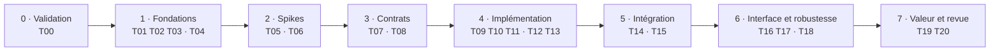

# Orchestration du projet, étape par étape

Révision OR-0.3 · statut : **proposé** · 8 octobre 2026 · fondé sur PD-0.3, MC-0.3 et SPIKE-01a · remplace OR-0.2

Le détail d'exécution de chaque tâche (objectif, obligations, méthodologie, contrôles exécutables, prompts de réalisation et de vérification) est dans le guide `docs/construction/`.

**Changements depuis OR-0.2** :

- T00 vérifie l'environnement de Qwen avant T01.
- Le contrôle de dépendances et le lint sont attribués à T02 et T03.
- T08 se finalise après T07.
- T05 devient SPIKE-01b, la partie éditeur, puisque SPIKE-01a est fait.
- La latence se mesure en T16, par aller-retour.

**Changements depuis OR-0.1**

- Le runner de tests (T02) précède la CI (T03).
- SPIKE-02 ne dépend plus de la CI : il se fait à la main sur 4.7.2 et sur la préversion.
- Tous les contrats du POC sont validés en T07 et T08, avant leur premier usage.
- L'instrumentation du banc d'essai (T15) vient après le helper FlowTrace (T13).
- Chaque étape respecte la limite de deux files actives à 10 h par semaine.
- Le graphe dessiné quitte le POC : SPIKE-03 passe au début du MVP.
- Les tâches sont réparties entre Opus 5.5, Sonnet, Gemini et Qwen3.8-27B en local.
- Les budgets se suivent en heures humaines, en temps agent et en capacités acceptées.

## Modèles et files

| Modèle | Rôle |
| --- | --- |
| Opus 5.5 | Contrats, façades de compatibilité, spikes, débogage difficile, relecture des diffs à risque |
| Sonnet | Code de l'éditeur et intégration |
| Gemini | Lecture et analyse des jeux open source ; relecture croisée des diffs de Sonnet |
| Qwen3.8-27B, local | Implémentation sous contrat validé avec tests ; documentation ; rapports |
| Sans IA | Tests, lint, CI, mesures |

| File | Contenu |
| --- | --- |
| L1 Socle | Modèle, identités, protocole, Event Store |
| L2 Runtime | FlowTrace, buffer, lots, corrélation |
| L3 Éditeur | Plugin, réception, panneau, navigation |
| L4 Acquisition | Inventaire, extraction, existant (MVP) |
| L5 Bancs d'essai | Choix, migration, instrumentation, mesures de valeur |
| L6 Compatibilité | Façades, profil moteur, CI |

Deux files actives au plus à 10 h par semaine, trois à 20 h, quatre à 35 h.

## Étapes du POC

Dans le schéma, le point médian sépare les deux files d'une étape.

| Étape | File A | File B | Porte de sortie |
| --- | --- | --- | --- |
| 0 Validation | Humain et Opus : PD-0.3, MC-0.3, décisions D-01, D-02, D-05, D-07, squelettes de docs | T00 | Décisions consignées ; Qwen opérationnel avec ses outils |
| 1 Fondations | T01, puis T02, puis T03 | T04 | CI verte sur 4.7.2 ; un test en échec bien détecté ; banc d'essai prêt |
| 2 Spikes | T05 | T06 | Rapports KEEP, REWRITE ou DISCARD |
| 3 Contrats | T07 | T08, préparé en parallèle, finalisé après T07 | C-01 à C-07 validés et gelés pour le POC |
| 4 Implémentation | T09, puis T10, puis T11 | T12, puis T13 | Tests verts sur 4.7.2 ; préversion rapportée ; chemin désactivé mesuré |
| 5 Intégration | T14 | T15 | Événements du banc d'essai reçus et stockés |
| 6 Interface et robustesse | T16, puis T17 | T18 | Démonstration complète ; arrêt propre |
| 7 Valeur et revue | T19, puis T20 | — | Décision : continuer, réduire, réorienter ou arrêter |

## Premières tâches, T00 à T20

| ID | Objectif | Étape | File | Modèle | Dépend de | Preuve de réussite | Risque |
| --- | --- | --- | --- | --- | --- | --- | --- |
| T00 | Environnement de Qwen : serveur local et harnais avec outils, vérifiés sur une tâche jouet | 0 | — | Humain et Opus | — | Tâche jouet réussie sans intervention | Moyen |
| T01 | Squelette du dépôt et plugin activable | 1 | L3 | Qwen | T00, étape 0 | Activation et désactivation sans erreur sur 4.7.2 | Faible |
| T02 | Runner de tests headless et contrôle de dépendances (`tools/check_deps`) | 1 | L1 | Qwen | T01 | Un test en échec rend un code de sortie non nul ; une dépendance interdite volontaire est détectée | Faible |
| T03 | CI : 4.7.2 bloquant, préversion dans un job séparé ; choix et configuration du lint | 1 | L6 | Qwen, revue Opus | T01, T02 | Push vert ; push volontairement cassé rouge ; lint et contrôle de dépendances exécutés ; job préversion exécuté | Moyen |
| T04 | Choix et préparation du banc d'essai (D-02) | 1 | L5 | Humain et Gemini | Étape 0 | Fiche du jeu (licence, version, ennemis à décision) ; copie ouverte sans erreur sur 4.7.2 | Moyen |
| T05 | SPIKE-01b : partie éditeur du canal, sur ta machine ; la partie jeu (SPIKE-01a) est faite | 2 | L2 | Opus | T01 | Critères de la fiche T05 remplis ; rapport mis à jour | Élevé |
| T06 | SPIKE-02 : façade, capacités, UID, isolation de compilation, à la main sur 4.7.2 et la préversion | 2 | L6 | Opus | T01 | Rapport ; règle d'isolation écrite | Élevé |
| T07 | Contrats C-01 identités et cycle de vie, C-02 ancrage, C-05 graphe déclaré | 3 | L1 | Opus et humain | Étape 0 | Contrats validés, exemples complets valides et invalides | Moyen |
| T08 | Contrats C-03 façades ; C-04 enveloppe, champs par type et réserve de contrôle ; C-06 Event Store ; C-07 API et protocole de session de FlowTrace | 3 | L2, L6 | Opus et humain | T05, T06, T07 | Contrats validés ; tests de contrat listés | Moyen |
| T09 | Codec et validateur de l'enveloppe (C-04) | 4 | L1 | Qwen | T08 | Identifiants 64 bits sans perte ; version inconnue rejetée ; tailles bornées | Faible |
| T10 | Modèle minimal, graphe déclaré, résolution des clés de sonde (C-01, C-02, C-05) | 4 | L1 | Qwen | T07, T09 | Fixture chargée ; clé inconnue « non résolue » ; références non résolues conservées | Faible |
| T11 | Event Store minimal : rétention, fin de session, chemin observé (C-06) | 4 | L1 | Qwen | T08, T10 | Troncature marquée ; « fin inconnue » ; requête par invocation testée | Moyen |
| T12 | Façades de compatibilité, côté éditeur et dans le dossier runtime autonome, et profil moteur (C-03) | 4 | L6 | Qwen, revue Opus | T06, T08 | Tests de contrat verts sur 4.7.2 ; préversion rapportée | Moyen |
| T13 | FlowTrace : classe statique, protocole de session, bail, buffer et réserve de contrôle, lots, invocations, cycle de vie ; SPIKE-05 | 4 | L2 | Qwen, revue Opus | T08, T09, T12 | Commande en réentrance, coupure et réserve pleine testées ; coûts actif et désactivé mesurés | Moyen |
| T14 | Réception côté éditeur vers l'Event Store | 5 | L3 | Sonnet, relu par Gemini | T09, T11, T12, T13 | Séquences contrôlées, trous comptés, messages du moteur ignorés | Moyen |
| T15 | Instrumentation du banc d'essai : deux instances, attack ou chase, retrait puis réinsertion | 5 | L5 | Qwen | T04, T13 | Événements émis ; aucune destruction affichée après réinsertion | Faible |
| T16 | Panneau du POC : journal sélectionnable, graphe déclaré en liste, sélection d'instance | 6 | L3 | Sonnet, relu par Gemini | T10, T14 | Deux instances distinguées ; rafraîchissement borné ; latence jusqu'à l'affichage mesurée par aller-retour | Moyen |
| T17 | Chemin observé par invocation et ouverture du code à la bonne révision | 6 | L3, L1 | Qwen et Sonnet | T15, T16 | « Cohérent » sur le cas attendu ; « indéterminé » après un trou provoqué ; lien périmé signalé | Moyen |
| T18 | Robustesse : sans debugger, arrêt, redémarrage, plugin désactivé pendant une collecte puis réactivé, session tuée | 6 | L2 | Qwen | T13, T14 | Trois opérations du cycle de vie démontrées ; aucun lot après « stopped » ; « fin inconnue » affichée | Faible |
| T19 | Mesure de valeur : deux ou trois bugs, installation et instrumentation comprises | 7 | L5 | Humain | T16 à T18 | Tableau chronométré avec et sans l'outil | Moyen |
| T20 | Revue de continuation ; décisions sur SPIKE-03, SPIKE-04 et la reprise d'AST Flow ; recalibrage du routage | 7 | Toutes | Opus et humain | T19 | Décision consignée ; budgets et routage mis à jour | Faible |

L'ordre de dépendance est ferme. Le contenu des tâches T06 à T20 peut changer selon les résultats des spikes.

## Fiches détaillées des premières tâches

### T00 — Environnement de Qwen

- **Objectif** : un agent local opérationnel avant de lui confier T01.
- **Contenu** : serveur local du modèle ; harnais d'agent capable de lire, écrire et exécuter des commandes dans le dépôt ; fichier de contexte recopié depuis la source unique de règles.
- **Preuve** : une tâche jouet réussie sans intervention (créer un fichier, lancer une commande, rédiger un rapport), avec le temps et la mémoire notés.
- **Si l'essai échoue** : T01 à T03 passent à Sonnet, et la vérification de Qwen est reprise en parallèle de l'étape 1.
- **Risque** : moyen. **Modèle** : humain et Opus.

### T01 — Squelette du dépôt et plugin activable

- **Capacité et invariants** : CAP-06 en préparation ; INV-06, INV-09.
- **Objectif** : un projet Godot de développement et un plugin qui s'active et se désactive proprement.
- **Prérequis** : D-01 tranchée.
- **Fichiers à créer** : `project.godot`, `addons/godot_dev_mapper/plugin.cfg`, `addons/godot_dev_mapper/plugin.gd`, dossiers des modules avec un README d'une ligne, `addons/godot_dev_mapper_runtime/` vide, `.gitignore` Godot.
- **Fichiers interdits** : `docs/` sauf PROJECT_STATE.md, `prompts/`.
- **Critères d'acceptation** : activation et désactivation sans erreur ni avertissement ; `plugin.gd` ne fait que déléguer ; aucune autre classe n'hérite d'EditorPlugin.
- **Vérifications** : manuelle dans l'éditeur 4.7.2 ; import headless du projet, commande consignée après exécution.
- **Risque** : faible. **Autonomie** : A1. **Modèle** : Qwen. **File** : L3.
- **Résultat** : patch, rapport de tâche, PROJECT_STATE.md à jour.

### T02 — Runner de tests headless

- **Objectif** : lancer tous les tests sans interface, avec un code de sortie non nul au moindre échec.
- **Prérequis** : T01 ; D-05 tranchée (runner maison minimal proposé).
- **Fichiers à créer** : `tests/run_all.gd`, `tests/unit/test_smoke.gd`, `tests/README.md`, `tools/check_deps` (dépendances interdites entre modules, API sensibles hors de la frontière, dossier runtime indépendant du plugin).
- **Fichiers interdits** : code des modules.
- **Critères d'acceptation** : découverte des fichiers `test_*.gd` ; rapport lisible ; aucune API éditeur utilisée.
- **Vérifications** : un test qui passe et un test volontairement en échec, en local ; une dépendance interdite volontaire détectée ; commandes consignées après exécution réelle.
- **Risque** : faible. **Autonomie** : A1. **Modèle** : Qwen. **File** : L1.

### T03 — CI sur 4.7.2, préversion à part

- **Objectif** : chaque push teste le projet sur 4.7.2 en bloquant ; un job séparé teste la dernière préversion sans bloquer.
- **Prérequis** : T01, T02 ; D-07 tranchée.
- **Fichiers à créer** : `addons/godot_dev_mapper/compat/versions.json`, `.github/workflows/ci.yml`, `tools/ci/fetch_godot.sh`, `tools/ci/run_tests.sh`, configuration du lint (outil choisi et version figée).
- **Fait établi par SPIKE-01a** : l'archive godot-builds sert les binaires officiels à une adresse stable, par exemple `…/releases/download/4.7.2-stable/Godot_v4.7.2-stable_linux.x86_64.zip`.
- **Fichiers interdits** : code des modules.
- **Critères d'acceptation** : binaires officiels téléchargés depuis l'archive, intégrité contrôlée quand une empreinte est publiée ; versions lues depuis `versions.json` ; job préversion explicitement non bloquant ; lint et contrôle de dépendances exécutés à chaque push.
- **Vérifications** : un push vert, un push volontairement cassé rouge.
- **Risque** : moyen. **Autonomie** : A1. **Modèle** : Qwen, revue Opus. **File** : L6.

### T04 — Choix et préparation du banc d'essai

- **Objectif** : retenir un jeu open source qui permet la démonstration du POC.
- **Prérequis** : étape 0.
- **Fichiers à créer** : `benches/benches.json` (nom, dépôt, révision, licences du code et des assets, version de Godot d'origine), fiche dans `docs/benches/`.
- **Critères d'acceptation** : au moins deux ennemis qui prennent une décision observable ; copie de travail ouverte sans erreur sur 4.7.2 ; licences compatibles avec une copie de travail locale ; aucun fichier du jeu copié dans le dépôt.
- **Vérifications** : ouverture et lancement du jeu sur 4.7.2 ; liste des scripts concernés par la démonstration.
- **Risque** : moyen, migration depuis une version antérieure. **Autonomie** : A0 pour l'analyse, A1 pour la migration. **Modèle** : humain et Gemini. **File** : L5.

### T05 — SPIKE-01b : partie éditeur du canal

- **Déjà établi par SPIKE-01a** (partie jeu, conteneur, 4.7.2 et 4.8-dev7) : classe statique sans autoload, commandes appliquées à la frontière de frame, bail, aucun lot après « stopped », 24 000 événements par seconde sans perte, sans rendu. Rapport : `docs/spikes/SPIKE-01.md`.
- **Questions restantes** : le plugin reçoit-il les lots par sa capture de débogueur ? Peut-il envoyer start, stop et le bail par la session ? Que se passe-t-il lors de lancements répétés depuis l'éditeur, et quand on désactive le plugin pendant une collecte ?
- **Prérequis** : T01.
- **Fichiers à créer** : `spikes/spike01_debugger/editor/` (plugin jetable) ; mise à jour de `docs/spikes/SPIKE-01.md`.
- **Fichiers interdits** : `addons/godot_dev_mapper/`.
- **Critères de réussite** :
  1. Runtime initialisé, puis « prêt » reçu par le plugin.
  2. Démarrage confirmé par « started » avant tout lot.
  3. Arrêt explicite avant la désactivation du plugin : « stopped » reçu en une seconde au plus, aucun lot ensuite.
  4. Coupure (jeu tué, ou plugin retiré sans arrêt) : collecte arrêtée par le bail côté jeu ; « fin inconnue » côté éditeur.
  5. Instances enregistrées avant le démarrage présentes dans l'état initial.
  6. Cinq lancements successifs depuis l'éditeur, sans fuite ni erreur.
  7. Débit et cadence mesurés avec rendu, à 1 200 et 10 000 événements par seconde.
- **Risque** : élevé. **Autonomie** : A0. **Modèle** : Opus. **File** : L2.

## Au-delà du POC

| Phase | Étapes clés | Modèles | Heures humaines avec agents | Porte |
| --- | --- | --- | --- | --- |
| P4 Acquisition statique | SPIKE-03 rendu ; SPIKE-04 AST Flow ou extraction maison ; inventaire ; golden tests sur le banc d'essai | Opus pour les spikes ; Gemini pour la lecture du jeu ; Qwen ensuite | 6–12 d'évaluations, puis 8–14 de backend, ou 4–8 avec AST Flow | Jeu de 300 scripts indexé ; aucune relation certaine fausse |
| P5 Navigation | Appelants, appelés, recherche, arborescence res:// | Sonnet, Qwen | 8–13 | Test de cartographie gagnant |
| P6 Historique et protocole MVP | Persistance, relecture, reconnexion, marqueurs de lacune | Qwen ; Opus pour le protocole | 10–16 | Session rechargée ; reconnexion testée |
| P7 Logique et Game Flow annoté | Décisions et états ; blocs temporels déclarés | Qwen | 5–9 | Bloc interrompu affiché « incomplet » |
| P8 Compatibilité MVP | Matrice publiée ; bascule vers 4.8 stable | Qwen ; Opus si une API change | 6–10 | CI verte sur la fenêtre |
| P9 à P16 : V1 | Timeline, instances, data flow, Expected vs Actual, Explain et Tune, performance, AI Snapshot | Mixte | 75–120 | Portes du plan, §9 |

## Routage, aide-mémoire

| Situation | Modèle |
| --- | --- |
| Écrire ou modifier un contrat, une façade, le protocole | Opus, puis validation humaine |
| Implémenter une tâche dont le contrat et les tests existent | Qwen |
| Deux échecs de Qwen aux mêmes tests | Sonnet |
| Code de l'éditeur | Sonnet, relu par Gemini |
| Lire et comprendre un jeu open source | Gemini |
| Comportement inexpliqué, régression transverse | Opus |
| Échec du job préversion | Qwen pour le tri ; Opus si une API a changé de sens |
| Tests, lint, mesures | Outils sans IA |

## Mesures à tenir dans PROJECT_STATE.md

- Heures humaines, temps agent et capacités acceptées, par phase et contre le budget.
- Par modèle : taux de réussite au premier essai, escalades, part de quota consommée.
- Versions de Godot testées et résultat de chaque suite.
- Mesure de valeur : temps de diagnostic avec et sans l'outil, installation et instrumentation comprises (T19) ; temps de cartographie à la porte du MVP.
