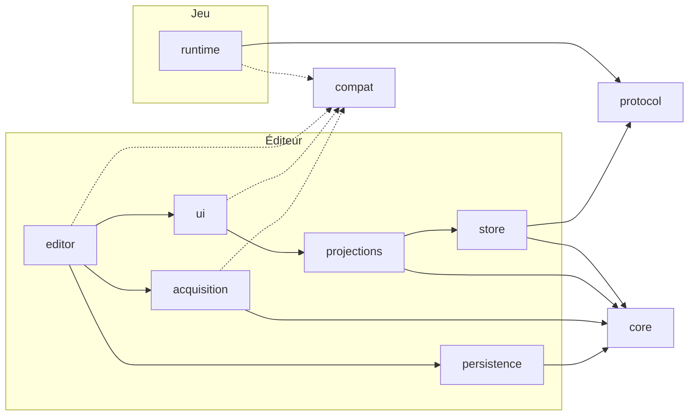

# Plan directeur — Godot Visual Program & Execution Explorer

Révision PD-0.1 · statut : **proposé**, aucune décision validée · 7 octobre 2026 · entrée : `prompts/conception.txt` v2.2

Ce document est une proposition. Une décision reste une proposition tant qu'elle n'est pas marquée « validée » dans le dossier de passage (§10). Aucun prototype n'a été exécuté pour l'écrire, et aucune performance n'est mesurée.

## 0. Contexte établi

| Élément | Valeur retenue | Statut | Conséquence | Vérification |
| --- | --- | --- | --- | --- |
| Moteur | Godot 4.7.x standard pour le développement ; 4.8 en préversion | Connu | Couche de compatibilité dès le POC, CI sur deux versions | Fixer le correctif 4.7.x ; récupérer la dernière préversion 4.8 |
| Langage analysé | GDScript uniquement | Connu | C#, GDExtension et sources absentes hors MVP | — |
| Équipe | Un développeur ; Claude Code (Opus 5.5) sur Pro ; Qwen3.8-27B en local | Connu | Orchestration multi-modèles, voir la méthodologie | Mesurer quota et réussite locale en semaine 1 |
| Disponibilité | Hypothèse : 10 h par semaine | À compléter | Environ 6 tâches par semaine en mode agent | Confirmer |
| Système | Hypothèse : Windows ou Linux de bureau ; CI sous Linux | À compléter | Scripts CI en Bash ; outils locaux multiplateformes | Confirmer |
| Bancs d'essai | Hypothèse : un jeu d'action 2D open source avec ennemis (moins de 150 scripts) et un jeu de 300 à 600 scripts | À compléter | Choix = tâche T07 | Lister nom, dépôt, licences, version d'origine |
| Matériel local | Hypothèse : GPU de 24 Go ou machine à 32 Go de mémoire unifiée | À compléter | Context packs de 32K tokens au plus pour garder un débit utile | Mesurer les tokens par seconde |
| Dépendances | Addons GDScript sous licence permissive, derrière un adaptateur | Hypothèse | Reprise possible de GDScript AST Flow | SPIKE-04 |
| Instrumentation | Explicite, sur des copies de travail des jeux | Hypothèse | POC possible sans instrumentation automatique | — |
| IA dans le plugin | Aucune au MVP ; export local seulement | Hypothèse | L'AI Snapshot est un export, sans appel réseau | — |

Aucune question n'est bloquante : chaque hypothèse est réversible.

## 1. Synthèse décisionnelle

**Valeur.** L'outil doit d'abord répondre, preuves à l'appui, à une question de débogage concrète : quelle instance a pris quelle branche, et où est le code. La carte globale vient ensuite ; elle reste partielle par construction et l'affiche.

**Recommandation.** Construire dans cet ordre : un débogueur de décisions instrumentées relié au code (POC), puis une carte statique bornée et navigable (MVP), puis les modes avancés selon les preuves obtenues (V1). La couche de compatibilité moteur existe dès le POC, car Godot publie une version mineure tous les quelques mois et sa politique de publication admet des ruptures ciblées entre versions mineures.

**POC, 17 à 28 sessions** (revue obligatoire au-delà de 35) : une scène d'un jeu open source, deux instances, une décision attack/chase instrumentée, transport réel, journal sélectionnable, ouverture du code, tests sur 4.7.x et sur la préversion 4.8. Réussite : un développeur explique, preuves à l'appui, quelle instance a pris quelle branche.

**MVP, 63 à 98 sessions cumulées** : inventaire statique d'un jeu réel, relations d'appel avec provenance, navigation, historique et persistance, pertes visibles, Game Flow annoté, installation fiable sur les versions supportées.

**V1, 138 à 211 sessions cumulées** : timeline, comparaison d'instances, Expected vs Actual, origine des paramètres, Explain et Tune, performance, AI Snapshot, support de deux versions stables.

**Inconnues à lever d'abord** : comportement réel du canal débogueur (SPIKE-01), isolation de compilation entre versions (SPIKE-02), rendu à l'échelle visée (SPIKE-03), reprise d'un parseur existant (SPIKE-04), coût de la capture (SPIKE-05), fiabilité du modèle local (SPIKE-06).

**Critère d'arrêt.** Si le POC ne fait pas gagner de temps sur deux ou trois bugs d'un jeu open source, réorienter avant d'investir dans l'acquisition statique.

## 2. Vision, scénarios et glossaire

Une carte navigable et honnête d'un projet Godot : ce qui existe, ce qui peut se produire, ce qui s'est réellement produit et où intervenir, chaque affirmation portant sa provenance.

| ID | Question de l'utilisateur | Parcours attendu | Phase |
| --- | --- | --- | --- |
| SC-01 | Pourquoi ce Goblin ne poursuit-il pas le héros ? | Sélectionner l'instance, voir sa décision observée et ses preuves, ouvrir le code | POC |
| SC-02 | Comment ce jeu inconnu est-il organisé ? | Inventaire, groupes, appelants et appelés, code | MVP |
| SC-03 | Que se passe-t-il entre l'entrée dans la pièce et la fin du combat ? | Blocs annotés, occurrences observées, interruptions | MVP annoté, V1 timeline |
| SC-04 | Où modifier la cadence d'attaque, et qui sera touché ? | Origine du paramètre, lecteurs, portée | V1 |
| SC-05 | Que donner à une IA pour diagnostiquer ce bug ? | Sous-graphe, trace, lacunes, export local | V1 |
| SC-06 | L'outil fonctionne-t-il avec la nouvelle version de Godot ? | Profil moteur, matrice de compatibilité, mode dégradé annoncé | POC profil, MVP matrice |

| Terme | Définition |
| --- | --- |
| Définition | Élément statique du programme (script, fonction, signal, décision déclarée), identifié indépendamment de son chemin |
| Instance runtime | Objet vivant d'une session qui exécute une définition |
| Occurrence | Passage observé d'une instance à un instant : appel, décision, bloc |
| Provenance | Extraite, déclarée, observée ou inférée |
| Résolution | Résolue, partielle ou non résolue |
| Non observé | Aucune trace dans la fenêtre et la couverture de capture ; ne prouve pas la non-exécution |
| Lacune | Intervalle de séquence perdu, filtré, échantillonné ou non capturé |
| Révision du programme | Empreinte des sources à laquelle se rattachent traces et liens |
| Vue logique, timeline métrique | Positions sémantiques, ou temps mesuré avec unité |
| Relecture, rejeu | Reconstruction des vues depuis le journal, ou réexécution déterministe du jeu (hors périmètre) |
| Profil moteur | Version et capacités de Godot détectées à l'exécution |
| Port, adaptateur | Interface interne stable, et son implémentation pour une plage de versions |

## 3. Capacités, priorités, acquisition et faisabilité

| ID | Capacité | Priorité | Acquisition | Couverture et limites | Difficulté | Critère observable |
| --- | --- | --- | --- | --- | --- | --- |
| CAP-01 | Graphe déclaré minimal affiché | POC | Déclaration (.flow.json) | Ce qui est déclaré ; écart possible avec le code | Faible | 6 à 12 éléments affichés, chacun ouvre son code |
| CAP-02 | Capture runtime jusqu'à l'Event Store | POC | Instrumentation explicite | Seuls les points instrumentés | Moyenne | Séquence continue ou pertes comptées, par session |
| CAP-03 | Décision observée par instance | POC | API d'instrumentation | Décisions instrumentées | Faible | Branche, instance, horodatage et preuves affichés |
| CAP-04 | Sélection d'instance, identité de session | POC | Runtime | Identités valables dans une session | Moyenne | Deux instances distinctes ; nouvelle session, nouvelles identités |
| CAP-05 | Ouverture du code à la bonne révision | POC | Ancrage source | Lien périmé signalé | Faible | Clic vers fichier et ligne ; avertissement si le fichier a changé |
| CAP-06 | Profil moteur et couche de compatibilité | POC | Détection de capacités | Ports utilisés par la tranche | Moyenne | Tests verts sur 4.7.x ; écarts 4.8 listés |
| CAP-07 | Pertes et lacunes visibles | POC compteur, MVP marqueurs | Protocole | Aucune garantie de zéro perte | Moyenne | Saturation provoquée : pertes affichées, aucun diagnostic de non-exécution |
| CAP-08 | Inventaire statique d'un projet | MVP | Réflexion des scripts, état des scènes, dépendances | Sans instancier le projet ; fichiers invalides isolés | Moyenne | Jeu de 300 scripts ou plus indexé ; erreurs listées par fichier |
| CAP-09 | Relations d'appel avec provenance | MVP | Extraction syntaxique, maison ou AST tiers | Appels dynamiques non résolus | Élevée | Appels directs résolus ; dynamiques marqués non résolus |
| CAP-10 | Navigation : appelants, appelés, recherche, filtres, arborescence res:// | MVP | Requêtes sur le modèle | Expansion bornée | Moyenne | Trois clics de la recherche au code |
| CAP-11 | Historique borné, relecture, export de trace | MVP | Event Store | Mémoire bornée | Moyenne | Session rechargée et relue sans le jeu |
| CAP-12 | Game Flow annoté et occurrences | MVP annoté, V1 timeline | Déclaration et instrumentation | Blocs inférés exclus | Moyenne | Bloc interrompu affiché « incomplet » |
| CAP-13 | Matrice de compatibilité publiée | MVP | CI | Versions testées seulement | Faible | Matrice regénérée par la CI à chaque fusion |
| CAP-14 | Origine et usages d'un paramètre | V1 | Statique et observation | « Dernière écriture connue » bornée à la fenêtre observée | Élevée | Défaut, ressource, override et valeur observée distingués |
| CAP-15 | Expected vs Actual, comparaison d'instances | V1 | Déclaration, baseline | Alignement sémantique, pas temporel | Moyenne | Première divergence connue montrée avec ses preuves |
| CAP-16 | Explain, Tune, InterventionPoints | V1 | Modèle et annotations | Aucune intention inventée | Élevée | Point d'intervention : fichier, fonction, paramètre, portée |
| CAP-17 | Couche performance corrélée | V1 | Moniteurs et instrumentation | Pas de temps CPU par fonction | Moyenne | Coût de capture mesuré avec et sans |
| CAP-18 | AI Snapshot local | V1 | Export | Champs choisis, aperçu avant partage | Faible | JSON et PNG cohérents, lacunes incluses |
| CAP-19 | Décisions extraites automatiquement | ADVANCED | AST | Robustesse inconnue | Élevée | — |
| CAP-20 | Instrumentation automatique | EXPERIMENTAL | Réécriture de copies | Risque de dérive du code | Très élevée | — |

Les dix modes de la spécification sont des projections de ces capacités, pas des sous-systèmes : Map (CAP-08 à 10), Game Flow (CAP-12), Logic (CAP-03, 09, 19), Data Flow (CAP-14), Runtime (CAP-02, 04, 07, 11), Debug (CAP-15), Explain et Tune (CAP-16), Performance (CAP-17), AI Context (CAP-18).

**Analyse de l'existant et décision proposée**

| Outil | Apport | Décision proposée |
| --- | --- | --- |
| GDScript AST Flow (MIT, Godot 4.7.x) | Parseur GDScript, graphe d'appels, flux de signaux, def-use, export JSON | Candidat backend de CAP-09, comparé à une extraction maison minimale en SPIKE-04. S'il est retenu : derrière le port de syntaxe, version épinglée, plan de sortie si sa compatibilité 4.8 tarde |
| Script Dependency Inspector (MIT) | Instantané validé, diagnostics à codes stables, état périmé explicite | S'inspirer de ses diagnostics et de sa gestion des états périmés |
| Signal Lens (MIT) | Graphe de signaux en direct dans un onglet du débogueur | S'inspirer de son intégration au débogueur |
| LimboAI | Illumination runtime des arbres de comportement | S'inspirer de son interface d'illumination |
| Débogueur, profileur et moniteurs de Godot | Points d'arrêt, temps par fonction, moniteurs | Compléter sans dupliquer |

## 4. Architecture, compatibilité moteur et politique de versions

Dix modules en couches. Seule la couche de compatibilité touche aux API moteur susceptibles de changer (INV-09), et le runtime n'embarque que le contrat partagé (INV-06).



| Module | Responsabilité | Dépend de | Interdit |
| --- | --- | --- | --- |
| core | Modèle, identités, provenance, requêtes de base | Types fondamentaux de Godot | Éditeur, UI, runtime, compat |
| compat | Profil moteur, ports, adaptateurs par plage de versions | API Godot (seul module autorisé pour les API sensibles) | Modules du plugin |
| protocol | Enveloppe, codec, validation | Types fondamentaux | Tout le reste |
| runtime | API d'instrumentation, buffer borné, lots | protocol, port runtime de compat | editor, ui, core, store |
| acquisition | Inventaire, extraction syntaxique, adaptateurs d'outils tiers | core, compat | ui, runtime |
| store | Sessions, Event Store, lacunes | core, protocol | ui, editor |
| projections | Requêtes des vues, diagnostics | core, store | Widgets, compat |
| ui | Panneaux, journal, graphe | projections, ports UI de compat | store en direct, runtime |
| editor | Point d'entrée du plugin, intégration débogueur, cycle de vie | ui, store, acquisition, persistence, compat | runtime hors protocol |
| persistence | Formats versionnés, sauvegarde atomique | core | ui, runtime |

`plugin.gd` est le seul script autorisé à hériter d'EditorPlugin. Il délègue immédiatement à `editor` et `compat`.

**Couche de compatibilité moteur**

| Port | Usage | Phase |
| --- | --- | --- |
| RuntimePort | Activité du débogueur, envoi de messages, horloge monotone, thread appelant, identifiant d'objet | POC |
| DebuggerPort | Capture des messages côté éditeur, cycle de vie des sessions | POC |
| EditorPort | Ouvrir un script à la ligne, sélectionner un fichier, panneaux, notifications | POC |
| IntrospectionPort | Méthodes, signaux et propriétés d'un script ; source ; classes globales ; état d'une scène empaquetée ; dépendances | MVP |
| FileSystemPort | Parcours, changements, UID des ressources | MVP |
| SyntaxPort | Grammaire GDScript par version, constructions apparues après 4.0 comprises (dictionnaires typés, par exemple) | MVP |
| UiPort | API de widgets sensibles : graphe, arbre | MVP |

Sélection à l'activation du plugin :

1. Détecter la version et les capacités réellement présentes, et construire le profil moteur.
2. Charger l'adaptateur de base, puis les surcharges de la plage de versions détectée.
3. Afficher le niveau de support : supporté, préversion, non testé ou non supporté.
4. Hors fenêtre, passer en mode dégradé annoncé : les capacités non vérifiées sont désactivées, jamais silencieusement.

**Isolation de compilation, à vérifier en SPIKE-02.** Un script qui référence une API absente de la version courante peut échouer à sa compilation. Règle proposée : le code partagé ne référence que des API présentes dans la version minimale supportée ; les adaptateurs plus récents sont chargés par chemin, sans `class_name`, après détection.

**Fenêtre de support**

| Moment | Bloquant en CI | Suivi sans bloquer |
| --- | --- | --- |
| Aujourd'hui | 4.7.x | Dernière préversion 4.8 |
| Sortie de 4.8 stable | 4.8.x, et 4.7.x jusqu'à la V1 | Préversion 4.9 dès sa parution |
| Sortie de 4.9 stable | 4.9.x et 4.8.x | Préversion suivante |

**Veille de versions.** Une tâche CI hebdomadaire télécharge la dernière préversion officielle, publiée en release GitHub par le projet godot-builds, et lance les tests. Un échec ouvre une tâche. À chaque nouvelle version mineure, le guide de migration officiel (sections Editor, GDScript et Core) met à jour la liste des API sensibles. Budget : 1 à 3 sessions par version mineure.

**Arborescence proposée, à créer**

```
addons/godot_dev_mapper/
  plugin.cfg
  plugin.gd                  # seul héritier d'EditorPlugin
  core/                      # modèle, identités, provenance
  compat/
    engine_profile.gd
    versions.json            # fenêtre de support
    ports/                   # interfaces stables
    adapters/base/ ...       # adaptateur de référence
    adapters/v4_8/ ...       # surcharges chargées par chemin
  protocol/                  # enveloppe, codec, validateur
  runtime/                   # API d'instrumentation, buffer, lots
  acquisition/ store/ projections/ ui/ editor/ persistence/
addons/godot_dev_mapper_runtime/  # helper autonome laissé dans les jeux instrumentés
tests/ unit/ contract/ integration/ fixtures/
benches/benches.json         # jeux de test référencés par dépôt et révision
tools/ci/                    # téléchargement de Godot, lancement des tests, contrôle des dépendances
.github/workflows/ ci.yml version-watch.yml
docs/                        # SPEC, ARCHITECTURE, CONTRACTS, COMPATIBILITY, adr/, spikes/
```

## 5. Modèle minimal, identités et exemples

| Entité | Rôle | Champs requis | Phase |
| --- | --- | --- | --- |
| ProgramSnapshot | État indexé du programme | snapshot_id, revision, engine_profile, coverage | POC minimal |
| Definition | Élément statique | def_id, kind, name, anchor, evidence | POC |
| SourceAnchor | Lien vers le code | script_uid, path, line_start, line_end, revision, range_hash | POC |
| Relation | Lien typé | rel_id, kind, from, to (définition ou référence non résolue), evidence | POC |
| Evidence | Preuve d'une information | kind, source, resolution, revision, confiance optionnelle | POC |
| RuntimeSession | Une exécution | session_id, process_id, revision, engine_profile, capture_config, status | POC |
| RuntimeInstance | Objet vivant | instance_key, def_ref, label, object_id en chaîne, node_path, spawn_order | POC |
| TraceEvent | Occurrence | session_id, producer_id, seq, t_usec, type, def_ref, inst_ref, payload, corrélations optionnelles | POC |
| Gap | Lacune | session_id, producer_id, from_seq, to_seq, reason, count | POC |
| TemporalBlockDefinition, TemporalBlockOccurrence | Game Flow | id, parent, cycle de vie, statut d'occurrence | MVP |
| Annotation, Suggestion | Apport humain, apport IA | target, text, author, created_at, status | MVP |

Décisions d'identité proposées :

- `def_id` est opaque. Sa clé de correspondance associe l'UID du script et le nom qualifié, pour survivre aux déplacements de fichiers. La disponibilité des UID de scripts sur chaque version supportée est à vérifier en SPIKE-02 ; à défaut, la clé repose sur le chemin.
- Un renommage de fonction crée une nouvelle définition ; une suggestion « renommage probable » peut les relier, sans fusion automatique.
- Une identité runtime vaut pour une session. L'`object_id` et le `NodePath` sont du contexte, sans promesse de stabilité d'une session à l'autre.
- Les identifiants d'objets Godot sont des entiers 64 bits : ils sont stockés en chaîne dans tout format JSON.
- Les références non résolues sont conservées telles quelles, sans cible inventée.
- Une réindexation n'écrase jamais une annotation humaine ; une annotation orpheline est signalée.
- Les cycles sont permis dans les appels et transitions ; la hiérarchie de contenance reste acyclique.
- Une session est rattachée à une révision. Après une modification du code pendant la capture, les événements suivants sont marqués « révision incertaine ».

Graphe déclaré (`.flow.json`, version 1) :

```json
{
  "schema_version": 1,
  "kind": "declared_graph",
  "revision": "src-7f3a9c",
  "definitions": [
    {"def_id": "d-0007", "kind": "function", "name": "EnemyAI.choose_action",
     "anchor": {"script_uid": "uid://b4k2m1xq", "path": "res://enemies/enemy_ai.gd", "line_start": 42, "line_end": 58}},
    {"def_id": "d-0008", "kind": "decision", "name": "distance <= attack_range",
     "anchor": {"script_uid": "uid://b4k2m1xq", "path": "res://enemies/enemy_ai.gd", "line_start": 47, "line_end": 47}}
  ],
  "relations": [
    {"rel_id": "r-0012", "kind": "contains", "from": "d-0007", "to": "d-0008", "evidence": [{"kind": "declared"}]},
    {"rel_id": "r-0013", "kind": "branch_true", "from": "d-0008", "to": "d-0009", "evidence": [{"kind": "declared"}]}
  ]
}
```

Lot d'événements, sous sa forme persistée :

```json
{
  "protocol_version": 1,
  "session_id": "s-2f81",
  "producer_id": "main",
  "revision": "src-7f3a9c",
  "first_seq": 120,
  "last_seq": 121,
  "dropped_since_last_batch": 0,
  "events": [
    {"seq": 120, "t_usec": 8421337, "type": "decision", "def": "d-0008", "inst": "s-2f81/i-17", "payload": {"result": false}},
    {"seq": 121, "t_usec": 8421390, "type": "function_enter", "def": "d-0011", "inst": "s-2f81/i-17"}
  ]
}
```

## 6. Runtime, protocole, temporalité, preuve et diagnostic

Chaîne découplée : instrumentation, buffer borné par producteur, lots, transport via les ports runtime et débogueur, validation, Event Store, projections, interface. Le modèle n'agit jamais directement sur des widgets.

| Événement | Produit par | Phase |
| --- | --- | --- |
| function_enter, function_exit | Appels explicites à l'API d'instrumentation | POC |
| decision avec résultat | Appel explicite | POC |
| instance_created, instance_destroyed | Appel explicite dans `_ready` et `_exit_tree` ; signaux du SceneTree à évaluer | POC |
| Contrôle : session, configuration, lacune | Runtime | POC |
| signal_emit, signal_received, state_change | Appels explicites | MVP |
| block_begin, block_end | Appels explicites | MVP |
| collision, resource_load, custom | Appels explicites | MVP |
| metric | Échantillonneur des moniteurs | V1 |

Le canal débogueur transporte des messages : il ne capture rien tout seul. Chaque événement a donc un producteur explicite.

**Contrat runtime phasé**

| Phase | Contenu |
| --- | --- |
| POC | Version de protocole, session, producteur, séquence par producteur, révision, horodatage monotone en microsecondes, type, références de définition et d'instance, charge bornée, pertes par lot, identifiants en chaîne |
| MVP | Capacités négociées, connexion tardive, reconnexion, incompatibilité de version, marqueurs de lacune, frames et ticks physiques, doublons, références tardives, historique indexé, export |
| V1 et plus | Corrélations causales avancées, collecte multi-thread et ordre entre producteurs, build exporté sans debugger |

**Saturation au POC, objectifs à valider en SPIKE-05.** Buffer de 4 096 événements par producteur ; lot toutes les 50 ms ou tous les 256 événements. Les décisions, changements d'état et événements de cycle de vie sont gardés jusqu'à 90 % de remplissage ; les événements continus partent en premier. Les pertes sont comptées par type et annoncées dans le lot suivant, puis affichées avec leur fenêtre.

**Sans debugger**, chaque appel d'instrumentation se réduit à un test booléen. Un arrêt suivi d'un redémarrage crée une nouvelle session ; les messages tardifs de l'ancienne sont archivés, jamais mélangés.

**Temporalité.** Horloge monotone en microsecondes au POC, frames et ticks physiques au MVP. Cycle de vie des blocs : non démarré, actif, suspendu, terminé, échoué, abandonné, incomplet. Une vue logique place les étapes par leur sens ; seule la timeline métrique place par le temps mesuré. La relecture reconstruit les vues depuis le journal ; le rejeu déterministe reste hors périmètre.

**Limites de preuve**

- Une décision observée prouve ce cas, pas les autres chemins possibles.
- Une absence d'événement s'affiche « non observé », avec la couverture : points instrumentés, fenêtre, pertes.
- L'ordre n'est garanti que par producteur ; la proximité temporelle ne crée aucune arête causale.
- Toute comparaison cite la révision, la configuration, le scénario, la fenêtre et la couverture.

**Diagnostic (V1).** Les étapes de deux instances sont alignées par leur sens, pas par leurs horodatages. L'outil montre la première divergence connue, les inconnues et les vérifications suggérées. Il n'affirme jamais une cause racine.

## 7. Navigation, projections et rendu

| Parcours | Étapes | Phase |
| --- | --- | --- |
| J1 | Instance, décision observée, preuves, code | POC |
| J2 | Recherche, définition, appelants et appelés sur une ou deux profondeurs, code | MVP |
| J3 | Fichier de res://, nœud correspondant dans le graphe | MVP |
| J4 | Paramètre, origine, lecteurs, portée | V1 |

Les projections sont des requêtes sur le modèle. Le POC affiche un journal sélectionnable et un graphe déclaré de 50 éléments au plus. SPIKE-03 compare GraphEdit, un canevas dessiné et une approche hybride à 50, 300 et 1 000 éléments visibles : temps de frame, latence d'interaction, mémoire. Le choix passe par un ADR.

Les états ne reposent jamais sur la couleur ou un halo éphémère seuls : icône et texte les accompagnent. Recherche, fil d'Ariane, historique de navigation et navigation au clavier sont prévus dès le MVP.

## 8. Performance, persistance, cycle de vie et exports

| Mesure | Objectif initial, à valider | Mesuré par |
| --- | --- | --- |
| Surcoût runtime de capture | 5 % du temps de frame au plus, à 1 000 événements par seconde | SPIKE-05 |
| Mémoire du buffer runtime | 8 Mo par producteur au plus | SPIKE-05 |
| Latence runtime vers affichage | 200 ms au plus au 95e centile | T12 |
| Rafraîchissement de l'interface | 30 Hz au plus, découplé du débit | T15 |
| Indexation statique | 15 s au plus pour 300 scripts, incrémentale ensuite | MVP |
| Éléments visibles | 300 sans dégradation perceptible | SPIKE-03 |

Les machines et fixtures de mesure sont nommées dans PROJECT_STATE.md. Le plugin affiche ses propres coûts : événements reçus et perdus, occupation du buffer, retard, temps de projection et de rendu.

| Données | Emplacement | Versionné dans Git | Format |
| --- | --- | --- | --- |
| Graphes déclarés, annotations, attentes | Dossier dédié du projet analysé | Oui | JSON avec schema_version |
| Caches d'index | Dossier de cache du projet | Non | Régénérable |
| Traces de session | Dossier utilisateur configurable | Non, par défaut | JSON par lots, export compressé |
| Layouts | Projet | Au choix | JSON |

Sauvegarde atomique par fichier temporaire puis renommage, validation à l'import, refus explicite des versions inconnues.

**Cycle de vie.** L'activation ajoute le panneau, la capture débogueur et, après accord, l'autoload runtime ; la désactivation retire tout. Les appels d'instrumentation présents dans le code d'un jeu doivent rester valides quand le plugin éditeur est désactivé : le helper runtime vit donc dans un petit dossier autonome. Un outil de retrait de l'instrumentation est prévu en V1.

**Exports (V1).** L'AI Snapshot produit un JSON (sous-graphe, provenance, couverture, lacunes, références source) et un PNG, avec choix des champs, exclusion des données sensibles et aperçu avant partage. Il reste local.

## 9. POC, MVP, roadmap, critères et risques

| Phase | Livre | Sessions | Files parallèles | Niveau de modèle dominant | Sortie démontrable |
| --- | --- | --- | --- | --- | --- |
| P0 Cadrage | Plan et méthode validés, banc d'essai choisi, squelettes | 4–6 | Validation, bancs d'essai | Grand modèle et humain | Décisions D-01 à D-08 consignées |
| P1 Spikes | SPIKE-01, 02 ; puis 03 et 05 dans P3 | 2–4 | Spikes indépendants | Grand modèle | Rapports KEEP, REWRITE ou DISCARD |
| P2 Socle et compatibilité minimale | Modèle minimal, protocole, profil moteur, ports POC, runner, CI | 5–8 | Socle, compatibilité, bancs d'essai | Local sous contrats | Tests verts sur 4.7.x, rapport 4.8 |
| P3 Tranche POC | CAP-01 à CAP-07 | 6–10 | Runtime, éditeur | Intermédiaire et local | Démonstration et mesure de valeur |
| **POC cumulé** | | **17–28** | | | Revue de continuation |
| P4 Acquisition statique bornée | CAP-08, CAP-09 | 12–18, ou 6 à 10 de moins si reprise | Acquisition | Local ; grand modèle pour l'adaptateur | Inventaire d'un jeu réel |
| P5 Navigation et Project Tree | CAP-10 | 8–12 | Éditeur | Intermédiaire et local | Parcours J2 et J3 |
| P6 Historique, persistance, pertes, protocole MVP | CAP-07 complet, CAP-11 | 12–18 | Socle, runtime | Local ; grand modèle pour le protocole | Session rechargée, reconnexion |
| P7 Logique et Game Flow annoté | Décisions, CAP-12 annoté | 6–10 | Runtime, bancs d'essai | Local | Bloc incomplet visible |
| P8 Compatibilité MVP et stabilisation | CAP-13, bascule vers 4.8 stable | 8–12 | Compatibilité | Local et grand modèle | MVP installé sur 4.7.x et 4.8.x |
| **MVP cumulé** | | **63–98** | | | Revue de continuation |
| P9 à P16 | Timeline, instances, data flow, Expected vs Actual, Explain et Tune, performance, AI Snapshot, durcissement et deux versions stables | 75–113 | Toutes | Mixte | Démonstrations CAP-12 à CAP-18 |
| **V1 cumulée** | | **138–211** | | | |

**Portes de passage**

- POC : CAP-01 à CAP-07 démontrées sur 4.7.x ; tests de contrat verts ; exécution sur la préversion 4.8 rapportée ; mesure de valeur faite sur deux ou trois bugs ; budget de 35 sessions au plus, sinon revue.
- MVP : jeu réel de 300 scripts ou plus indexé sans instanciation ; relations avec provenance ; session rechargée ; pertes visibles ; installation et désinstallation propres ; CI verte sur les versions de la fenêtre ; budgets de performance mesurés.
- V1 : CAP-12 à CAP-18 démontrées ; deux versions stables supportées ; matrice de compatibilité publiée ; documentation utilisateur.

**Critères d'arrêt ou de réorientation**

- POC sans gain mesuré : réorienter vers un débogueur de décisions seul, ou une contribution à un outil existant.
- Dépassement de 50 % d'un budget de phase : revue de continuation immédiate.
- Modèle local sous 40 % de réussite au premier essai après dix tâches : réacheminer vers le modèle intermédiaire.
- Rupture de version qui impose du code hors de la couche de compatibilité : revue d'architecture.

**Risques ordonnés**

| Rang | Risque | Probabilité | Impact | Mitigation | Phase |
| --- | --- | --- | --- | --- | --- |
| 1 | Rupture d'API éditeur entre versions mineures | Élevée | Élevé | Couche de compatibilité, CI multi-version, veille | Toutes |
| 2 | Dérive de périmètre | Élevée | Élevé | Budgets, revues de continuation | Toutes |
| 3 | Débit ou pertes du canal débogueur | Moyenne | Élevé | Lots, buffer borné, pertes visibles, SPIKE-01 et 05 | POC |
| 4 | Analyse statique trompeuse | Élevée | Moyen | Provenance, résolution, « non résolu » | MVP |
| 5 | Graphe illisible | Élevée | Moyen | Projections, expansion bornée, SPIKE-03 | MVP |
| 6 | Saturation de la relecture humaine | Élevée | Moyen | Files limitées, petites tâches | Toutes |
| 7 | Échecs du modèle local sur les API Godot | Moyenne | Moyen | Packs autonomes, escalade, mesure | Toutes |
| 8 | Instrumentation qui casse le jeu si le plugin est retiré | Moyenne | Moyen | Helper runtime autonome, outil de retrait | POC, V1 |
| 9 | Outil tiers abandonné | Moyenne | Moyen | Adaptateur, version épinglée, plan de sortie | MVP |
| 10 | Licences des bancs d'essai | Faible | Moyen | Référencer sans copier | P0 |

## 10. Dossier de passage vers la méthodologie

**Identité.** PD-0.1, statut proposé, 7 octobre 2026, fondé sur `prompts/conception.txt` v2.2.

**Versions de Godot et politique de compatibilité.** Développement sur 4.7.x, correctif à fixer (D-01) ; préversion 4.8 suivie sans bloquer ; fenêtre et veille décrites au §4.

**Invariants.** INV-01 à INV-09 tels que définis dans le prompt de conception v2.2.

**Capacités par périmètre.** POC : CAP-01 à CAP-07. MVP : en plus, CAP-08 à CAP-13. V1 : en plus, CAP-14 à CAP-18. Reportées : CAP-19, CAP-20, rejeu déterministe, C#, multi-processus.

**Contrats candidats**

| ID | Contrat | Phase |
| --- | --- | --- |
| C-01 | Identités : définition, instance, occurrence, session | POC |
| C-02 | Ancrage source et révision du programme | POC |
| C-03 | Ports de compatibilité du POC (runtime, débogueur, éditeur) et profil moteur | POC |
| C-04 | Enveloppe runtime du POC et codec | POC |
| C-05 | Modèle minimal et graphe déclaré `.flow.json` v1 | POC |
| C-06 | Event Store minimal et requête « chemin observé par instance » | POC |
| C-07 | API d'instrumentation : enter, exit, decision, instance | POC |

**Décisions de réutilisation.** GDScript AST Flow : tranchée par SPIKE-04, au début de P4. Les autres outils servent d'inspiration.

**Budgets, frontières parallélisables, niveaux de modèle.** Voir le §9 ; le détail tâche par tâche est dans `docs/orchestration.md`.

**Inconnues**

| ID | Question |
| --- | --- |
| SPIKE-01 | Un message du jeu atteint-il le plugin, à quel débit, avec quelle latence, et après un arrêt puis un redémarrage ? |
| SPIKE-02 | Détection de capacités, UID de scripts et isolation de compilation fonctionnent-ils sur 4.7.x et sur la préversion 4.8 ? |
| SPIKE-03 | Quelle technique de rendu tient 300 éléments visibles ? |
| SPIKE-04 | GDScript AST Flow fait-il mieux qu'une extraction maison minimale sur le banc d'essai ? |
| SPIKE-05 | Quel est le surcoût de capture à 100, 1 000 et 10 000 événements par seconde ? |
| SPIKE-06 | Qwen3.8-27B réussit-il des tâches représentatives sous contrat sans escalade ? |

**Décisions à confirmer**

| ID | Décision | Bloquante au démarrage |
| --- | --- | --- |
| D-01 | Correctif 4.7.x de référence | Oui, pour le premier prototype exécutable |
| D-02 | Jeux open source retenus comme bancs d'essai | Oui, pour P3 |
| D-03 | Disponibilité hebdomadaire | Non, elle règle le calendrier |
| D-04 | Politique de dépendances tierces | Oui, pour conclure SPIKE-04 |
| D-05 | Runner de tests : maison minimal, ou framework existant compatible | Oui, pour P2 |
| D-06 | Licence du plugin | Non, avant toute diffusion |
| D-07 | Fenêtre de support initiale : 4.7.x bloquant, 4.8 suivie | Oui, pour la CI |
| D-08 | Emplacement des traces et des fichiers déclarés | Non pour le POC |

**Critères d'acceptation.** Les portes du §9.

**Vérification de cohérence**

- Toutes les capacités du prompt sont couvertes ou explicitement reportées.
- Mécanismes non vérifiés : comportement des API débogueur et éditeur sur 4.7.x et 4.8, isolation de compilation, UID de scripts, coût de capture. Ils relèvent de SPIKE-01, 02 et 05.
- Contradictions résolues : la « carte complète » devient une couverture explicite ; le temps CPU par fonction est retiré.
- INV-09 s'applique à tout le code : aucune API moteur sensible hors de la couche de compatibilité, vérifié par le contrôle de dépendances.
- Ce plan n'affirme aucun résultat de prototype ni aucune performance mesurée.
