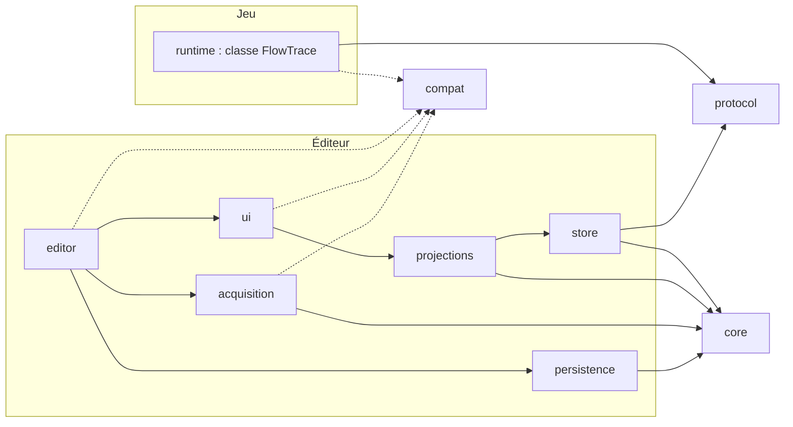

# Plan directeur — Godot Visual Program & Execution Explorer

Révision PD-0.5 · statut : **proposé** · 8 octobre 2026 · entrée : `prompts/conception.txt` v2.2 · remplace PD-0.4

**Changements depuis PD-0.4**, après une vérification de cohérence et les consignes de l'utilisateur :

- Mode d'exécution : trois IA en rotation, deux créneaux chacune par jour, une unité après l'autre ; présence humaine à la recette finale (§0, §9, D-03, nouvelle D-09). Le déroulé est `docs/construction/sequence.md`.
- Fait vérifié le 8 octobre 2026 : l'éditeur 4.7.2 tourne avec un rendu logiciel sous écran virtuel ; SPIKE-01b peut s'exécuter sans la machine du développeur (§10).
- Phrase périmée corrigée : SPIKE-01a a bien été exécuté (en-tête).

**Changements depuis PD-0.3**, après une relecture du guide de construction :

- Latence mesurée en deux parties : transport, puis réception → affichage (§8).
- Mesure de valeur exploratoire ; critère d'arrêt reformulé (§1, §9).
- T13 découpée en T13a, T13b et T13c (§1, §9, §10).
- Validation des formats en deux niveaux (§10).
- Ce que le POC montre, et ce qu'il ne montre pas (§1).

**Changements depuis PD-0.2**, amendement court après une seconde relecture et SPIKE-01a :

- Protocole de session de FlowTrace : initialisation, état initial, démarrage et arrêt confirmés, bail, désactivation pendant une collecte (§6, §8).
- Commandes appliquées à la frontière de frame, après un constat de réentrance (§6).
- Réserve bornée pour les événements de contrôle (§6).
- Troisième état du chemin observé : « indéterminé — trace incomplète » (§6).
- Champs requis par type d'événement (§5, §6).
- Latence mesurée en T16 par aller-retour, sans soustraire des horloges différentes (§8).
- Budget de P4 séparé entre évaluations et implémentation ; totaux exacts (§1, §9).

**Changements depuis PD-0.1**, après une relecture externe :

- Instrumentation sans autoload, et trois opérations distinctes pour la désactiver (§6, §8).
- Cycle de vie des instances qui sépare enregistrement, présence dans l'arbre et destruction (§5).
- Corrélation minimale par invocation pour le chemin observé (§6).
- Garanties du protocole précisées dès le POC (§6).
- Exemples de données complets et clés de sonde (§5).
- Compatibilité ramenée à une frontière légère avant la preuve de valeur (§4).
- Unités de mesure définies et budgets en heures (§0, §9).
- Mesure de valeur élargie à la cartographie (§9).
- Références normatives intégrées au dossier de passage (§10).

Ce document est une proposition. Une décision reste une proposition tant qu'elle n'est pas marquée « validée » dans le dossier de passage. Le seul prototype exécuté est SPIKE-01a ; ses mesures, prises sans rendu, ne valent pas performance de l'outil.

## 0. Contexte et unités

| Élément | Valeur retenue | Statut | Conséquence | Vérification |
| --- | --- | --- | --- | --- |
| Moteur | Godot 4.7.2 stable, référence reproductible | Proposé (D-01) | CI bloquante sur 4.7.2 | Télécharger 4.7.2 depuis l'archive officielle |
| Préversion | 4.8, au snapshot dev 7 du 29 septembre 2026, en gel des fonctionnalités | Connu | Contrôle séparé, non bloquant | Relancer sur chaque nouvelle préversion |
| Langage analysé | GDScript uniquement | Connu | C#, GDExtension et sources absentes hors MVP | — |
| Équipe | Un développeur ; trois IA à tour de rôle, IA 1, IA 2 et IA 3, qu'il choisit | Connu | Orchestration de plusieurs IA | Mesurer la réussite par IA sur les dix premières tâches |
| Disponibilité | Trois IA en rotation, deux créneaux chacune par jour, soit environ 12 h d'agent par jour ; présence humaine à la recette finale | Exprimé par l'utilisateur le 8 octobre 2026 (D-03, D-09) | Une seule file : une unité après l'autre (`docs/construction/sequence.md`) | Mesurer les créneaux consommés par unité sur le POC |
| Bancs d'essai | Jeux open source disponibles | À lister (D-02) | Choix en T04 | Nom, dépôt, licences, version d'origine |
| Instrumentation | Explicite, sur des copies de travail des jeux | Hypothèse | POC possible sans instrumentation automatique | — |
| IA dans le plugin | Aucune au MVP | Hypothèse | L'AI Snapshot est un export local | — |

| Unité | Définition |
| --- | --- |
| Heure humaine | Temps réel de la personne : décider, relire, valider, tester à la main |
| Temps agent | Durée d'exécution des agents, sans présence requise |
| Tâche | Unité de l'orchestration, avec un objectif et une preuve de réussite |
| Capacité acceptée | CAP démontrée et validée à une porte de passage |
| Session (historique) | 2 à 3 h de travail humain sans agent ; sert seulement à comparer avec l'estimation |

Le pilotage suit séparément les heures humaines, le temps agent et les capacités acceptées.

## 1. Synthèse décisionnelle

**Valeur.** L'outil doit d'abord répondre, preuves à l'appui, à une question de débogage concrète : quelle instance a pris quelle branche, et où est le code. La carte globale vient ensuite ; elle reste partielle par construction et l'affiche.

**Recommandation.** Construire dans cet ordre : un débogueur de décisions instrumentées relié au code (POC), une carte statique bornée et navigable (MVP), puis les modes avancés selon les preuves (V1).

La compatibilité commence par une frontière légère : tous les appels moteur sensibles passent par une façade, 4.7.2 est figée, la préversion est testée à part. Les adaptateurs par version et la veille automatisée n'arrivent qu'au MVP, ou plus tôt si une rupture réelle apparaît.

**POC : 23 tâches, 25 à 40 heures humaines avec agents** (40 à 65 h sans agent), soit 3 à 5 semaines à 10 h par semaine. Démonstration : deux instances, une décision, une trace réelle, un lien source et un arrêt propre. Le POC montre un journal, une liste arborescente du graphe déclaré et le chemin observé d'une invocation : il ne valide pas l'expérience visuelle complète. La carte navigable arrive au MVP ; la timeline, les flux de données et l'export pour une IA arrivent en V1.

**MVP : 68 à 114 heures humaines cumulées avec agents**, ou 64 à 108 si GDScript AST Flow sert de backend statique. L'économie porte sur l'implémentation du backend, pas sur son évaluation.

**V1 : 143 à 234 heures humaines cumulées avec agents.** Ces chiffres sont des objectifs de travail, relecture et corrections humaines comprises. Ils seront recalibrés après la première chaîne complète (T17).

**Inconnues.** SPIKE-01a, la partie jeu du canal débogueur, est faite : la collecte démarre, s'arrête et redémarre sans perte, sur 4.7.2 et 4.8-dev7 (`docs/spikes/SPIKE-01.md`). Restent avant le code du POC : SPIKE-01b, la partie éditeur, et SPIKE-02 (façade et isolation de compilation). SPIKE-05 (coût de capture, chemin désactivé compris) dans la tâche T13c. SPIKE-03 (rendu) et SPIKE-04 (reprise d'un parseur) au début du MVP. SPIKE-06 (fiabilité des modèles) mesuré pendant l'étape 4.

**Critère d'arrêt.** Si le POC ne montre aucun signal d'utilité sur trois bugs d'un jeu open source (mesure exploratoire, coûts d'installation et d'instrumentation compris), réorienter avant l'acquisition statique.

## 2. Vision, scénarios et glossaire

Une carte navigable et honnête d'un projet Godot : ce qui existe, ce qui peut se produire, ce qui s'est réellement produit et où intervenir, chaque affirmation portant sa provenance.

| ID | Question de l'utilisateur | Parcours attendu | Phase |
| --- | --- | --- | --- |
| SC-01 | Pourquoi ce Goblin ne poursuit-il pas le héros ? | Sélectionner l'instance, voir sa décision observée et ses preuves, ouvrir le code | POC |
| SC-02 | Comment ce jeu inconnu est-il organisé ? | Inventaire, groupes, appelants et appelés, code | MVP |
| SC-03 | Qui appelle cette fonction ? | Recherche, appelants, code | MVP |
| SC-04 | Que se passe-t-il entre l'entrée dans la pièce et la fin du combat ? | Blocs annotés, occurrences, interruptions | MVP annoté, V1 timeline |
| SC-05 | Où modifier la cadence d'attaque, et qui sera touché ? | Origine du paramètre, lecteurs, portée | V1 |
| SC-06 | Que donner à une IA pour diagnostiquer ce bug ? | Sous-graphe, trace, lacunes, export local | V1 |
| SC-07 | L'outil fonctionne-t-il avec la nouvelle version de Godot ? | Profil moteur, niveau de support affiché | POC profil, MVP matrice |

| Terme | Définition |
| --- | --- |
| Définition | Élément statique du programme, identifié indépendamment de son chemin |
| Instance runtime | Objet vivant d'une session qui exécute une définition |
| Invocation | Une exécution d'une fonction instrumentée, identifiée pour relier décisions et appels |
| Occurrence | Passage observé : appel, décision ou bloc, rattaché à une instance et à une invocation |
| Clé de sonde | Identifiant lisible écrit dans le code instrumenté, relié à une définition par le graphe déclaré |
| Chemin observé | Suite d'événements d'une même invocation, comparée aux branches déclarées ; ce n'est pas une preuve causale |
| Provenance | Extraite, déclarée, observée ou inférée |
| Résolution | Résolue, partielle ou non résolue |
| Non observé | Aucune trace dans la fenêtre et la couverture de capture ; ne prouve pas la non-exécution |
| Lacune | Intervalle de séquence perdu, filtré, évincé ou non capturé |
| Révision du programme | Empreinte des sources à laquelle se rattachent traces et liens |
| Profil moteur | Version et capacités de Godot détectées à l'exécution |

## 3. Capacités, priorités, acquisition et faisabilité

| ID | Capacité | Priorité | Acquisition | Couverture et limites | Difficulté | Critère observable |
| --- | --- | --- | --- | --- | --- | --- |
| CAP-01 | Graphe déclaré minimal affiché | POC | Déclaration | Ce qui est déclaré | Faible | 6 à 12 éléments affichés, chacun ouvre son code |
| CAP-02 | Capture runtime jusqu'à l'Event Store | POC | Instrumentation explicite | Points instrumentés seulement | Moyenne | Séquence continue, ou trous de séquence comptés |
| CAP-03 | Décision observée par instance et invocation | POC | Instrumentation | Parcours synchrones au POC | Faible | Branche, instance, invocation, horodatage, preuves |
| CAP-04 | Identité et cycle de vie des instances | POC | Instrumentation | Valables dans une session | Moyenne | Retrait puis réinsertion : même instance, jamais « détruite » |
| CAP-05 | Ouverture du code à la bonne révision | POC | Ancrage source | Lien périmé signalé | Faible | Clic vers fichier et ligne ; avertissement si le fichier a changé |
| CAP-06 | Frontière de compatibilité et profil moteur | POC | Façade, détection de capacités | Appels de la tranche | Faible | Tests verts sur 4.7.2 ; résultat de la préversion rapporté |
| CAP-07 | Pertes, lacunes et fin de session visibles | POC | Protocole | Aucune garantie de zéro perte | Moyenne | Saturation provoquée : pertes affichées ; session tuée : « fin inconnue » |
| CAP-08 | Inventaire statique d'un projet | MVP | Réflexion, état des scènes, dépendances | Sans instancier le projet | Moyenne | Jeu de 300 scripts ou plus indexé ; erreurs isolées par fichier |
| CAP-09 | Relations d'appel avec provenance | MVP | Extraction syntaxique, maison ou AST tiers | Appels dynamiques non résolus | Élevée | Appels directs résolus ; dynamiques marqués non résolus |
| CAP-10 | Navigation : appelants, appelés, recherche, arborescence res:// | MVP | Requêtes | Expansion bornée | Moyenne | Un appelant retrouvé plus vite qu'avec la recherche de l'éditeur |
| CAP-11 | Historique borné, relecture, export | MVP | Event Store | Mémoire bornée | Moyenne | Session rechargée et relue sans le jeu |
| CAP-12 | Game Flow annoté et occurrences | MVP annoté, V1 timeline | Déclaration, instrumentation | Blocs inférés exclus | Moyenne | Bloc interrompu affiché « incomplet » |
| CAP-13 | Matrice de compatibilité publiée | MVP | CI | Versions testées seulement | Faible | Matrice regénérée par la CI |
| CAP-14 | Origine et usages d'un paramètre | V1 | Statique et observation | « Dernière écriture connue » bornée | Élevée | Défaut, ressource, override et valeur observée distingués |
| CAP-15 | Expected vs Actual, comparaison d'instances | V1 | Déclaration, baseline | Alignement sémantique | Moyenne | Première divergence connue montrée avec ses preuves |
| CAP-16 | Explain, Tune, InterventionPoints | V1 | Modèle et annotations | Aucune intention inventée | Élevée | Fichier, fonction, paramètre et portée affichés |
| CAP-17 | Couche performance corrélée | V1 | Moniteurs, instrumentation | Pas de temps CPU par fonction | Moyenne | Coût de capture mesuré avec et sans |
| CAP-18 | AI Snapshot local | V1 | Export | Champs choisis, aperçu avant partage | Faible | JSON et PNG cohérents, lacunes incluses |
| CAP-19 | Décisions extraites automatiquement | ADVANCED | AST | Robustesse inconnue | Élevée | — |
| CAP-20 | Instrumentation automatique | EXPERIMENTAL | Réécriture de copies | Risque de dérive du code | Très élevée | — |

Les modes de la spécification sont des projections de ces capacités : Map (CAP-08 à 10), Game Flow (CAP-12), Logic (CAP-03, 09, 19), Data Flow (CAP-14), Runtime (CAP-02, 04, 07, 11), Debug (CAP-15), Explain et Tune (CAP-16), Performance (CAP-17), AI Context (CAP-18).

| Outil existant | Apport | Décision proposée |
| --- | --- | --- |
| GDScript AST Flow (MIT, 4.7.x) | Parseur GDScript, graphe d'appels et de signaux, def-use, export JSON | Candidat backend de CAP-09 ; SPIKE-04 au début du MVP. S'il est retenu : derrière la façade de syntaxe, version épinglée, plan de sortie |
| Script Dependency Inspector (MIT) | Instantané validé, diagnostics à codes stables | S'inspirer de ses diagnostics et états périmés |
| Signal Lens (MIT) | Signaux en direct dans un onglet du débogueur | S'inspirer de son intégration au débogueur |
| LimboAI | Illumination runtime d'arbres de comportement | S'inspirer de son interface |
| Débogueur, profileur, moniteurs de Godot | Points d'arrêt, temps par fonction, moniteurs | Compléter sans dupliquer |

## 4. Architecture et frontière de compatibilité



| Module | Responsabilité | Dépend de | Interdit |
| --- | --- | --- | --- |
| core | Modèle, identités, provenance, requêtes de base | Types fondamentaux de Godot | Éditeur, UI, runtime, compat |
| compat | Façades moteur, éditeur et débogueur ; profil moteur | API Godot, seul module autorisé pour les API sensibles | Modules du plugin |
| protocol | Enveloppe, codec, validation | Types fondamentaux | Tout le reste |
| runtime | Classe statique FlowTrace, buffer borné, lots, corrélation | Partie partagée du protocole et façade runtime, embarquées dans le dossier runtime | editor, ui, core, store et tout fichier du plugin éditeur ; aucun autoload requis |
| acquisition | Inventaire, extraction, adaptateurs d'outils tiers | core, compat | ui, runtime |
| store | Sessions, Event Store, lacunes, rétention | core, protocol | ui, editor |
| projections | Requêtes des vues, chemin observé, diagnostics | core, store | Widgets, compat |
| ui | Panneaux, journal, vues | projections, façade UI | store en direct, runtime |
| editor | Point d'entrée du plugin, capture débogueur, cycle de vie | ui, store, acquisition, persistence, compat | runtime hors protocol |
| persistence | Formats versionnés, sauvegarde atomique | core | ui, runtime |

`plugin.gd` est le seul script autorisé à hériter d'EditorPlugin ; il délègue immédiatement.

**Frontière de compatibilité, légère au POC.** La politique de publication de Godot admet des ruptures ciblées entre versions mineures tout en visant une compatibilité générale. Cela justifie une frontière et des tests ciblés, pas une infrastructure d'adaptation avant la preuve de valeur.

| Phase | Ce qui existe | Déclencheur |
| --- | --- | --- |
| POC | Une façade par domaine (runtime, débogueur, éditeur), la façade runtime vivant dans le dossier runtime autonome ; profil moteur, INV-09 vérifié par le contrôle de dépendances, CI bloquante sur 4.7.2, job séparé non bloquant sur la dernière préversion | Toujours |
| MVP | Matrice publiée, bascule vers 4.8 stable, façades d'introspection et de syntaxe | Gate MVP ou sortie de 4.8 stable |
| Au besoin | Adaptateurs par plage de versions chargés à la demande ; veille hebdomadaire automatisée | Rupture constatée, ou rupture ayant coûté plus d'une session |

**Isolation de compilation, à vérifier en SPIKE-02.** Un script qui référence une API absente de la version courante peut échouer à sa compilation. Le code partagé ne référence donc que des API présentes dans la version minimale supportée ; une adaptation plus récente passe par un script chargé par chemin, sans `class_name`, après détection.

**Arborescence proposée, à créer**

```
addons/godot_dev_mapper/
  plugin.cfg
  plugin.gd                    # seul héritier d'EditorPlugin
  core/ protocol/ store/ projections/ ui/ editor/ persistence/ acquisition/
  compat/
    engine_facade.gd           # façades débogueur et éditeur
    engine_profile.gd
    versions.json              # 4.7.2 bloquant, préversion suivie
addons/godot_dev_mapper_runtime/  # autonome : reste dans les jeux instrumentés
  flow_trace.gd                # class_name FlowTrace, fonctions statiques, inerte par défaut
  runtime_facade.gd            # seule partie de la frontière de compatibilité côté jeu
  envelope.gd                  # partie partagée du protocole : encodage des lots
tests/ unit/ contract/ integration/ fixtures/
benches/benches.json           # jeux de test référencés par dépôt et révision
tools/ci/                      # téléchargement de Godot, runner, contrôle des dépendances
.github/workflows/ci.yml
docs/                          # SPEC, ARCHITECTURE, CONTRACTS, COMPATIBILITY, adr/, spikes/
```

## 5. Modèle minimal, identités et exemples

| Entité | Rôle | Champs requis | Phase |
| --- | --- | --- | --- |
| ProgramSnapshot | État indexé du programme | snapshot_id, revision, engine_profile, coverage | POC minimal |
| Definition | Élément statique | def_id, kind, name, probe_keys, anchor, evidence | POC |
| SourceAnchor | Lien vers le code | script_uid, path, line_start, line_end, revision, range_hash | POC |
| Relation | Lien typé | rel_id, kind, from, to (def_id, ou objet `{"unresolved": …}`), evidence | POC |
| Evidence | Preuve | kind, source, resolution, revision ; confiance optionnelle | POC |
| RuntimeSession | Une exécution | session_id, revision, engine_profile, capture_config, status (active, terminée, fin inconnue) | POC |
| RuntimeInstance | Objet vivant | instance_key, probe_key de la définition, label, object_id en chaîne, tree_state, destruction (inconnue ou constatée, avec instant de constat) | POC |
| Invocation | Exécution d'une fonction | inv_id, instance_key, probe_key, parent_inv optionnel | POC |
| TraceEvent | Occurrence | Communs : seq, t_usec, type ; hérités du lot : session_id, producer_id, revision ; propres au type : voir §6 | POC |
| Gap | Lacune | session_id, producer_id, from_seq, to_seq, reason, count | POC |
| TemporalBlockDefinition, TemporalBlockOccurrence | Game Flow | id, parent, cycle de vie, statut | MVP |
| Annotation, Suggestion | Apport humain, apport IA | target, text, author, created_at, status | MVP |

**Clés de sonde.** Le code instrumenté n'écrit jamais de `def_id`, qui reste opaque. Il écrit une clé lisible et stable, sous forme de StringName littéral, par exemple `&"enemy_ai.choose_action/in_range"`. Le graphe déclaré associe chaque clé à une définition. Au chargement d'un instantané, le store construit la table clé → définition pour cette révision ; une clé inconnue garde ses événements, marqués « définition non résolue ». Le runtime n'a ainsi besoin d'aucun modèle (INV-06).

**Cycle de vie des instances.**

- **Enregistrement** : premier appel explicite `FlowTrace.register(self, clé)`. Il crée l'`instance_key` de la session.
- **Arbre** : entrée et sortie de l'arbre sont des événements distincts, facultatifs au POC. Sortir de l'arbre ne signifie jamais être détruit ; `_ready()` n'est en principe pas rappelé lors d'une réinsertion.
- **Destruction connue** : signalée par une notification de pré-suppression de l'objet, ou constatée plus tard quand une référence faible devient nulle. Dans ce second cas, l'instant affiché est « au plus tard ».
- **Réutilisation d'objets** : la mort d'un ennemi dans un pool est un changement d'état du jeu, pas une destruction d'instance.

La fixture « retrait puis réinsertion » fait partie des tests d'identité dès le POC.

**Autres règles d'identité.**

- La clé de correspondance d'une définition associe l'UID du script et le nom qualifié, pour survivre aux déplacements de fichiers. La disponibilité des UID est à vérifier en SPIKE-02 ; à défaut, la clé repose sur le chemin.
- Un renommage de fonction crée une nouvelle définition ; une suggestion « renommage probable » peut les relier.
- Les identifiants d'objets Godot sont des entiers 64 bits, stockés en chaîne dans tout JSON.
- Les références non résolues sont conservées ; une réindexation n'écrase jamais une annotation humaine.
- Une session est rattachée à une révision ; après une modification du code pendant la capture, les événements suivants sont marqués « révision incertaine ».

**Exemple complet de graphe déclaré** (`.flow.json`, version 1). Toutes les cibles sont définies ou explicitement non résolues.

```json
{
  "schema_version": 1,
  "kind": "declared_graph",
  "revision": "src-7f3a9c",
  "definitions": [
    {"def_id": "d-0007", "kind": "function", "name": "EnemyAI.choose_action",
     "probe_keys": ["enemy_ai.choose_action"],
     "anchor": {"script_uid": "uid://b4k2m1xq", "path": "res://enemies/enemy_ai.gd",
                "line_start": 42, "line_end": 58, "revision": "src-7f3a9c", "range_hash": "h-91c0"},
     "evidence": [{"kind": "declared", "source": "flow.json", "resolution": "resolved", "revision": "src-7f3a9c"}]},
    {"def_id": "d-0008", "kind": "decision", "name": "distance <= attack_range",
     "probe_keys": ["enemy_ai.choose_action/in_range"],
     "anchor": {"script_uid": "uid://b4k2m1xq", "path": "res://enemies/enemy_ai.gd",
                "line_start": 47, "line_end": 47, "revision": "src-7f3a9c", "range_hash": "h-4a2e"},
     "evidence": [{"kind": "declared", "source": "flow.json", "resolution": "resolved", "revision": "src-7f3a9c"}]},
    {"def_id": "d-0009", "kind": "function", "name": "EnemyAI.attack",
     "probe_keys": ["enemy_ai.attack"],
     "anchor": {"script_uid": "uid://b4k2m1xq", "path": "res://enemies/enemy_ai.gd",
                "line_start": 60, "line_end": 71, "revision": "src-7f3a9c", "range_hash": "h-77b1"},
     "evidence": [{"kind": "declared", "source": "flow.json", "resolution": "resolved", "revision": "src-7f3a9c"}]},
    {"def_id": "d-0010", "kind": "function", "name": "EnemyAI.chase",
     "probe_keys": ["enemy_ai.chase"],
     "anchor": {"script_uid": "uid://b4k2m1xq", "path": "res://enemies/enemy_ai.gd",
                "line_start": 73, "line_end": 90, "revision": "src-7f3a9c", "range_hash": "h-0c5d"},
     "evidence": [{"kind": "declared", "source": "flow.json", "resolution": "resolved", "revision": "src-7f3a9c"}]}
  ],
  "relations": [
    {"rel_id": "r-0012", "kind": "contains", "from": "d-0007", "to": "d-0008",
     "evidence": [{"kind": "declared", "source": "flow.json", "resolution": "resolved", "revision": "src-7f3a9c"}]},
    {"rel_id": "r-0013", "kind": "branch_true", "from": "d-0008", "to": "d-0009",
     "evidence": [{"kind": "declared", "source": "flow.json", "resolution": "resolved", "revision": "src-7f3a9c"}]},
    {"rel_id": "r-0014", "kind": "branch_false", "from": "d-0008", "to": "d-0010",
     "evidence": [{"kind": "declared", "source": "flow.json", "resolution": "resolved", "revision": "src-7f3a9c"}]},
    {"rel_id": "r-0015", "kind": "call", "from": "d-0010", "to": {"unresolved": "NavigationAgent2D.get_next_path_position"},
     "evidence": [{"kind": "declared", "source": "flow.json", "resolution": "unresolved", "revision": "src-7f3a9c"}]}
  ]
}
```

**Exemple de lot d'événements**, forme persistée, avec un événement évincé (seq 122) :

```json
{
  "protocol_version": 1,
  "session_id": "s-2f81",
  "producer_id": "main",
  "revision": "src-7f3a9c",
  "first_seq": 120,
  "last_seq": 124,
  "dropped": {"count": 1, "by_type": {"metric": 1}},
  "events": [
    {"seq": 120, "t_usec": 8421301, "type": "function_enter", "probe": "enemy_ai.choose_action", "inst": "s-2f81/i-17", "inv": "s-2f81/v-940"},
    {"seq": 121, "t_usec": 8421337, "type": "decision", "probe": "enemy_ai.choose_action/in_range", "inst": "s-2f81/i-17", "inv": "s-2f81/v-940", "payload": {"result": false}},
    {"seq": 123, "t_usec": 8421390, "type": "function_enter", "probe": "enemy_ai.chase", "inst": "s-2f81/i-17", "inv": "s-2f81/v-941", "parent_inv": "s-2f81/v-940"},
    {"seq": 124, "t_usec": 8421455, "type": "function_exit", "probe": "enemy_ai.chase", "inst": "s-2f81/i-17", "inv": "s-2f81/v-941"}
  ]
}
```

Lecture : dans l'invocation v-940, la décision « à portée » est fausse ; chase est ensuite appelée depuis cette même invocation. Le chemin est donc **cohérent** avec la branche déclarée r-0014. Le trou en 122 est expliqué par le compteur d'éviction. Seule la décision porte une charge : les champs requis dépendent du type d'événement (§6).

## 6. Runtime, protocole, temporalité, preuve et diagnostic

**Chaîne.** Instrumentation, buffer borné par producteur, lots, transport via la façade, validation, Event Store, projections, interface.

**Protocole de session.** Sa partie jeu est vérifiée par SPIKE-01a (`docs/spikes/SPIKE-01.md`).

| Étape | Règle |
| --- | --- |
| Initialisation | Au premier appel de FlowTrace, ou par `FlowTrace.init()` : si un débogueur est attaché, enregistrement de la capture de messages, branchement sur la frontière de frame, puis message « prêt » |
| Instances antérieures | `register` attribue toujours une identité, même collecte inactive, dans un registre borné ; au démarrage, ce registre part comme « état initial » |
| Démarrage | L'éditeur envoie « start » ; FlowTrace l'applique à la frontière de frame suivante et répond « started » avec la séquence courante |
| Arrêt | « stop » s'applique à la frontière de frame : vidage complet, puis « stopped » avec la séquence finale ; aucun lot ne suit |
| Commandes | Le rappel de capture ne modifie jamais l'état : il note la commande. Constat de SPIKE-01a : les messages entrants peuvent être traités en réentrance, au milieu du code du jeu |
| Bail | L'éditeur renouvelle un bail toutes les 250 ms ; sans renouvellement pendant 2 s, FlowTrace arrête seul la collecte. Constat : `EngineDebugger.is_active()` reste vrai après une coupure |
| Désactivation du plugin pendant une collecte | Le plugin envoie « stop » et attend « stopped » une seconde au plus avant de retirer sa capture ; à défaut, le bail arrête la collecte côté jeu |
| Fin du moteur | Désenregistrement explicite de la capture ; sans lui, une erreur apparaît à la sortie (constaté) |
| Messages du moteur | set_pid, output, window:title et performance:profile_frame sont ignorés par la capture de l'outil |

| Événement | Produit par | Phase |
| --- | --- | --- |
| instance_registered | `FlowTrace.register` | POC |
| instance_destroyed | Notification de pré-suppression, ou constat par référence faible | POC |
| function_enter, function_exit | `FlowTrace.enter` (renvoie l'identifiant d'invocation) et `FlowTrace.exit` | POC |
| decision | `FlowTrace.decision`, rattachée à l'invocation courante | POC |
| Contrôle : démarrage, arrêt, fin de session | Runtime et éditeur | POC |
| tree_entered, tree_exited | Helper facultatif | MVP |
| signal_emit, signal_received, state_change, block_begin, block_end | Appels explicites | MVP |
| metric | Échantillonneur de moniteurs | V1 |

**Champs requis par type.** S'y ajoutent les champs communs (seq, t_usec, type) et ceux hérités du lot (session_id, producer_id, revision).

| Type | Champs propres requis | Charge |
| --- | --- | --- |
| instance_registered | probe, inst | Libellé facultatif |
| instance_destroyed | inst | `{"detected": true}` si la destruction est constatée par référence faible |
| function_enter | probe, inst, inv ; parent_inv si l'appel est imbriqué | Aucune |
| function_exit | probe, inst, inv | Aucune |
| decision | probe, inst, inv | `{"result": …}`, requise |
| Contrôle | type | Séquence courante ; pour la fin de session, séquence finale et compteurs |

**Corrélation minimale par invocation.** FlowTrace tient une pile d'invocations par thread. `enter` empile un nouvel identifiant et enregistre son parent ; `decision` se rattache au sommet ; `exit` dépile. Le POC est limité aux parcours synchrones, sans `await` ni réentrance. Trois moyens tiennent ce périmètre : l'instrumentation du banc d'essai est contrôlée (T15) ; les restrictions sont écrites dans C-07 ; FlowTrace vérifie qu'une invocation ouverte se ferme dans la même frame. Hors de ce périmètre, l'interface affiche « corrélation non garantie ». En V1, l'identifiant renvoyé par `enter` pourra être passé explicitement à travers un `await`.

**Chemin observé.** Il réunit les événements d'une même invocation et ses invocations enfants. Il prend l'un de trois états : « cohérent avec la branche déclarée », « incohérent », ou « indéterminé — trace incomplète » quand un trou de séquence touche l'invocation, qu'une sortie manque ou que la corrélation n'est pas garantie. Il ne s'affiche jamais comme une cause.

**Garanties du protocole dès le POC**

| Sujet | Règle |
| --- | --- |
| Séquence | Numéro attribué à l'enregistrement, avant le buffer : toute éviction laisse un trou détectable |
| Éviction | Buffer plein : les événements continus récents partent d'abord, avec un comptage par type |
| Réserve de contrôle | 64 places réservées aux événements de contrôle. Les contrôles répétitifs sont regroupés en compteurs. Réserve pleine : la collecte s'arrête et l'état « capture interrompue » part dès que possible. La mémoire reste bornée dans tous les cas |
| Taille | 1 Ko de charge par événement (au-delà, tronquée et signalée), 256 événements et 64 Ko par lot ; objectifs à valider |
| Fin de session | Message de fin avec séquence finale et compteurs ; s'il manque, session marquée « fin inconnue » après la dernière séquence reçue |
| Rétention | Event Store borné, objectif de 200 000 événements ou 64 Mo par session ; au-delà, éviction des plus anciens avec un marqueur « tronqué avant seq N » |
| Version | Version de protocole inconnue : lot rejeté avec une erreur visible |
| Ancienne session | Messages tardifs archivés à part, jamais mélangés |

| Phase | Contenu du contrat runtime |
| --- | --- |
| POC | Ci-dessus, plus session, producteur, révision, horodatage monotone, clés de sonde, invocations |
| MVP | Capacités négociées, connexion tardive, reconnexion, marqueurs de lacune explicites, frames et ticks physiques, doublons, références tardives, export |
| V1 et plus | Corrélation à travers `await`, collecte multi-thread et ordre entre producteurs, build exporté sans debugger |

**Coût du chemin désactivé.** Un appel inactif coûte plus qu'un test booléen : ses arguments sont évalués avant l'appel. Les règles d'écriture sont donc : clés en StringName littéraux, résultats primitifs, aucune construction de chaîne au point d'appel, et `if FlowTrace.enabled:` devant toute charge coûteuse. Le coût côté appelant est mesuré, collecte inactive puis active (SPIKE-05, dans T13c).

**Temporalité.** Horloge monotone en microsecondes au POC ; frames et ticks physiques au MVP. Cycle de vie des blocs : non démarré, actif, suspendu, terminé, échoué, abandonné, incomplet. La relecture reconstruit les vues depuis le journal ; le rejeu déterministe reste hors périmètre.

**Limites de preuve**

- Une décision observée prouve ce cas, pas les autres chemins possibles.
- Une absence d'événement s'affiche « non observé », avec la couverture : sondes posées, fenêtre, pertes.
- L'ordre n'est garanti que par producteur ; la proximité temporelle ne crée aucune arête causale.
- Toute comparaison cite révision, configuration, scénario, fenêtre et couverture.

**Diagnostic (V1).** Étapes alignées par leur sens ; première divergence connue ; inconnues et vérifications suggérées ; aucune cause racine affirmée.

## 7. Navigation, projections et rendu

| Parcours | Étapes | Phase |
| --- | --- | --- |
| J1 | Instance, invocation, décision, preuves, code | POC |
| J2 | Recherche, définition, appelants et appelés, code | MVP |
| J3 | Fichier de res://, élément du graphe | MVP |
| J4 | Paramètre, origine, lecteurs, portée | V1 |

Le POC n'a pas besoin de graphe dessiné : un journal sélectionnable et une liste arborescente du graphe déclaré suffisent à la démonstration. SPIKE-03 compare GraphEdit, un canevas dessiné et une approche hybride au début du MVP, à 50, 300 et 1 000 éléments visibles. Les états ne reposent jamais sur la couleur seule.

## 8. Performance, persistance, cycle de vie et exports

| Mesure | Objectif initial, à valider | Mesuré par |
| --- | --- | --- |
| Surcoût de capture active | 5 % du temps de frame au plus, à 1 000 événements par seconde | T13c (SPIKE-05) |
| Chemin désactivé, côté appelant compris | Non mesurable dans le temps de frame à 1 000 appels par seconde | T13c |
| Mémoire du buffer runtime | 8 Mo par producteur au plus | T13a |
| Débit soutenu sans perte | 10 000 événements par seconde au moins ; SPIKE-01a : 24 000 sans perte, sans rendu | T13b, puis SPIKE-01b avec rendu |
| Aller-retour du transport | Informatif ; SPIKE-01a : médiane d'environ 50 ms, sans rendu | T16, ping mesuré avec la seule horloge de l'éditeur |
| Délai réception → affichage | Latence estimée (moitié de l'aller-retour plus ce délai) : 200 ms au plus au 95e centile | T16, horodatages de réception et d'affichage, horloge de l'éditeur |
| Rafraîchissement de l'interface | 30 Hz au plus | T16 |
| Indexation statique | 15 s au plus pour 300 scripts | MVP |
| Éléments visibles | 300 sans dégradation perceptible | SPIKE-03 |

| Données | Emplacement | Versionné dans Git | Format |
| --- | --- | --- | --- |
| Graphes déclarés, annotations, attentes | Dossier dédié du projet analysé | Oui | JSON avec schema_version |
| Caches d'index | Dossier de cache du projet | Non | Régénérable |
| Traces de session | Dossier utilisateur configurable | Non, par défaut | JSON par lots |
| Layouts | Projet | Au choix | JSON |

Sauvegarde atomique par fichier temporaire puis renommage ; validation à l'import ; refus explicite des versions inconnues.

**Cycle de vie : trois opérations distinctes**

| Opération | Effet | Ce qui reste |
| --- | --- | --- |
| Désactiver l'interface | Si une collecte est active : arrêt, puis attente de la confirmation une seconde au plus. Ensuite, panneaux et capture côté éditeur retirés | Le jeu tourne ; FlowTrace reste appelable ; il est inerte, ou le devient à l'expiration du bail |
| Arrêter la collecte | L'éditeur envoie l'arrêt ; FlowTrace vide son buffer et repasse inerte | Interface et données disponibles |
| Désinstaller l'instrumentation | Un outil liste les appels FlowTrace du projet ; le dossier runtime n'est retiré que s'il n'en reste aucun | Rien, ou un rapport des appels restants |

FlowTrace est une classe à `class_name` et fonctions statiques, sans autoload : les appels du jeu restent valides tant que son fichier existe, même plugin désactivé. Le dossier runtime ne dépend d'aucun fichier du plugin éditeur : il embarque sa façade et l'encodage du protocole. Son déclenchement de lot par frame, sans autoload, est vérifié par SPIKE-01a.

**Exports (V1).** AI Snapshot JSON et PNG, choix des champs, exclusion des données sensibles, aperçu avant partage, export local seulement.

## 9. Budgets, roadmap, critères et risques

| Phase | Livre | Tâches | Heures humaines avec agents | Sans agent | Porte |
| --- | --- | --- | --- | --- | --- |
| P0 à P3 : POC | CAP-01 à CAP-07 | 23 | 25–40 | 40–65 | Démonstration et mesure de valeur |
| P4a Évaluations : SPIKE-03 rendu, SPIKE-04 backend statique | Décisions | 3–5 | 6–12 | 10–18 | Rapports KEEP, REWRITE ou DISCARD |
| P4b Backend statique et inventaire | CAP-08, CAP-09 | 9–13 | 8–14, ou 4–8 avec AST Flow | 20–30 | Inventaire d'un jeu réel |
| P5 Navigation et Project Tree | CAP-10 | 8–12 | 8–13 | 20–30 | Test de cartographie réussi |
| P6 Historique, persistance, protocole MVP | CAP-11, CAP-07 complet | 10–16 | 10–16 | 30–45 | Session rechargée, reconnexion |
| P7 Logique et Game Flow annoté | CAP-12 annoté | 5–9 | 5–9 | 15–25 | Bloc incomplet visible |
| P8 Compatibilité MVP et stabilisation | CAP-13, bascule vers 4.8 stable | 6–10 | 6–10 | 20–30 | MVP installé proprement |
| **MVP cumulé** | | **64–88** | **68–114**, ou 64–108 avec AST Flow | **155–243** | Revue de continuation |
| P9 à P16 : V1 | CAP-12 à CAP-18, deux versions stables | 65–110 | 75–120 | 190–285 | Démonstrations CAP-12 à 18 |
| **V1 cumulée** | | **129–198** | **143–234** | **345–528** | |

À 10 h par semaine, avec deux files actives : POC en 3 à 5 semaines, MVP en 1,5 à 3 mois, V1 en 3,5 à 5,5 mois. En mode autonome (D-09), le calendrier se compte en créneaux d'IA : POC en 7 à 10 jours, MVP vers le jour 17 à 26, V1 entre le jour 30 et le jour 44 (`docs/construction/sequence.md`). Ce sont des objectifs de travail, à recalibrer après le POC.

**Mesure de valeur, élargie**

- **Diagnostic, au POC (T19), exploratoire** : trois bugs de difficulté comparable, chacun sur une variante isolée du banc d'essai, diagnostiqués avec et sans l'outil ; ordre contrebalancé si deux personnes participent. Coûts d'installation, de déclaration et d'instrumentation comptés. Trois bugs donnent un signal d'utilité et révèlent les problèmes d'usage ; ils ne chiffrent pas un gain fiable. La conclusion est qualitative, les durées indicatives.
- **Cartographie, à la porte du MVP** : retrouver tous les appelants d'une fonction, et expliquer un système inconnu du banc d'essai, chronométrés avec et sans l'outil.

**Portes de passage**

- POC : CAP-01 à CAP-07 démontrées sur 4.7.2 ; protocole de session démontré avec l'éditeur réel, désactivation pendant une collecte comprise ; fixture « retrait puis réinsertion » verte ; chemin désactivé mesuré ; arrêt propre et fin inconnue démontrés ; résultat de la préversion rapporté ; mesure de diagnostic faite.
- MVP : jeu réel de 300 scripts ou plus indexé sans instanciation ; test de cartographie gagnant ; session rechargée ; installation et désinstallation propres ; CI verte sur la fenêtre.
- V1 : CAP-12 à CAP-18 ; deux versions stables ; matrice publiée ; documentation utilisateur.

**Critères d'arrêt ou de réorientation**

- POC sans aucun signal d'utilité, coûts d'installation compris : réorienter.
- Dépassement de 50 % d'un budget de phase : revue de continuation immédiate.
- Un modèle sous 40 % de réussite au premier essai après dix tâches : réacheminer ses tâches.
- Rupture de version qui impose du code hors de la façade : revue d'architecture.

**Risques ordonnés**

| Rang | Risque | Probabilité | Impact | Mitigation |
| --- | --- | --- | --- | --- |
| 1 | Valeur insuffisante au regard du coût de déclaration et d'instrumentation | Moyenne | Élevé | Mesure élargie, critère d'arrêt, réutilisation de l'existant |
| 2 | Dérive de périmètre | Élevée | Élevé | Budgets en heures, revues de continuation |
| 3 | Débit ou pertes du canal débogueur | Moyenne | Élevé | Lots, buffer borné, trous de séquence, SPIKE-01 |
| 4 | Chronologie présentée comme causalité | Moyenne | Élevé | Invocations, libellés « cohérent » ou « non garanti » |
| 5 | Analyse statique trompeuse | Élevée | Moyen | Provenance, résolution, « non résolu » |
| 6 | Saturation de la relecture humaine | Élevée | Moyen | Deux files à 10 h par semaine, petites tâches |
| 7 | Rupture ciblée d'API entre versions | Moyenne | Moyen | Façade, CI 4.7.2, contrôle de la préversion |
| 8 | Échecs des IA sur les API Godot | Moyenne | Moyen | Packs autonomes, escalade, mesure par IA |
| 9 | Graphe illisible | Élevée | Moyen | Projections, expansion bornée, SPIKE-03 |
| 10 | Outil tiers abandonné | Moyenne | Moyen | Façade, version épinglée, plan de sortie |
| 11 | Licences des bancs d'essai | Faible | Moyen | Référencer sans copier |

## 10. Dossier de passage vers la méthodologie

**Identité.** PD-0.5, proposé, 8 octobre 2026, fondé sur `prompts/conception.txt` v2.2 et sur SPIKE-01a. Méthode associée : MC-0.5 ; orchestration : OR-0.5 ; guide de construction : GC-0.4, avec son déroulé séquentiel.

**Versions.** 4.7.2 bloquante (D-01) ; dernière préversion 4.8 contrôlée sans bloquer.

**Invariants normatifs**

| ID | Règle |
| --- | --- |
| INV-01 | Le modèle du programme existe indépendamment des widgets et de la vue affichée |
| INV-02 | Une définition statique, une instance runtime et une occurrence d'exécution sont distinctes |
| INV-03 | Les informations extraites, déclarées, observées et inférées conservent leur provenance |
| INV-04 | Une information non observée n'est pas une preuve de non-exécution |
| INV-05 | Ordre chronologique, relation causale et intention attendue sont distincts |
| INV-06 | Le runtime ne dépend pas de l'éditeur ni de son interface |
| INV-07 | Collecte, stockage et affichage ont des limites explicites ; les pertes sont visibles |
| INV-08 | Toute trace et tout lien source indiquent la révision du programme à laquelle ils se rapportent |
| INV-09 | Aucun module n'appelle directement une API moteur susceptible de changer entre versions : tout passe par la frontière de compatibilité, vérifiée en CI sur les versions supportées |

**Capacités par périmètre.** POC : CAP-01 à CAP-07. MVP : en plus, CAP-08 à CAP-13. V1 : en plus, CAP-14 à CAP-18. Reportées : CAP-19, CAP-20, rejeu déterministe, C#, multi-processus.

**Contrats candidats et tâche qui les valide**

| ID | Contenu | Validé par |
| --- | --- | --- |
| C-01 | Identités : définition, instance et cycle de vie, invocation, occurrence, session ; clés de sonde | T07 |
| C-02 | Ancrage source et révision du programme | T07 |
| C-03 | Façades de compatibilité du POC et profil moteur | T08 |
| C-04 | Enveloppe runtime du POC, champs par type, réserve de contrôle, codec | T08 |
| C-05 | Modèle minimal et graphe déclaré `.flow.json` v1 | T07 |
| C-06 | Event Store minimal, rétention, fin de session, requête « chemin observé » | T08 |
| C-07 | API FlowTrace : init, register, enter, exit, decision, enabled, shutdown ; protocole de session ; règles du chemin désactivé | T08 |

**Inconnues**

| ID | Question | Phase |
| --- | --- | --- |
| SPIKE-01a | Partie jeu : aller-retour, débit, arrêt et redémarrage, classe statique, coupure | Fait : KEEP avec modifications |
| SPIKE-01b | Partie éditeur : capture du plugin, envoi par la session, lancements répétés, désactivation pendant une collecte, débit avec rendu. Exécutable sous écran virtuel, rendu logiciel (vérifié le 8 octobre 2026) ; la mesure sur GPU passe à la recette | POC, T05 |
| SPIKE-02 | Façade, détection de capacités, UID et isolation de compilation tiennent-ils sur 4.7.2 et sur la préversion ? | POC |
| SPIKE-03 | Quel rendu tient 300 éléments visibles ? | MVP |
| SPIKE-04 | GDScript AST Flow ou extraction maison ? | MVP |
| SPIKE-05 | Coût de capture active et du chemin désactivé, côté appelant compris | POC, dans T13c |
| SPIKE-06 | Taux de réussite de chaque modèle sur des tâches sous contrat | POC, étape 4 |

**Décisions à confirmer**

| ID | Décision | Bloquante au démarrage |
| --- | --- | --- |
| D-01 | 4.7.2 comme référence reproductible | Oui |
| D-02 | Jeux open source retenus | Oui, pour l'étape 5 |
| D-03 | Disponibilité : trois IA, deux créneaux chacune par jour | Non |
| D-04 | Politique de dépendances tierces | Avant SPIKE-04 |
| D-05 | Runner de tests : maison minimal, ou framework existant compatible | Oui |
| D-06 | Licence du plugin | Avant toute diffusion |
| D-07 | Fenêtre initiale : 4.7.2 bloquant, préversion suivie | Oui |
| D-08 | Emplacement des traces et des fichiers déclarés | Non pour le POC |
| D-09 | Mode d'exécution : autonome et séquentiel, décisions de démarrage adoptées par défaut, recette humaine finale | Oui |

**Vérification de cohérence**

- Toutes les capacités du prompt sont couvertes ou explicitement reportées.
- Les exemples de données respectent le modèle annoncé : champs requis présents, cibles définies ou non résolues.
- Les formats se valident en deux niveaux : schéma JSON, puis règles sémantiques à codes d'erreur (références, unicité d'une clé, ordre des séquences, taille en octets).
- Les contrats du POC ont chacun une tâche de validation avant leur premier usage.
- Le chemin observé n'est jamais présenté comme causal.
- Vérifiés côté jeu par SPIKE-01a : aller-retour, classe statique déclenchée par frame, bail, arrêt sans lot tardif. Restent non vérifiés : la partie éditeur (SPIKE-01b), l'isolation de compilation et les UID (SPIKE-02), le coût de capture (SPIKE-05).
- Les seules mesures citées viennent de SPIKE-01a, dans un conteneur sans rendu : elles ne valent pas performance de l'outil.
